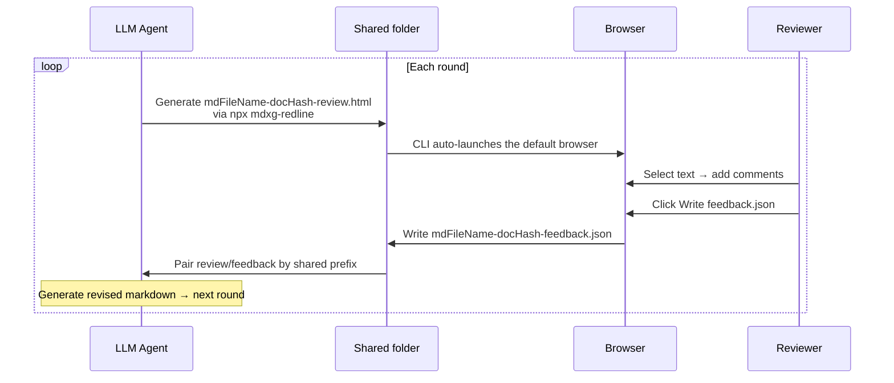

# MDXG Redline

[](./README.md)
[](./README_ja.md)

**MDXG-compliant markdown review tool — runs as a single standalone HTML file, exports review comments as structured JSON for LLM agents.**

> Third-party implementation of [vercel-labs/mdxg](https://github.com/vercel-labs/mdxg). Conforms to the MDXG specification, but is not affiliated with Vercel Labs or the upstream repository.

MDXG Redline is a browser tool that lets an LLM agent receive feedback on long-form markdown from a human reviewer as **location-aware structured JSON instead of free-form prose**. Sitting between LLM agents and human reviewers, it replaces the ambiguous "paste markdown, receive prose feedback" loop with a **machine-readable feedback artifact**.

End users only need a **single HTML file** (`standalone.html`). No server, no extra installation, zero outbound traffic from LLM content by default.

## Features

- **Location-aware inline comments**: Select any text range, leave a comment, and export JSON that pinpoints each comment with `headingPath` and `sourceLine`
- **Single-file HTML usage (standalone build)**: All dependencies including the syntax highlighter (Shiki) and Diagram Rendering (Mermaid) are inlined — no CDN references
- **CLI usage (`npx mdxg-redline`)**: Designed for LLM-to-human markdown review workflows (e.g. via agent skills). Unlike the standalone build, only the dependencies the target markdown actually uses get inlined, keeping the artifact size minimal
- **Read-only**: Rendering conforms to [MDXG Viewer](https://github.com/vercel-labs/mdxg), the read-only renderer profile of the Markdown Experience Guidelines
- **Virtual Pages (Stacked View)**: H1 / H2 boundaries split the document into paper-like sheets stacked vertically; the entire document can be read end-to-end with a single scroll gesture (Word / Pages style)
- **WASD keyboard navigation**: `a / w / s / d / e / f` cover pane movement, scrolling, activation, and search entirely with the left hand
- **Syntax highlighting**: Fenced code blocks render for all Shiki-bundled languages (~235 grammars)
- **Mermaid support**: ` ```mermaid ` blocks render as SVG
- **Swappable markdown preview stylesheet**: Replace the body preview CSS with your own via the CLI `--markdown-css <path>` flag

## Usage

### Get `standalone.html`

Obtain `standalone.html` via either:

- **Download**: Grab `standalone.html` directly from GitHub Releases (no install required)
- **npm**: `npm install mdxg-redline` and use `node_modules/mdxg-redline/dist/standalone.html`

The companion `dist/embed-template.html` is **only** used by the `mdxg-redline` CLI as a rewrite template — end users do not need to open it directly (it has no syntax highlighting grammars inlined, by design, so all code blocks would render as plain text). Always open `standalone.html` for single-file usage.

### Quickest path

Open `standalone.html` in your browser, load markdown via `Open file`, select text → `＋ Comment` to leave a comment, then `Comments ▾ → Copy as JSON` to hand it back.

### Generate and open a review request with `npx mdxg-redline`

When an LLM agent needs to request a review from a human, or for one-off reviews of a single local markdown file, the bundled CLI builds a review HTML with the markdown already embedded and opens it in your default browser.

```bash
npx mdxg-redline <input.md>                                # writes alongside input.md and opens browser
npx mdxg-redline <input.md> ./reviews                      # writes into ./reviews
npx mdxg-redline --no-open <input.md>                      # generate only, do not open browser
cat spec.md | npx mdxg-redline - --document-name spec.md   # read markdown from stdin
npx mdxg-redline --help                                    # print full usage and exit
```

#### Options

| Option                                   | Description                                                                                                                                                                                                                                                     | Default              |
| ---------------------------------------- | --------------------------------------------------------------------------------------------------------------------------------------------------------------------------------------------------------------------------------------------------------------- | -------------------- |
| `--no-open`                              | Suppress browser launch. The output path is always printed to stdout so CI scripts and agents can capture it                                                                                                                                                    | (launches browser)   |
| `--document-name <name>`                 | Override the document name (used for the `data-name` attribute and the output filename prefix). Recommended when reading from stdin to get a meaningful filename                                                                                                | input MD basename    |
| `--theme <system\|light\|dark>`          | Initial theme hint for the generated HTML (`<html data-theme>`)                                                                                                                                                                                                 | unset                |
| `--comments-width <0\|280-640>`          | Initial width of the comments panel (px). `0` starts with the panel closed (only the right edge tab visible)                                                                                                                                                    | `360` / open         |
| `--page-nav-width <0\|180-480>`          | Initial width of the left pages panel (px). `0` starts with the panel closed (only the left edge tab visible)                                                                                                                                                   | `220` / open         |
| `--shiki-langs <auto\|all\|none\|<csv>>` | Shiki grammar injection mode. `auto` scans the markdown for fenced languages, `all` injects all 27, `none` skips injection (plain text fallback), `<csv>` takes a list like `ts,js,py`                                                                          | `auto`               |
| `--markdown-css <path>`                  | Replace the markdown preview stylesheet. Only the `<style id="markdown-css">` block inside the distributed HTML is swapped; layout / chrome (review.css) is untouched. Author rules under the `#doc` scope. See `dist/markdown.sample.css` for a starting point | bundled markdown.css |
| `--help`                                 | Print the usage help and exit                                                                                                                                                                                                                                   | —                    |

**UI hint precedence**: Values written by `--theme` / `--comments-width` / `--page-nav-width` are evaluated by the receiving inline script as **`localStorage` (the user's UI interaction history) > CLI hint > default (`prefers-color-scheme` / default width)**. When the CLI option is omitted, the attribute itself is not emitted and the default decision path runs unchanged.

#### Output

- Filename is auto-derived as `<input-md-basename>-<docHash>-review.html` (per §8 file-naming protocol)
- `output-dir` defaults to the input's directory (or cwd when reading from stdin)

#### Browser launch

- By default the CLI launches the system browser via `$BROWSER` → `open` (macOS) → `xdg-open` (Linux) → `cmd.exe /c start` (Windows), in that order
- When VS Code Remote Containers / Codespaces is detected, the CLI instead starts a tiny HTTP server on `127.0.0.1` at port `51729` (override with `MDXG_REDLINE_PORT`) and hands the host browser an `http://localhost:<port>/...` URL (since `file://` paths in the container are invisible to the host). If the preferred port is busy, the CLI falls back to a random port and prints a warning to stderr — **note that random ports may not be forwarded to the host browser if `forwardPorts` is not set to `auto`, so pin a known-free `MDXG_REDLINE_PORT` (or register it in `devcontainer.json` `forwardPorts`) for reliable host access**

Requires Node.js 20+ (see `engines.node` in `package.json`)

See [docs/DESIGN.md §3 User flow](docs/DESIGN.md#3-ユーザーフロー) and [§8 Workspace protocol](docs/DESIGN.md#8-ワークスペースプロトコル) for escape handling and the file-naming protocol.

### Standard loop between an LLM agent and a reviewer (Chromium-based browsers recommended)

For workflows where an agent and a reviewer iterate multiple times on the same machine.



1. The agent runs `npx mdxg-redline <input.md> <folder>` to generate `<mdFileName>-<docHash>-review.html` in a shared folder (`mdFileName` is the basename with the `.md` / `.markdown` extension stripped; `docHash` is the first 16 hex chars of SHA-256 over the markdown body)
2. The CLI launches the default browser with that HTML. The reviewer writes comments
3. The reviewer clicks `Write feedback.json` (split button in the comments panel). On first use, a picker prompts for the output folder and the handle is persisted to IndexedDB; subsequent clicks write to the same folder without re-prompting
4. `<mdFileName>-<docHash>-feedback.json` is written into the same folder (sharing the same `<mdFileName>` / `<docHash>` as the source review HTML, so pairs can be matched mechanically)
5. The agent reads the matching feedback.json, prepares a revised markdown, and starts the next round with `npx mdxg-redline <input2.md> <folder>` — repeat

`Write feedback.json` relies on the File System Access API, so only Chromium-based browsers (Chrome / Edge / Arc / Brave / Opera) support it. On Safari / Firefox, fall back to `Comments ▾ → Export as JSON` (download) or `Copy as JSON` (clipboard).

See [docs/DESIGN.md §8 Workspace Protocol](docs/DESIGN.md#8-ワークスペースプロトコル) for the full file-naming protocol and lifecycle.

## Keyboard shortcuts

A WASD-based global keymap lets you drive the entire UI with the left hand only. All shortcuts are single keys without modifiers, so no browser-native shortcut (`Cmd/Ctrl+F` etc.) is overridden.

| Key       | Action                                                                             |
| --------- | ---------------------------------------------------------------------------------- |
| `a` / `d` | Move focus to the previous / next pane (TOC ↔ doc ↔ comments, cycles at both ends) |
| `w` / `s` | Move focus up / down within the current pane (line scroll in the doc pane)         |
| `e`       | Activate the focused item (same as `Enter` / click)                                |
| `f`       | Open the in-document search                                                        |
| `h`       | Open the keyboard shortcuts help                                                   |
| `Esc`     | Close any open modal, menu, or search                                              |

`↑↓` / `Home` / `End` / `Enter` continue to work in parallel for MDXG §13 compliance. When focus is in a text field (search box, comment editor), single-letter shortcuts are bypassed so typing is never disturbed.

See [docs/DESIGN.md §13 Keyboard Navigation](docs/DESIGN.md#13-keyboard-navigationキーボードナビゲーション) for the full affordance design (focus visualization, dispatch table, etc.).

## Output JSON

```jsonc
{
  "document": "spec.md",
  "docHash": "a1b2c3d4e5f6a7b8",
  "exportedAt": "2026-05-15T10:30:00.000Z",
  "comments": [
    {
      "id": "a1b2c3d4",
      "quote": "the selected text",
      "comment": "This assumes X but X is never defined",
      "created": "2026-05-15T10:28:11.000Z",
      "headingPath": ["## 3. Input and Output Paths"],
      "sourceLine": 42,
    },
  ],
}
```

## Excluding generated artifacts from git

When the output directory (the CLI's `output-dir` or the folder chosen via `Write feedback.json`) lives inside a git repository, add the following patterns to `.gitignore` so that review artifacts are not accidentally committed:

```gitignore
*-review.html
*-feedback.json
```

## MDXG compliance status

The [Markdown Experience Guidelines (MDXG)](https://github.com/vercel-labs/mdxg) are currently a preview specification and may change. MDXG Redline embeds an **MDXG Viewer** (the read-only rendering conformance level) and layers inline commenting and structured feedback JSON export on top of it as review-specific features. Viewer features are being adopted incrementally.

| MDXG section             | Required level | Current status                                                                           |
| ------------------------ | -------------- | ---------------------------------------------------------------------------------------- |
| §1 Theming               | MUST (Viewer)  | Compliant (DADS theme + 3-state toggle following `prefers-color-scheme`)                 |
| §2 Code Block Rendering  | MUST (Viewer)  | Compliant (Shiki dual theme over all bundled languages (~235), copy button per block)    |
| §3 Task Lists            | MUST (Viewer)  | Supported via marked defaults                                                            |
| §4 Images                | MUST (Viewer)  | Partial (relative image paths not resolved due to the trust boundary)                    |
| §5 Tables                | MUST (Viewer)  | Compliant (horizontal scrolling supported)                                               |
| §6 Virtual Pages         | MUST (Viewer)  | Compliant (H1 / H2 boundary split, ATX / setext forms, code-fence tracking)              |
| §7 Page Navigation       | MUST (Viewer)  | Compliant (Stacked View with all pages stacked vertically, left TOC + page scroll-spy)   |
| §8 Page Outline          | MUST (Viewer)  | Compliant (H3–H6 inline outline under the active page + IntersectionObserver scroll-spy) |
| §9 Sequential Navigation | MUST (Viewer)  | Compliant (Prev / Next row integrated into the left TOC header, hidden at boundaries)    |
| §10 Search               | MUST (Viewer)  | Compliant (`f` opens an in-document search bar with debounced live highlighting)         |
| §13 Keyboard Navigation  | MUST (Viewer)  | Compliant (WASD-based left-hand keymap + MDXG-required arrow / Enter / Home/End)         |

For the roadmap ahead, see [docs/DESIGN.md §12 MDXG compliance roadmap and future extensions](docs/DESIGN.md#12-mdxg-準拠ロードマップ今後の拡張).

## Development

The build tool is [Vite+ (vp)](https://viteplus.dev/), installed via npm (`vite-plus`) as a dev dependency. The devcontainer and `local_setup.sh` handle setup, so using those is the fastest path for local development.

```bash
npm ci
npm run build                  # Generates dist/standalone.html, dist/embed-template.html, and dist/review-request.mjs
npm run build:review-request   # = vp build --config vite.review-request.config.ts  rebuilds the review-request CLI only
npm run build:watch # = vp build --watch  rebuilds the HTML outputs on file changes
npm run dev         # = vp dev           dev server with HMR
npm test            # = vp test          runs in-source tests
```

`npm ci` will install `vp` locally from `vite-plus`.

## License

MIT
