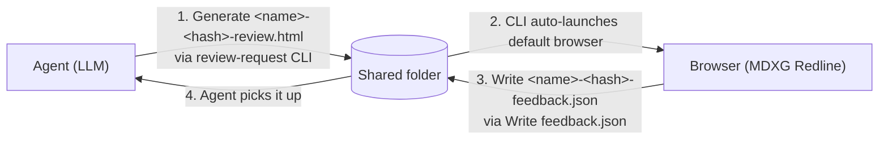

# MDXG Redline

[](https://mdxg-redline.pages.dev/?url=https%3A%2F%2Fraw.githubusercontent.com%2Foubakiou%2Fmdxg-redline%2Frefs%2Fheads%2Fmain%2FREADME.md#p:mdxg-redline)
[](https://www.npmjs.com/package/mdxg-redline)

[](./README.md)
[](./README_ja.md)

**MDXG-compliant markdown review tool — runs as a single standalone HTML file, exports review comments as structured JSON for LLM agents.**

> Third-party implementation of [vercel-labs/mdxg](https://github.com/vercel-labs/mdxg). Conforms to the MDXG specification, but is not affiliated with Vercel Labs or the upstream repository.

https://github.com/user-attachments/assets/d40ccab2-c7fd-4321-aefc-3e42cc5df9af

MDXG Redline is a browser tool that lets an LLM agent receive feedback on long-form markdown from a human reviewer as **location-aware structured JSON instead of free-form prose**. Sitting between LLM agents and human reviewers, it replaces the ambiguous "paste markdown, receive prose feedback" loop with a **machine-readable feedback artifact**.

End users only need a **single HTML file** (`standalone.html`). No server, no extra installation, zero outbound traffic from LLM content by default.

## Features

- **Location-aware inline comments**: Select any text range, leave a comment, and export JSON that pinpoints each comment with `headingPath` and `sourceLine`
- **Single-file HTML usage (standalone build)**: All dependencies including the syntax highlighter (Shiki) and Diagram Rendering (Mermaid) are inlined — no CDN references
- **CLI usage (`npx mdxg-redline`)**: Designed for LLM-to-human markdown review workflows (e.g. via agent skills). Unlike the standalone build, only the dependencies the target markdown actually uses get inlined, keeping the artifact size minimal
- **Read-only**: Rendering conforms to [MDXG Viewer](https://github.com/vercel-labs/mdxg), the read-only renderer profile of the Markdown Experience Guidelines
- **Virtual Pages (Stacked View)**: H1 / H2 boundaries split the document into paper-like sheets stacked vertically; the entire document can be read end-to-end with a single scroll gesture (Word / Pages style)
- **WASD keyboard navigation**: `a / w / s / d / e / f` cover pane movement, scrolling, activation, and search entirely with the left hand
- **Syntax highlighting**: Fenced code blocks render for all Shiki-bundled languages (~235 grammars)
- **Mermaid support**: ` ```mermaid ` blocks render as SVG
- **Math rendering**: write math with `$...$` / `$$...$$` syntax like `$i\hbar \frac{\partial}{\partial t}\Psi(\mathbf{r}, t) = \hat{H}\Psi(\mathbf{r}, t)$`, rendered via KaTeX as $i\hbar \frac{\partial}{\partial t}\Psi(\mathbf{r}, t) = \hat{H}\Psi(\mathbf{r}, t)$.
- **Footnotes**: GitHub Flavored Markdown footnote syntax — inline references like `text with reference[^note]` plus definitions like `[^note]: footnote body` at the end of the document. Footnotes embedded in body text[^readme-fn-example] are automatically gathered into a "Footnotes" section at the end of the page.
- **Swappable markdown preview stylesheet**: Replace the body preview CSS with your own via the CLI `--markdown-css <path>` flag

## Usage

### Online edition

Open [`https://mdxg-redline.pages.dev/`](https://mdxg-redline.pages.dev/) in your browser and enter the markdown URL via the toolbar "Open URL" button. Alternatively, bootstrap directly with `?url=<encodeURIComponent(markdown URL)>`. Example: [view this README in the online viewer](https://mdxg-redline.pages.dev/?url=https%3A%2F%2Fraw.githubusercontent.com%2Foubakiou%2Fmdxg-redline%2Frefs%2Fheads%2Fmain%2FREADME.md#p:mdxg-redline).

Allowed fetch hosts are restricted to `raw.githubusercontent.com` and `gist.githubusercontent.com` (CSP `connect-src` allowlist). If you self-host, extend the allowlist via the `MDXG_ONLINE_CONNECT_SRC` environment variable (see [docs/feature-online-runtime-assets.md](docs/feature-online-runtime-assets.md)).

### Standalone build

Download `standalone.html` from [GitHub Releases](https://github.com/oubakiou/mdxg-redline/releases) and open it in your browser.

### CLI (recommended)

#### When a human invokes the CLI directly

```bash
npx mdxg-redline path/to/draft.md                        # generate review.html in the same directory and open it
npx mdxg-redline path/to/draft.md ./reviews              # when you want a separate output-dir
npx mdxg-redline --comments-width 0 path/to/draft.md     # hide the comments panel and open as a plain markdown viewer
```

#### When an LLM invokes the CLI via a skill

```bash
# Skill installation example with gh skill install
gh skill install oubakiou/mdxg-redline md-review --agent claude-code --scope project

# Skill installation example with npx skills add
npx skills add oubakiou/mdxg-redline --skill md-review --agent claude-code --yes
```

An LLM agent (e.g. Claude Code) invokes this CLI through the `md-review` skill, ping-ponging markdown between the agent and the reviewer. Each round: the agent generates the review HTML → the reviewer comments → feedback.json is written out → the agent picks it up.



`Write feedback.json` relies on the File System Access API, so only Chromium-based browsers (Chrome / Edge / Arc / Brave / Opera) support it. On Safari / Firefox, fall back to `Comments ▾ → Export as JSON` (download) or `Copy as JSON` (clipboard).

#### CLI options

| Option                                   | Description                                                                                                                                                                                                                                                     | Default              |
| ---------------------------------------- | --------------------------------------------------------------------------------------------------------------------------------------------------------------------------------------------------------------------------------------------------------------- | -------------------- |
| `--no-open`                              | Suppress browser launch. The output path is always printed to stdout so CI scripts and agents can capture it                                                                                                                                                    | (launches browser)   |
| `--show-open-file`                       | Keep the `Open file` button visible in the generated HTML's header. Hidden by default (prevents accidentally loading a different markdown, which would discard the current comments)                                                                            | hidden               |
| `--document-name <name>`                 | Override the document name (used for the `data-name` attribute and the output filename prefix). Recommended when reading from stdin to get a meaningful filename                                                                                                | input MD basename    |
| `--theme <system\|light\|dark>`          | Initial theme hint for the generated HTML (`<html data-theme>`)                                                                                                                                                                                                 | unset                |
| `--comments-width <0\|280-640>`          | Initial width of the comments panel (px). `0` starts with the panel closed (only the right edge tab visible)                                                                                                                                                    | `360` / open         |
| `--page-nav-width <0\|180-480>`          | Initial width of the left pages panel (px). `0` starts with the panel closed (only the left edge tab visible)                                                                                                                                                   | `220` / open         |
| `--shiki-langs <auto\|all\|none\|<csv>>` | Shiki grammar injection mode. `auto` scans the markdown for fenced languages, `all` injects all bundled grammars (~235, ~5.5 MB gzipped), `none` skips injection (plain text fallback), `<csv>` takes a list like `ts,js,py`                                    | `auto`               |
| `--mermaid <auto\|on\|off>`              | Mermaid runtime injection mode. `auto` injects only if the markdown has at least one ` ```mermaid ` block, `on` always injects, `off` never injects (Shiki-highlighted fallback). Approx. +700 KB gzipped when injected                                         | `auto`               |
| `--math <auto\|on\|off>`                 | KaTeX runtime injection mode. `auto` injects only if the markdown has at least one `$...$` / `$$...$$` expression, `on` always injects, `off` never injects (raw plain text)                                                                                    | `auto`               |
| `--math-fonts <minimal\|all>`            | Font coverage when KaTeX is injected. `minimal` is 9 families (approx. +250 KB gzipped), `all` is 20 families including `\mathcal` / `\mathfrak` / `\mathscr` etc. (approx. +340 KB). Ignored when `--math off`                                                 | `minimal`            |
| `--markdown-css <path>`                  | Replace the markdown preview stylesheet. Only the `<style id="markdown-css">` block inside the distributed HTML is swapped; layout / chrome (review.css) is untouched. Author rules under the `#doc` scope. See `dist/markdown.sample.css` for a starting point | bundled markdown.css |
| `--help`                                 | Print the usage help and exit                                                                                                                                                                                                                                   | —                    |

Option examples:

```bash
npx mdxg-redline <input.md> ./reviews                      # writes into ./reviews
npx mdxg-redline --no-open <input.md>                      # generate only, do not open browser
cat spec.md | npx mdxg-redline - --document-name spec.md   # read markdown from stdin
npx mdxg-redline --help                                    # print full usage and exit
```

#### Browser auto-launch

- By default the CLI launches the system browser via `$BROWSER` → `open` (macOS) → `xdg-open` (Linux) → `cmd.exe /c start` (Windows), in that order
- When VS Code Remote Containers / Codespaces is detected, the CLI instead starts a tiny HTTP server on `127.0.0.1` at port `51729` (override with `MDXG_REDLINE_PORT`) and hands the host browser an `http://localhost:<port>/...` URL (since `file://` paths in the container are invisible to the host). If the preferred port is busy, the CLI falls back to a random port and prints a warning to stderr — **note that random ports may not be forwarded to the host browser if `forwardPorts` is not set to `auto`, so pin a known-free `MDXG_REDLINE_PORT` (or register it in `devcontainer.json` `forwardPorts`) for reliable host access**

#### Generated artifacts

- The review HTML filename is auto-derived as `<input-md-basename>-<docHash>-review.html` (per §8 file-naming protocol)
- The feedback JSON written by the reviewer is `<input-md-basename>-<docHash>-feedback.json`. It shares the same prefix as the review HTML, so pairs match mechanically
- `output-dir` defaults to the input's directory (or cwd when reading from stdin)

#### Cleanup of generated artifacts

Bulk-remove the review / feedback pairs that accumulate in a distribution folder with the `--clean` subcommand.

```bash
npx mdxg-redline --clean               # target the current directory (dry-run)
npx mdxg-redline --clean <dir>         # list deletion candidates (dry-run)
npx mdxg-redline --clean <dir> --yes   # actually delete
npx mdxg-redline --clean <dir> -r      # also descend into subdirectories
```

| Option              | Description                                                                                             | Default        |
| ------------------- | ------------------------------------------------------------------------------------------------------- | -------------- |
| `--clean [dir]`     | Target `*-<docHash>-review.html` / `*-<docHash>-feedback.json` directly under `<dir>` (defaults to cwd) | —              |
| `--yes`             | Perform the deletion (without it, runs as a dry-run that only lists candidates)                         | dry-run        |
| `-r`, `--recursive` | With `--clean`, also descend into subdirectories                                                        | top level only |
| `--keep <docHash>`  | Preserve the pair for the given 16-hex docHash (may be repeated)                                        | —              |

#### Excluding generated artifacts from git

When the output directory (the CLI's `output-dir` or the folder chosen via `Write feedback.json`) lives inside a git repository, add the following patterns to `.gitignore` so that review artifacts are not accidentally committed:

```gitignore
*-review.html
*-feedback.json
```

### Keyboard shortcuts

A WASD-based global keymap lets you drive the entire UI with the left hand only. All shortcuts are single keys without modifiers, so no browser-native shortcut (`Cmd/Ctrl+F` etc.) is overridden.

| Key                                  | Action                                                                             |
| ------------------------------------ | ---------------------------------------------------------------------------------- |
| `a` / `d`                            | Move focus to the previous / next pane (TOC ↔ doc ↔ comments, cycles at both ends) |
| `w` / `s`                            | Move focus up / down within the current pane (line scroll in the doc pane)         |
| `e`                                  | Activate the focused item (same as `Enter` / click)                                |
| `f`                                  | Open the in-document search                                                        |
| `h`                                  | Open the keyboard shortcuts help                                                   |
| `Esc`                                | Close any open modal, menu, or search                                              |
| `↑` / `↓` / `Home` / `End` / `Enter` | Work in parallel for MDXG §13 compliance (in-pane movement / activate)             |

## MDXG compliance status

The [Markdown Experience Guidelines (MDXG)](https://github.com/vercel-labs/mdxg) are currently a preview specification and may change. MDXG Redline embeds an **MDXG Viewer** (the read-only rendering conformance level) and layers inline commenting and structured feedback JSON export on top of it as review-specific features. Viewer features are being adopted incrementally.

| MDXG section             | Required level | Current status |
| ------------------------ | -------------- | -------------- |
| §1 Theming               | MUST (Viewer)  | Compliant      |
| §2 Code Block Rendering  | MUST (Viewer)  | Compliant      |
| §3 Task Lists            | MUST (Viewer)  | Compliant      |
| §4 Images                | MUST (Viewer)  | Partial        |
| §5 Tables                | MUST (Viewer)  | Compliant      |
| §6 Virtual Pages         | MUST (Viewer)  | Compliant      |
| §7 Page Navigation       | MUST (Viewer)  | Compliant      |
| §8 Page Outline          | MUST (Viewer)  | Compliant      |
| §9 Sequential Navigation | MUST (Viewer)  | Compliant      |
| §10 Search               | MUST (Viewer)  | Compliant      |
| §13 Keyboard Navigation  | MUST (Viewer)  | Compliant      |
| §14 Math Rendering       | SHOULD (Ext.)  | Compliant      |
| §15 Diagram Rendering    | SHOULD (Ext.)  | Compliant      |
| §16 Footnotes            | SHOULD (Ext.)  | Compliant      |

For the roadmap ahead, see [docs/DESIGN.md §12 MDXG compliance roadmap and future extensions](docs/DESIGN.md#12-mdxg-準拠ロードマップ今後の拡張).

## Development

The build tool is [Vite+ (vp)](https://viteplus.dev/), installed via npm (`vite-plus`) as a dev dependency. The devcontainer and `local_setup.sh` handle setup, so using those is the fastest path for local development.

`vp build` is the shortest command and only produces the main build artifacts (`dist/standalone.html` / `dist/embed-template.html`). To produce the full distribution set (mermaid runtime, KaTeX runtime, and the review-request CLI as well), run `npm run build`.

```bash
vp build        # Generates only dist/standalone.html and dist/embed-template.html (shortest)
npm run build   # Generates the full distribution (mermaid / katex / standalone / embed-template / review-request)
vp check --fix  # Runs format / lint / type checks together (--fix auto-fixes)
vp test         # Runs in-source tests
```

Design intent, structure, and trade-offs are documented in the design document [docs/DESIGN.md](docs/DESIGN.md). Table of contents:

- [1. Overview](docs/DESIGN.md#1-概要)
- [2. Constraints](docs/DESIGN.md#2-制約)
- [3. User flow](docs/DESIGN.md#3-ユーザーフロー)
- [4. Architecture](docs/DESIGN.md#4-アーキテクチャ)
- [5. Data model](docs/DESIGN.md#5-データモデル)
- [6. Comment anchoring](docs/DESIGN.md#6-コメントのアンカリング)
- [7. Persistence layer](docs/DESIGN.md#7-永続化レイヤー)
- [8. Workspace protocol](docs/DESIGN.md#8-ワークスペースプロトコル)
- [9. Boot sequence](docs/DESIGN.md#9-起動シーケンス)
- [10. Browser compatibility](docs/DESIGN.md#10-ブラウザ互換性)
- [11. Security and privacy](docs/DESIGN.md#11-セキュリティとプライバシー)
- [12. MDXG compliance roadmap and future extensions](docs/DESIGN.md#12-mdxg-準拠ロードマップ今後の拡張)
- [13. Build pipeline](docs/DESIGN.md#13-ビルドパイプライン)

## License

MIT

[^readme-fn-example]: This is an actual footnote that renders inside the README. It ends up in the same "Footnotes" section both on GitHub and inside MDXG Redline.
