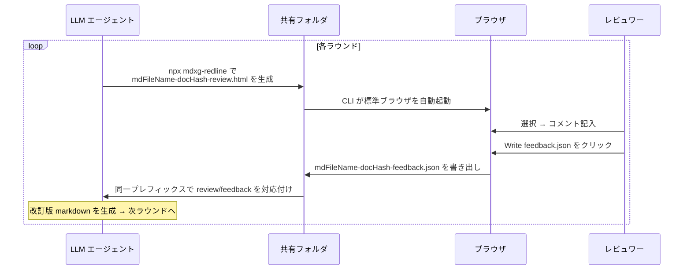

# MDXG Redline

[](./README.md)
[](./README_ja.md)

**MDXG に準拠した markdown レビューツール — 単一 HTML ファイルだけで動作し、レビューコメントを構造化 JSON として書き出して LLM エージェントに引き渡す。**

> [vercel-labs/mdxg](https://github.com/vercel-labs/mdxg) のサードパーティ実装です。規格としての MDXG に準拠しますが、Vercel Labs / 本家リポジトリとは無関係です。

MDXG Redline は、LLM エージェントが人間レビュワーから「長文 markdown に対するフィードバック」を **散文の感想ではなく位置情報付きの構造化 JSON** として受け取るためのブラウザツールです。LLM エージェントと人間レビュワーの間に立ち、「markdown を貼って、散文のフィードバックを受け取る」という曖昧なループを、**機械可読なフィードバック成果物** に置き換えます。

エンドユーザーには **単一 HTML ファイル**（`standalone.html`）を配布するだけで動きます。サーバー不要・追加インストール不要・ LLM コンテンツ起点での外部通信ゼロ。

## 特徴

- **位置情報付きインラインコメント**: 任意のテキスト範囲を選択してコメントを残し、`headingPath` と `sourceLine` で位置を特定できる JSON を出力
- **単一 HTML 配布**: `marked` / Shiki core+JS engine+2 テーマを含む全依存を inline、CDN 参照なし
- **2 つの入力経路**: HTML への事前注入（埋め込み） / ブラウザでのファイル選択
- **読み取り専用**: 原文 markdown を改変しない
- **Virtual Pages (Stacked View)**: H1 / H2 で区切られたページを縦に紙シート状に並べて連続スクロール (Word / Pages 風)。左サイドバー TOC + 現在ページ配下の H3–H6 outline + Prev/Next で MDXG §6–§9 に準拠
- **シンタックスハイライト**: Shiki (`github-light` + `github-dark`) で 27 言語のフェンスコードを描画、コードブロックには Copy button を動的注入
- **両サイドバー幅可変**: 左 TOC (180–480px) と右 Conversation (280–640px) は独立にドラッグでリサイズ + 開閉可能。状態は `localStorage` に保存、配布側は `--page-nav-width` / `--comments-width` ヒントで初期値を指定可能
- **ライト / ダーク両対応**: `prefers-color-scheme` を初期値に、toolbar の 3 状態トグルで `system → light → dark` を循環。設定は `localStorage` に保存され、配布側は `--theme` ヒントで初期値を指定可能

## 使い方

### 入手

以下のいずれかで `standalone.html` を入手します:

- **ダウンロード**: GitHub Releases から `standalone.html` を直接ダウンロード（インストール不要）
- **npm**: `npm install mdxg-redline` で取得し `node_modules/mdxg-redline/dist/standalone.html` を使用

同梱の `dist/embed-template.html` は **`mdxg-redline` CLI が rewrite 用テンプレートとして読み込む素材専用** で、エンドユーザーが直接開く用途は想定していません（grammar を inline していないため全コードブロックが plain text になります）。単独利用では必ず `standalone.html` を開いてください。

### 最短ルート

`standalone.html` をブラウザで開き、`Open file` で markdown を読み込み、選択 → `＋ Comment` でコメント → `Comments ▾ → Copy as JSON` で書き戻し。

### `npx mdxg-redline` でレビュー依頼用 HTML を生成して開く

LLM エージェントから人間にレビューを依頼する場合や、手元の markdown 1 ファイルを単発レビューしたい場合に、同梱 CLI で markdown を埋め込んだ HTML を生成してそのままブラウザで開けます。

```bash
npx mdxg-redline <input.md>                                # input.md と同じディレクトリに書き、ブラウザを起動
npx mdxg-redline <input.md> ./reviews                      # ./reviews に書き出す
npx mdxg-redline --no-open <input.md>                      # 生成のみ、ブラウザは起動しない
cat spec.md | npx mdxg-redline - --document-name spec.md   # stdin から markdown を読み込む
npx mdxg-redline --help                                    # 使い方ヘルプを表示
```

#### オプション

| オプション                               | 説明                                                                                                                                                                        | 既定値              |
| ---------------------------------------- | --------------------------------------------------------------------------------------------------------------------------------------------------------------------------- | ------------------- |
| `--no-open`                              | ブラウザの自動起動を抑止（出力パスは常に stdout に出るので CI / エージェントから拾える）                                                                                    | （起動する）        |
| `--document-name <name>`                 | docName（`data-name` 属性 / 出力ファイル名 prefix）を上書き。stdin 入力時に意味のあるファイル名を付けたい場合に推奨                                                         | 入力 MD の basename |
| `--theme <system\|light\|dark>`          | 配布 HTML 初回起動時のテーマヒント（`<html data-theme>`）                                                                                                                   | 未指定              |
| `--comments-width <0\|280-640>`          | コメントパネルの初期幅 (px)。`0` は closed 起動（画面右端の縦タブのみ表示）                                                                                                 | `360` / open        |
| `--page-nav-width <0\|180-480>`          | 左サイドバー (ページ TOC) の初期幅 (px)。`0` は closed 起動（画面左端の縦タブのみ表示）                                                                                     | `220` / open        |
| `--shiki-langs <auto\|all\|none\|<csv>>` | Shiki grammar の注入モード。`auto` は markdown 内のフェンス言語を自動抽出、`all` は 27 言語全部、`none` は注入しない（plain text fallback）、`<csv>` は `ts,js,py` 等を指定 | `auto`              |
| `--help`                                 | 使い方ヘルプを表示して終了                                                                                                                                                  | —                   |

**UI ヒントの優先順位**: `--theme` / `--comments-width` / `--page-nav-width` で配布 HTML に書き込まれる値は、受信側 inline script で **`localStorage`（ユーザーが UI 上で操作した履歴）> CLI ヒント > 既定値（`prefers-color-scheme` / 既定幅）** の順で評価される。CLI 未指定時はそもそも属性を出力せず既定挙動を保つ。

#### 出力

- ファイル名は `<入力 MD basename>-<docHash>-review.html` で自動決定（§8 ファイル命名規約）
- `output-dir` 省略時は入力 MD と同じディレクトリ（stdin 入力時は cwd）

#### ブラウザ起動

- 既定で `$BROWSER` → `open` (macOS) → `xdg-open` (Linux) → `cmd.exe /c start` (Windows) の優先順で標準ブラウザを起動
- VS Code Remote Containers / Codespaces 検知時のみ、`127.0.0.1` の `51729` 番ポートに軽量 HTTP サーバーを立ててホスト側ブラウザに転送する（`MDXG_REDLINE_PORT` で変更可）。`file://` がホストから見えない環境向けの fallback。衝突時はランダムポートへ fallback して stderr に警告を出すが、**ランダムポートは `forwardPorts: "auto"` 設定でないとホスト側ブラウザから到達できない可能性がある**ため、空きが確定しているポートを `MDXG_REDLINE_PORT` で固定するか、`devcontainer.json` の `forwardPorts` に登録するのが推奨

動作要件: Node.js 20+（`package.json` の `engines.node`）

詳細・エスケープ仕様・命名規約は [docs/DESIGN.md §3 ユーザーフロー](docs/DESIGN.md#3-ユーザーフロー) と [§8 ワークスペースプロトコル](docs/DESIGN.md#8-ワークスペースプロトコル) を参照。

### LLM エージェントとレビュワーの標準ループ（Chromium 系推奨）

エージェントとレビュワーが同一マシンで複数往復するワークフロー用。



1. エージェントが `npx mdxg-redline <input.md> <folder>` で `<mdFileName>-<docHash>-review.html` をワークスペースフォルダに生成する（`mdFileName` は元 MD basename から `.md` / `.markdown` 拡張子を除いたもの、`docHash` は本文 SHA-256 の先頭 16 桁 hex）
2. CLI が標準ブラウザで HTML を自動起動。レビュワーがコメントを記入する
3. コメントパネルの `Write feedback.json` ボタン（split button）をクリック。初回は出力先フォルダを picker で選択し、IndexedDB に永続化。2 回目以降は picker 無しで同じフォルダに書き出される
4. 同じフォルダに `<mdFileName>-<docHash>-feedback.json` が書き出される（元レビュー HTML と同じ `<mdFileName>` / `<docHash>` を共有するため対応関係が機械的に決まる）
5. エージェントが対応する feedback.json を読み、改訂版を `npx mdxg-redline <input2.md> <folder>` で次ラウンドの HTML を生成 → ループ継続

`Write feedback.json` は File System Access API を使うため Chromium 系（Chrome / Edge / Arc / Brave / Opera）のみ対応。Safari / Firefox では代替として `Comments ▾ → Export as JSON` でダウンロード、または `Copy as JSON` でクリップボード経由のフィードバック授受になる。

ファイル命名規約と詳細フローは [docs/DESIGN.md §8 ワークスペースプロトコル](docs/DESIGN.md#8-ワークスペースプロトコル) を参照。

## 出力 JSON

```jsonc
{
  "document": "spec.md",
  "docHash": "a1b2c3d4e5f6a7b8",
  "exportedAt": "2026-05-15T10:30:00.000Z",
  "comments": [
    {
      "id": "a1b2c3d4",
      "quote": "選択された箇所",
      "comment": "ここはXを前提にしているが定義がない",
      "created": "2026-05-15T10:28:11.000Z",
      "headingPath": ["## 3. 入力経路と出力経路"],
      "sourceLine": 42,
    },
  ],
}
```

## 生成物を git 管理から除外する

生成物の書き出し先（CLI の `output-dir` や `Write feedback.json` で選んだフォルダ）が git 管理下にある場合、`.gitignore` に次のパターンを追加するとレビュー成果物の誤コミットを防げる。

```gitignore
*-review.html
*-feedback.json
```

## MDXG 準拠状況

[Markdown Experience Guidelines (MDXG)](https://github.com/vercel-labs/mdxg) は現在プレビュー版で、仕様は今後変更される可能性があります。MDXG Redline は **MDXG Viewer**（読み取り専用のレンダラ準拠レベル）を内蔵し、その上にインラインコメントと構造化フィードバック JSON の書き出しというレビュー機能を載せたツールです。Viewer の各機能は段階的に取り込み中です。

| MDXG セクション          | 必須レベル    | 現状                                                                                   |
| ------------------------ | ------------- | -------------------------------------------------------------------------------------- |
| §1 Theming               | MUST (Viewer) | 準拠（DADS テーマ + 3 状態テーマ切替で `prefers-color-scheme` 追従）                   |
| §2 Code Block Rendering  | MUST (Viewer) | 準拠（Shiki dual theme で 27 言語ハイライト、Copy button 動的注入）                    |
| §3 Task Lists            | MUST (Viewer) | marked デフォルトで対応                                                                |
| §4 Images                | MUST (Viewer) | 部分（相対画像パスは信頼境界の都合で未対応）                                           |
| §5 Tables                | MUST (Viewer) | 準拠（水平スクロール対応）                                                             |
| §6 Virtual Pages         | MUST (Viewer) | 準拠（H1 / H2 境界分割、ATX / setext 両形式、コードフェンス追跡）                      |
| §7 Page Navigation       | MUST (Viewer) | 準拠（Stacked View で全 page を縦に並べ、左 TOC + page scroll-spy で追従）             |
| §8 Page Outline          | MUST (Viewer) | 準拠（active page 配下に H3–H6 inline 展開 + IntersectionObserver でスクロールスパイ） |
| §9 Sequential Navigation | MUST (Viewer) | 準拠（左 TOC 上部に Prev / Next row を統合、最初 / 最後ページで該当方向を omit）       |
| §10 Search               | MUST (Viewer) | 未対応                                                                                 |
| §13 Keyboard Navigation  | MUST (Viewer) | 部分対応（アクセシブル名は網羅監査済み、ページナビ系のキーボード操作は未対応）         |

今後のロードマップは [docs/DESIGN.md §12 MDXG 準拠ロードマップ・今後の拡張](docs/DESIGN.md#12-mdxg-準拠ロードマップ今後の拡張) を参照。

## 開発

ビルドツールは [Vite+ (vp)](https://viteplus.dev/) を使用し、npm の devDependency（`vite-plus`）として導入しています。devcontainer / `local_setup.sh` がセットアップを担当するので、ローカル開発時はそれらを利用するのが最短です。

```bash
npm ci
npm run build                # dist/standalone.html / dist/embed-template.html / dist/review-request.mjs を生成
npm run build:review-request # = vp build --config vite.review-request.config.ts  review-request CLI のみ差分ビルド
npm run build:watch          # = vp build --watch  ファイル変更で HTML 出力を自動再ビルド
npm run dev                  # = vp dev           HMR 付き dev サーバー
npm test                     # = vp test          in-source tests を実行
```

`npm ci` で `vite-plus` 由来の `vp` がローカルに導入されます。

## ライセンス

MIT
