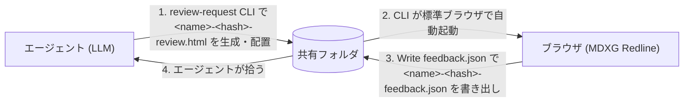

# MDXG Redline

[](https://www.npmjs.com/package/mdxg-redline)

[](./README.md)
[](./README_ja.md)

**MDXG に準拠した markdown レビューツール — 単一 HTML ファイルだけで動作し、レビューコメントを構造化 JSON として書き出して LLM エージェントに引き渡す。**

> [vercel-labs/mdxg](https://github.com/vercel-labs/mdxg) のサードパーティ実装です。規格としての MDXG に準拠しますが、Vercel Labs / 本家リポジトリとは無関係です。

https://github.com/user-attachments/assets/d40ccab2-c7fd-4321-aefc-3e42cc5df9af

MDXG Redline は、LLM エージェントが人間レビュワーから「長文 markdown に対するフィードバック」を **散文の感想ではなく位置情報付きの構造化 JSON** として受け取るためのブラウザツールです。LLM エージェントと人間レビュワーの間に立ち、「markdown を貼って、散文のフィードバックを受け取る」という曖昧なループを、**機械可読なフィードバック成果物** に置き換えます。

エンドユーザーには **単一 HTML ファイル**（`standalone.html`）を配布するだけで動きます。サーバー不要・追加インストール不要・ LLM コンテンツ起点での外部通信ゼロ。

## 特徴

- **位置情報付きインラインコメント**: 任意のテキスト範囲を選択してコメントを残し、`headingPath` と `sourceLine` で位置を特定できる JSON を出力
- **単一 HTML での利用 (standalone 版)**: Syntax highlighter (Shiki) と Diagram Rendering (Mermaid) を含む全依存を inline、CDN 参照なし
- **CLI での利用 (`npx mdxg-redline`)**: skill 経由での LLM から人間へのマークダウンレビュー依頼などに利用。standalone 版と違い、その markdown が実際に使う依存のみに絞って inline するため配布物サイズが最小化される
- **読み取り専用**: 表示は [MDXG Viewer](https://github.com/vercel-labs/mdxg) (Markdown Experience Guidelines の読み取り専用レンダラ準拠レベル) に準拠
- **Virtual Pages (Stacked View)**: H1 / H2 で区切られたページを紙シート状に縦に並べ、スクロール操作だけで全ページを通読できる (Word / Pages 風)
- **WASD ベースのキーボードナビゲーション**: `a / w / s / d / e / f` の左手のみで pane 移動・スクロール・activate・検索が完結
- **シンタックスハイライト**: Shiki bundled 全言語 (約 235) のフェンスコードを描画
- **Mermaid 対応**: ` ```mermaid ` ブロックを SVG に描画
- **数式描画**: `$i\hbar \frac{\partial}{\partial t}\Psi(\mathbf{r}, t) = \hat{H}\Psi(\mathbf{r}, t)$` のような `$...$` / `$$...$$` 記法で、 $i\hbar \frac{\partial}{\partial t}\Psi(\mathbf{r}, t) = \hat{H}\Psi(\mathbf{r}, t)$ のように数式を描画。
- **脚注**: `本文中の参照[^note]` と末尾の `[^note]: 脚注の本文` を組み合わせる GitHub Flavored Markdown 互換の記法をサポート。本文に脚注[^readme-fn-example]を埋め込むと、ページ末尾の "Footnotes" セクションに自動で集約される。
- **マークダウンプレビューのスタイル差し替え**: 本文プレビュー部分の CSS を CLI `--markdown-css <path>` でユーザー定義 CSS に差し替え可能

## 使い方

### standalone 版

[GitHub Releases](https://github.com/oubakiou/mdxg-redline/releases) から `standalone.html` をダウンロードし、ブラウザで開いて利用する。

### CLI 版 (推奨)

#### 人間が CLI を直接起動する場合

```bash
npx mdxg-redline path/to/draft.md            # 同じディレクトリに review.html を生成して開く
npx mdxg-redline path/to/draft.md ./reviews  # output-dir を分けたい場合
```

#### LLM が skill 経由で CLI を起動する場合

```bash
# gh skill install での例
gh skill install oubakiou/mdxg-redline md-review --agent claude-code --scope project

# npx skills add での例
npx skills add oubakiou/mdxg-redline --skill md-review --agent claude-code --yes
```

LLM エージェント (Claude Code 等) が `md-review` skill から本 CLI を呼び出し、エージェントとレビュワーの間で markdown を往復させるワークフロー。エージェントが review HTML を生成 → レビュワーがコメント → feedback.json を書き出し → エージェントが回収、を 1 ラウンドとして繰り返す。



`Write feedback.json` は File System Access API を使うため Chromium 系（Chrome / Edge / Arc / Brave / Opera）のみ対応。Safari / Firefox では `Comments ▾ → Export as JSON`（ダウンロード）または `Copy as JSON`（クリップボード）で代替する。

#### CLIオプション

| オプション                               | 説明                                                                                                                                                                                                           | 既定値                  |
| ---------------------------------------- | -------------------------------------------------------------------------------------------------------------------------------------------------------------------------------------------------------------- | ----------------------- |
| `--no-open`                              | ブラウザの自動起動を抑止（出力パスは常に stdout に出るので CI / エージェントから拾える）                                                                                                                       | （起動する）            |
| `--show-open-file`                       | 生成 HTML のヘッダに `Open file` ボタンを残す。既定は hidden（別 MD を誤読み込みして現在のコメントが破棄される事故を防ぐため）                                                                                 | hidden                  |
| `--document-name <name>`                 | docName（`data-name` 属性 / 出力ファイル名 prefix）を上書き。stdin 入力時に意味のあるファイル名を付けたい場合に推奨                                                                                            | 入力 MD の basename     |
| `--theme <system\|light\|dark>`          | 配布 HTML 初回起動時のテーマヒント（`<html data-theme>`）                                                                                                                                                      | 未指定                  |
| `--comments-width <0\|280-640>`          | コメントパネルの初期幅 (px)。`0` は closed 起動（画面右端の縦タブのみ表示）                                                                                                                                    | `360` / open            |
| `--page-nav-width <0\|180-480>`          | 左サイドバー (ページ TOC) の初期幅 (px)。`0` は closed 起動（画面左端の縦タブのみ表示）                                                                                                                        | `220` / open            |
| `--shiki-langs <auto\|all\|none\|<csv>>` | Shiki grammar の注入モード。`auto` は markdown 内のフェンス言語を自動抽出、`all` は Shiki bundled 全言語（約 235、gzip 約 5.5 MB）、`none` は注入しない（plain text fallback）、`<csv>` は `ts,js,py` 等を指定 | `auto`                  |
| `--mermaid <auto\|on\|off>`              | Mermaid runtime の注入モード。`auto` は ` ```mermaid ` ブロックが 1 件以上のとき注入、`on` は常時注入、`off` は注入しない（Shiki ハイライト fallback）。注入時 +約 700 KB gzipped                              | `auto`                  |
| `--math <auto\|on\|off>`                 | KaTeX runtime の注入モード。`auto` は `$...$` / `$$...$$` が 1 件以上のとき注入、`on` は常時注入、`off` は注入しない（raw のまま plain text）                                                                  | `auto`                  |
| `--math-fonts <minimal\|all>`            | KaTeX 注入時のフォント範囲。`minimal` は 9 family（gzip +約 250 KB）、`all` は `\mathcal` / `\mathfrak` / `\mathscr` 等も含む 20 family（+約 340 KB）。`--math off` 時は無視                                   | `minimal`               |
| `--markdown-css <path>`                  | 本文プレビュー用 CSS を差し替える。配布 HTML 内の `<style id="markdown-css">` のみが対象で、レイアウト / chrome 側 (review.css) は不変。`#doc` 配下のセレクタを書く規約。サンプルは `dist/markdown.sample.css` | デフォルト markdown.css |
| `--help`                                 | 使い方ヘルプを表示して終了                                                                                                                                                                                     | —                       |

オプションの利用例:

```bash
npx mdxg-redline <input.md> ./reviews                      # ./reviews に書き出す
npx mdxg-redline --no-open <input.md>                      # 生成のみ、ブラウザは起動しない
cat spec.md | npx mdxg-redline - --document-name spec.md   # stdin から markdown を読み込む
npx mdxg-redline --help                                    # 使い方ヘルプを表示
```

#### ブラウザ自動起動

- 既定で `$BROWSER` → `open` (macOS) → `xdg-open` (Linux) → `cmd.exe /c start` (Windows) の優先順で標準ブラウザを起動
- VS Code Remote Containers / Codespaces 検知時のみ、`127.0.0.1` の `51729` 番ポートに軽量 HTTP サーバーを立ててホスト側ブラウザに転送する（`MDXG_REDLINE_PORT` で変更可）。`file://` がホストから見えない環境向けの fallback。衝突時はランダムポートへ fallback して stderr に警告を出すが、**ランダムポートは `forwardPorts: "auto"` 設定でないとホスト側ブラウザから到達できない可能性がある**ため、空きが確定しているポートを `MDXG_REDLINE_PORT` で固定するか、`devcontainer.json` の `forwardPorts` に登録するのが推奨

#### 生成物

- review HTML のファイル名は `<入力 MD basename>-<docHash>-review.html` で自動決定（§8 ファイル命名規約）
- レビュワーが書き出す feedback JSON のファイル名は `<入力 MD basename>-<docHash>-feedback.json`。review.html とプレフィックスを共有するため、対応関係が機械的に決まる
- `output-dir` 省略時は入力 MD と同じディレクトリ（stdin 入力時は cwd）

#### 生成物のクリーンアップ

配布フォルダに溜まった review / feedback ペアは `--clean` サブコマンドでまとめて削除できる。

```bash
npx mdxg-redline --clean               # カレントディレクトリを対象（dry-run）
npx mdxg-redline --clean <dir>         # 削除候補を表示（dry-run）
npx mdxg-redline --clean <dir> --yes   # 実削除
npx mdxg-redline --clean <dir> -r      # サブディレクトリ配下も再帰的に対象
```

| オプション          | 説明                                                                                                                    | 既定値   |
| ------------------- | ----------------------------------------------------------------------------------------------------------------------- | -------- |
| `--clean [dir]`     | `<dir>` 直下の `*-<docHash>-review.html` / `*-<docHash>-feedback.json` を削除対象にする（省略時はカレントディレクトリ） | —        |
| `--yes`             | 実削除を行う（未指定時は dry-run で削除候補を表示するだけ）                                                             | dry-run  |
| `-r`, `--recursive` | `--clean` と併用し、サブディレクトリ配下も再帰的に対象にする                                                            | 直下のみ |
| `--keep <docHash>`  | 指定した 16 桁 hex の docHash ペアを温存する（繰り返し指定可）                                                          | —        |

#### 生成物を git 管理から除外する

生成物の書き出し先（CLI の `output-dir` や `Write feedback.json` で選んだフォルダ）が git 管理下にある場合、`.gitignore` に次のパターンを追加するとレビュー成果物の誤コミットを防げる。

```gitignore
*-review.html
*-feedback.json
```

### キーボードショートカット

WASD ベースのグローバルキーマップで左手だけで全 UI 操作が完結する。すべて修飾キーなしの単独キーで、ブラウザ native shortcut (`Cmd/Ctrl+F` 等) は上書きしない。

| キー                                 | 動作                                                         |
| ------------------------------------ | ------------------------------------------------------------ |
| `a` / `d`                            | 隣接 pane へ focus 移動（TOC ↔ doc ↔ comments、両端で wrap） |
| `w` / `s`                            | pane 内アイテムを上下に移動（doc-pane では line scroll）     |
| `e`                                  | focus 中のアイテムを activate（`Enter` / クリック相当）      |
| `f`                                  | ドキュメント内検索を開く                                     |
| `h`                                  | キーボードショートカット help を開く                         |
| `Esc`                                | 開いている modal / menu / 検索を閉じる                       |
| `↑` / `↓` / `Home` / `End` / `Enter` | MDXG §13 互換のため並立して動作（pane 内移動・activate）     |

## MDXG 準拠状況

[Markdown Experience Guidelines (MDXG)](https://github.com/vercel-labs/mdxg) は現在プレビュー版で、仕様は今後変更される可能性があります。MDXG Redline は **MDXG Viewer**（読み取り専用のレンダラ準拠レベル）を内蔵し、その上にインラインコメントと構造化フィードバック JSON の書き出しというレビュー機能を載せたツールです。Viewer の各機能は段階的に取り込み中です。

| MDXG セクション          | 必須レベル    | 現状     |
| ------------------------ | ------------- | -------- |
| §1 Theming               | MUST (Viewer) | 準拠     |
| §2 Code Block Rendering  | MUST (Viewer) | 準拠     |
| §3 Task Lists            | MUST (Viewer) | 準拠     |
| §4 Images                | MUST (Viewer) | 部分準拠 |
| §5 Tables                | MUST (Viewer) | 準拠     |
| §6 Virtual Pages         | MUST (Viewer) | 準拠     |
| §7 Page Navigation       | MUST (Viewer) | 準拠     |
| §8 Page Outline          | MUST (Viewer) | 準拠     |
| §9 Sequential Navigation | MUST (Viewer) | 準拠     |
| §10 Search               | MUST (Viewer) | 準拠     |
| §13 Keyboard Navigation  | MUST (Viewer) | 準拠     |
| §14 Math Rendering       | SHOULD (拡張) | 準拠     |
| §15 Diagram Rendering    | SHOULD (拡張) | 準拠     |
| §16 Footnotes            | SHOULD (拡張) | 準拠     |

今後のロードマップは [docs/DESIGN.md §12 MDXG 準拠ロードマップ・今後の拡張](docs/DESIGN.md#12-mdxg-準拠ロードマップ今後の拡張) を参照。

## 開発

ビルドツールは [Vite+ (vp)](https://viteplus.dev/) を使用し、npm の devDependency（`vite-plus`）として導入しています。devcontainer / `local_setup.sh` がセットアップを担当するので、ローカル開発時はそれらを利用するのが最短です。

`vp build` は本体ビルド（`dist/standalone.html` / `dist/embed-template.html`）のみを行う最短コマンド。配布物一式（mermaid runtime / KaTeX runtime / review-request CLI まで含む）を揃えるには `npm run build` を使う。

```bash
vp build        # dist/standalone.html と dist/embed-template.html を生成（最短）
npm run build   # 配布物一式（mermaid / katex / standalone / embed-template / review-request）を生成
vp check --fix  # format / lint / type-check をまとめて実行（--fix で自動修正）
vp test         # in-source tests を実行
```

設計の意図・構成・割り切りは設計ドキュメント [docs/DESIGN.md](docs/DESIGN.md) にまとめている。目次:

- [1. 概要](docs/DESIGN.md#1-概要)
- [2. 制約](docs/DESIGN.md#2-制約)
- [3. ユーザーフロー](docs/DESIGN.md#3-ユーザーフロー)
- [4. アーキテクチャ](docs/DESIGN.md#4-アーキテクチャ)
- [5. データモデル](docs/DESIGN.md#5-データモデル)
- [6. コメントのアンカリング](docs/DESIGN.md#6-コメントのアンカリング)
- [7. 永続化レイヤー](docs/DESIGN.md#7-永続化レイヤー)
- [8. ワークスペースプロトコル](docs/DESIGN.md#8-ワークスペースプロトコル)
- [9. 起動シーケンス](docs/DESIGN.md#9-起動シーケンス)
- [10. ブラウザ互換性](docs/DESIGN.md#10-ブラウザ互換性)
- [11. セキュリティとプライバシー](docs/DESIGN.md#11-セキュリティとプライバシー)
- [12. MDXG 準拠ロードマップ・今後の拡張](docs/DESIGN.md#12-mdxg-準拠ロードマップ今後の拡張)
- [13. ビルドパイプライン](docs/DESIGN.md#13-ビルドパイプライン)

## ライセンス

MIT

[^readme-fn-example]: これは README 上で実際にレンダリングされる脚注の例。GitHub 上でも MDXG Redline 上でも、同じ "Footnotes" セクションに集約される。
