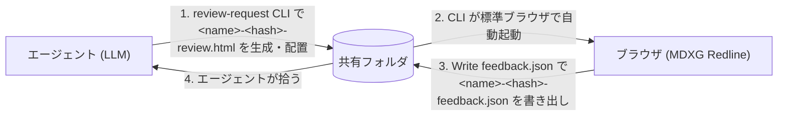

# MDXG Redline 設計ドキュメント

[](https://mkdn.review/?url=https%3A%2F%2Fraw.githubusercontent.com%2Foubakiou%2Fmdxg-redline%2Frefs%2Fheads%2Fmain%2Fdocs%2FDESIGN.md#p:mdxg-redline)

このドキュメントは MDXG Redline の設計意図・構成・割り切りを記録する。仕様変更・監査・他実装との比較検討時の参照資料とする。

## 目次

1. [概要](#1-概要)
2. [制約](#2-制約)
3. [ユーザーフロー](#3-ユーザーフロー)
4. [アーキテクチャ](#4-アーキテクチャ)
5. [データモデル](#5-データモデル)
6. [コメントのアンカリング](#6-コメントのアンカリング)
7. [永続化レイヤー](#7-永続化レイヤー)
8. [ワークスペースプロトコル](#8-ワークスペースプロトコル)
9. [起動シーケンス](#9-起動シーケンス)
10. [ブラウザ互換性](#10-ブラウザ互換性)
11. [セキュリティとプライバシー](#11-セキュリティとプライバシー)
12. [MDXG 準拠状況と設計判断](#12-mdxg-準拠状況と設計判断)
13. [関連ドキュメント](#関連ドキュメント) — ビルドパイプライン（旧 §13）→ [build-pipeline.md](./build-pipeline.md) / UI 国際化（旧 §14）→ [i18n.md](./i18n.md)

## 1. 概要

MDXG Redline は、レビュワー（人間）がブラウザで以下を行うためのツール：

1. markdown 文書をブラウザに読み込む
2. 任意のテキスト範囲をハイライトしてコメントを付ける
3. 結果を構造化 JSON として出力し、LLM エージェントに渡す

配布形態は 3 系統ある：

- **online 版**: ホスティング先 (`https://mkdn.review/`) で `dist/hosting/index.html` を配信し、`?url=` クエリや Paste markdown で外部 markdown をブラウザだけでレビューする。インストール不要・サーバー側状態なし
- **standalone 版**: `dist/standalone.html` 単一ファイルを直接開く。全依存を事前 inline 済みで、ネットワーク到達性ゼロのオフライン動作
- **CLI 版**: MDXG Redline CLI が `*-review.html` を生成する。レビュー対象 markdown を埋め込んだ配布物を都度生成し、LLM エージェント連携の標準ループ（§3）で使う

standalone 版・CLI 版はいずれも **単一 HTML ファイル** の配布だけで動く。サーバー不要・別ファイル不要・追加インストール不要（※ VS Code Remote Containers / Codespaces のように `$BROWSER` 経由で `file://` がホスト側ブラウザに届かない環境でのみ、review-request CLI が一時的な軽量 HTTP サーバーを立ててブラウザに配信する。詳細 §3）。

`dist/` には **役割の異なる 3 つの HTML** が生成される（build-pipeline.md §13）：

| ファイル                   | 用途                                                                                                        | grammar / Mermaid / KaTeX inline                                                                                               | 開く対象                             |
| -------------------------- | ----------------------------------------------------------------------------------------------------------- | ------------------------------------------------------------------------------------------------------------------------------ | ------------------------------------ |
| `dist/standalone.html`     | 単独 Open file / Paste markdown 用、エンドユーザーが直接開く                                                | Shiki bundled 全言語（約 235） + Mermaid runtime + KaTeX runtime (フォント `all`) をいずれも事前 inline                        | ユーザーが直接ダブルクリック         |
| `dist/embed-template.html` | review-request CLI が rewrite して配布 HTML を生成する素材                                                  | grammar / Mermaid / KaTeX いずれも 0（CLI が `--shiki-langs` / `--mermaid` / `--math` / `--math-fonts` で注入）                | CLI 経由でのみ使用、直接開く想定なし |
| `dist/hosting/index.html`  | online 版 (`https://mkdn.review/` 等) でホスティング配信し、`?url=` クエリで外部 markdown を fetch して描画 | grammar / Mermaid / KaTeX いずれも 0（最小 shell。markdown 内容を runtime で scan し必要アセットのみ同一オリジンから動的取得） | ホスティング先で配信、URL で開く     |

開発時のみ TypeScript ソースと Vite Plus ツールチェーン（`vp build`）を使い、CSS/JS をすべて inline した単一 HTML にビルドする。エンドユーザーには TS/Vite Plus の存在は見えない。詳細は build-pipeline.md §13。

長文を生成する LLM と、それをレビューする人間との間に立ち、「markdown をチャットに貼って、散文のフィードバックを受け取る」という曖昧なループを、**位置情報付きの構造化フィードバック成果物** に置き換えることを目的とする。

### 想定ユーザー

- LLM エージェントで文書・仕様書・記事を反復的に作成する個人
- 人間レビューを挟むエージェントパイプラインを構築する開発者
- 普通のファイルでレビュー成果物を共有するチーム

### スコープ外

- 複数ユーザーのリアルタイム共同編集
- 汎用 markdown エディタ（レンダリングは読み取り専用、ソースは改変しない）
- ソースコードの git / PR レビューの代替

---

## 2. 制約

| 制約                                                                                | 影響                                                                                                                                            |
| ----------------------------------------------------------------------------------- | ----------------------------------------------------------------------------------------------------------------------------------------------- |
| ブラウザのみ、バックエンドなし                                                      | 状態はすべてブラウザストレージかローカルファイル                                                                                                |
| エンドユーザーには単一 HTML ファイルとして配布                                      | CSS / JS / npm 依存をすべて Vite Plus が bundle・inline。CDN 参照なしで完全オフライン動作                                                       |
| `file://` と `http://localhost` の両方で動作                                        | origin が変わると IndexedDB の `workspace-handle` が分離するため、別 origin で開いた回は picker 再表示にフォールバックする（§7）                |
| フィードバックは機械可読                                                            | 位置情報を持つ安定参照を含む JSON 出力                                                                                                          |
| レビュー対象 markdown は信頼済みとは限らない                                        | markdown 内の raw HTML は実行せず、文字として escape 表示する                                                                                   |
| 開発時のみ Vite+ (vp) ツールチェーンを使用（`vite-plugin-singlefile` で 1 HTML 化） | TypeScript + 外部 CSS で開発、`vp build` で `dist/standalone.html` と `dist/embed-template.html` を再生成。配布時は JS / CSS とも inline される |

---

## 3. ユーザーフロー

markdown をページに入れる方法が 4 つ（ファイル選択 / 埋め込み / URL クエリ / Paste markdown による直接入力）、フィードバックを取り出す方法が 3 つあり、自由に組み合わせ可能。最も重要なユースケースは「LLM エージェントから人間へのレビュー依頼ループ」で、これを以下の標準ループとして定義する。

### 標準ループ（エージェント連携モード）

エージェント連携は「review-request CLI でレビュー対象の markdown を埋め込んだ `*-review.html` を生成 → 人間がブラウザでコメント → Write feedback.json でフォルダに書き出し → エージェントが拾う」という形に統一する。



`<name>` は元 MD の拡張子を除いた basename、`<hash>` は MD 本文 SHA-256 の先頭 16 桁 hex。改訂のたびに `<hash>` だけが変わり、新旧ペアがファイル名で分離される（命名規約は §8）。

### 入力

markdown を画面に乗せる経路は 4 つ。起動時の優先順位は §9 を参照。toolbar header の `Open ▾` ドロップダウンに Open file / Open URL / Paste markdown… の 3 menu-item を集約しており、各 item の表示制御は二層 gating + CLI 経路の hide で吸収する。

#### 1. ファイル選択

`dist/standalone.html` を直接開いたときに利用される経路。toolbar の `Open ▾` → `Open file…` で OS のファイルダイアログが開き、選んだローカル `*.md` を読み込む（実装は `chrome/toolbar.ts` の隠し `<input type="file">` 経由）。

- **想定ユースケース**: CLI を利用せずに MDXG Redline を利用したい場合
- **ファイル名の扱い**: 選択時のファイル名がそのまま `state.docName` となり、export 時の JSON `document` フィールド・ダウンロード時の既定ファイル名に反映される
- **再選択時の挙動**: 読み込むたびに `state.comments` は空に初期化される

#### 2. 埋め込み

MDXG Redline CLI が `*-review.html` を生成するときに利用される経路。`<script id="embedded-md" type="text/markdown">…</script>` ブロックに markdown を **JSON 文字列としてエンコードした状態で** 書き込む。

- **想定ユースケース**: LLM エージェントから人間へのレビュー依頼（最重要 / 標準ループ）、人間が CLI で直接起動するケース、固定文書のレビュー依頼、過去レビューのアーカイブ用スナップショット
- **コメントの同梱**: HTML に `<script id="embedded-feedback" type="application/json">` ブロックを置いてコメント配列を入れておくと、起動時に型ガード（`feedback.ts`）を通って取り込まれる。不正なら静かに無視される。review-request CLI は配置先ディレクトリに同じ `<name>-<hash>-` プレフィックスの `feedback.json`（前ラウンドで Write feedback.json が書き出したもの）があれば自動でこのブロックに inline する resume 経路を持つ（DESIGN.md §8「既存 feedback.json の取り込み」）
- **エンコード形式**: 本文は `JSON.stringify(markdown).replace(/</g, '<')` の形で書き込む（実装上は `String.raw` で `<` という 6 文字の literal を出力する）。本文中の `<` がすべて JSON Unicode escape `<` に置換されるため、HTML パーサが `</script>` を閉じタグとして誤検出する余地が構造的に無い。復元側 (`boot.ts`) は `JSON.parse` だけで生 markdown に戻せる
- **書き換え方法**: `node dist/review-request.mjs <input.md> [output-dir]` で markdown を読み込み、`<script id="embedded-md">` の中身と `data-name` 属性を書き換えた HTML を生成する。出力ファイル名は §8 のファイル命名規約に従って自動決定される。CLI 全体の挙動（引数仕様 / 自動起動 / VS Code Remote 対応 / ポート選定）は[後述の review-request CLI 詳細](#review-request-cli-詳細)を参照

#### 3. URL クエリ（オンライン版）

ホスティング先 (例: Cloudflare Pages) で `dist/hosting/index.html` (build pipeline の C 設計、build-pipeline.md §13) が配信されているとき、`?url=https://...` クエリで外部 markdown を fetch して描画する経路。standalone.html / embed-template.html ではこの経路は無効化されている（§11.b 配布物の境界）。

オンライン版は **最小 shell + runtime 動的アセット注入** 方式で配布される。`dist/hosting/index.html` 自体には Shiki grammar / Mermaid / KaTeX runtime を一切 inline せず、ロードした markdown の内容を runtime で scan して必要なアセットのみを同一オリジンから動的に取得する (CLI の `--shiki-langs auto` / `--mermaid auto` / `--math auto` を runtime に持ち上げた設計)。**フェンス言語 / Mermaid / 数式を含まない markdown ではアセット fetch ゼロ** であることが保証される。実装の詳細は `docs/archive/feature-online-runtime-assets.archive.md` を参照。

- **想定ユースケース**: 公開 OSS の README / 仕様書を共有 URL でレビュー、ホスティング先での体験版（インストール不要、ブラウザだけで完結）
- **URL allowlist**: ホスティング側で許可されたドメインの origin (`scheme://host[:port]`) のみ受け付ける。既定は `raw.githubusercontent.com` / `gist.githubusercontent.com` の 2 origin。`MDXG_ONLINE_CONNECT_SRC` build 時 env var で追加可能（origin 形式 CSV）
- **二段防御**: `core/online-url.ts` の `fetchMarkdownFromUrl(url, opts, allowlist)` が fetch 前検証（`validateOnlineUrl`）と fetch 後検証（`Response.url` の origin 再検証）の両方を内部で行う。CSP `connect-src` allowlist と二重で攻撃面を狭める（詳細は §11.a）
- **入力 URL の正規化**: `?url=` / Open URL modal の入力に `https://github.com/<owner>/<repo>/blob/<ref>/<path>`（人間がブラウザで開く GitHub 表示用 URL）や `https://gist.github.com/<user>/<id>` を受け付け、fetch 直前に `core/online-url-normalize.ts` の `normalizeGithubViewUrl` で対応 raw origin (`raw.githubusercontent.com` / `gist.githubusercontent.com`) へ書き換える。`?url=` クエリと modal 入力は元の URL のまま保持し、シェアリンクの可読性を維持する (`source` link は fetch 後の最終 URL = raw を表示)。allowlist / CSP / pre-validation / final-URL re-check は変更せず、入力 UX レイヤだけで吸収する設計のため、対象外パスは素通りで `host_not_allowlisted` reject に倒れる:
  - 変換するパス: `github.com/<owner>/<repo>/blob/<ref>/<path>`、`github.com/<owner>/<repo>/raw/<ref>/<path>`、`gist.github.com/<user>/<id>` (raw 配信が html ページのため `/raw` を補完)、`gist.github.com/<user>/<id>/raw[/...]`
  - 素通りパス: `github.com/<owner>/<repo>/(tree|pull|issues|...)`、`gist.github.com/(discover|login|...)`、`gist.github.com/<user>/<id>/(revisions|<commit_sha>)` など。これらは raw に対応エンドポイントが無いため、`host_not_allowlisted` エラー UI に倒す方が状況を正確に伝えられる
  - 再構築時に user info / port を authority から剥がして raw origin 側に持ち込まないことで、simple request 厳守 (`fetch` に Authorization 等 safelist 外ヘッダを載せない、§11.a) と allowlist origin (port なし) の一致を構造的に保つ
  - Open URL modal の help block (`#open-url-help-allowlist`) は `<script id="online-allowlist">` JSON を `resolveOnlineAllowlistFromJson` で読んだ effective allowlist (build 時 `MDXG_ONLINE_CONNECT_SRC` で拡張された host も含む) と、`online-url-normalize.ts` から export される `REWRITTEN_INPUT_HOSTS` (入力 UX として受理する書き換え対象 host) を同じ `<ul>` に列挙する。CSP `connect-src` / JS validator / modal 表示の 3 経路すべてが同じ JSON を single source とする (`open-url-modal.ts` の `buildHelpEntriesFromAllowlistJson`)
- **`file://` 起動時の挙動**: URL クエリ経路は無音 fallthrough し、Open file 経路で動作する（hosting 配信前提のため `file://` では fetch が CORS で必ず失敗する想定）
- **入力 UI**: toolbar の `Open ▾ → Open URL…` メニュー項目から modal で URL を入力可能。submit すると `?url=<encodeURIComponent(input)>` で同一ページが reload される
- **fetch 中の Loading 表示**: fetch 開始から 150ms 経過しても完了しなければ、 CLI 経路 (embedded-md) で使う rendering spinner と同じ `has-embedded-md` class を `<html>` に前倒し付与し、 `.doc-pane::before/::after` の spinner + `Loading…` をそのまま流用する (`src/styles/review.css` 既存定義)。 150ms 未満で完了する場合は flicker 回避のため一切表示せず初期 `empty-state-default` のまま遷移する。 timer 管理 scope は **fetch だけに限定** し、 fetch 完了時点で必ず `clearTimeout` する (`fetchWithSpinnerCleanup` の finally)。 fetch が想定外に throw した場合は `fetchOrFallbackFailure` の catch で `network_error` 扱いの `FetchResult` に正規化して empty-state-online-error に倒すが、 描画段階 (`runtime.loadFromMarkdown` 内の Shiki 注入 / docHash 計算 / Mermaid render 等) の throw は **意図的に伝播** させて app-wiring の boot.catch (`Startup failed` toast + `classList.remove('has-embedded-md')`) に倒す。 描画 throw を `network_error` UI に誤分類しない構造的な責務分離。 同一 class を再利用することで「fetch → rendering」が継ぎ目なく Loading 表示で繋がる
- **エラー時の挙動**: 7 カテゴリ（`pre_validation_failed` / `redirected_off_allowlist` / `http_error` / `timeout` / `network_error` / `size_exceeded` / `unsupported_content_type`）のいずれかに分類し、persistent な inline empty-state に「別 URL を試す」ボタンと共に表示する。 spinner 表示中に失敗した場合は `has-embedded-md` を剥がしてから empty-state-online-error を露出させる経路に倒す (`#doc-wrap { display: none }` で error UI まで隠れるのを避ける)
- **fetch 取得 markdown の信頼境界**: 全入力経路 (toolbar Open file / URL クエリ / Open URL modal / Paste markdown modal) は `app-wiring.ts` で 1 度だけ装飾された `loadFromMarkdown(text, name)` を経由する。`decorateLoadFromMarkdownForOnline(base, cache)` が base の前段で runtime アセット fetch を fire-and-forget で発火し、base 側で raw HTML escape / Renderer.link / Renderer.image / Shiki / Mermaid / KaTeX の sanitize 経路 (経路 1・2 と同一不変条件) を通す。アセット未到達ブロックは plain text fallback、到達順に上書き upgrade される (silent + progressive upgrade、§9 起動シーケンス 2d.5)

#### 4. Paste markdown（手動入力）

`Open ▾` → `Paste markdown…` で開くモーダルに、ドキュメント名 (任意) と markdown 本文を貼り付けて読み込む経路。online / standalone 両配布物で利用でき、外部通信を伴わず loadFromMarkdown を経由するため経路 1 と完全に同じ rendering pipeline を通る。

- **想定ユースケース**: クリップボードや別エディタから markdown を直接持ち込んで一時的にレビューしたい場合 (オフライン / ローカルファイルを保存せずに試したい / standalone HTML を共有して受け取り側が手元で markdown を貼って確認する 等)
- **ドキュメント名**: モーダルの「Document name」入力欄が空のときは `pasted.md` を fallback として使う。trim 後の値がそのまま `state.docName` となり、export / status 表示に反映される
- **再読み込み時の挙動**: 経路 1 と同じく `state.comments` は空に初期化される (loadFromMarkdown の責務)
- **CLI 経路での hide**: CLI (review-request) 既定では `<html data-toolbar-paste-markdown="off">` が注入され、ブラウザ側 `paste-markdown-modal.ts` が起動時に Paste menu-item と modal backdrop を DOM から削除する。Open file 経路 (`--show-open-file`) と対称な「特定 MD のレビュー固定文脈」を維持する設計で、`--show-paste-markdown` を明示すれば再表示できる
- **Open ▾ 自体の hide**: CLI 経路で Open file / Paste markdown の両方が hide で、かつ online edition でない (Open URL も hide) ときは、`Open ▾` ボタン自体を CSS rule (`html[data-toolbar-open-file='off'][data-toolbar-paste-markdown='off']:not([data-mdxg-online='1']) .toolbar-open-wrap`) で hide する。menu が空のまま toolbar に残るのを防ぐ

### review-request CLI 詳細

レビュー依頼 HTML の生成と既定ブラウザでの起動までを 1 コマンドで完結させる Node CLI。実装は `src/cli/` 配下と `src/core/embed.ts` (pure ロジック、ブラウザ側からも再利用) に分かれる。

#### コマンド仕様

```
node dist/review-request.mjs [--no-open] [--show-open-file] [--show-paste-markdown] [--document-name <name>] [--theme <system|light|dark>] [--shiki-langs <auto|all|none|<csv>>] [--mermaid <auto|on|off>] [--math <auto|on|off>] [--math-fonts <minimal|all>] [--comments-width <0|280-640>] [--page-nav-width <0|180-480>] [--markdown-css <path>] [--lang <auto|en|ja>] <input.md|-> [output-dir]
```

| オプション                               | 説明                                                                                                                                                                                                                                                                                                                                                                                                                                                         | 既定値           |
| ---------------------------------------- | ------------------------------------------------------------------------------------------------------------------------------------------------------------------------------------------------------------------------------------------------------------------------------------------------------------------------------------------------------------------------------------------------------------------------------------------------------------ | ---------------- |
| `<input.md>` / `-`                       | レビュー対象 markdown ファイルパス、または `-` で標準入力から読み込む（パイプ運用や生成エージェントからの直接渡し向け）                                                                                                                                                                                                                                                                                                                                      | —                |
| `output-dir`                             | 出力先ディレクトリ。省略時は入力 MD と同じディレクトリ（stdin 入力時は cwd）                                                                                                                                                                                                                                                                                                                                                                                 | 入力 MD と同じ   |
| `--no-open`                              | 自動起動（file パス直渡し / HTTP サーバーモード双方）を抑止                                                                                                                                                                                                                                                                                                                                                                                                  | 自動起動する     |
| `--show-open-file`                       | 生成 HTML の `Open ▾` メニューから「Open file」項目を残す。既定 hidden は「特定 MD のレビュー固定文脈」前提で別 MD を誤読み込み → `state.comments` 初期化の事故（§3 入力 1）を構造的に防ぐ目的。`standalone.html`（CLI 非経由）は属性が付かず常に表示                                                                                                                                                                                                        | hidden           |
| `--show-paste-markdown`                  | 生成 HTML の `Open ▾` メニューから「Paste markdown」項目を残す。既定 hidden は `--show-open-file` と同じ「特定 MD のレビュー固定文脈」維持のため。`standalone.html`（CLI 非経由）は属性が付かず常に表示                                                                                                                                                                                                                                                      | hidden           |
| `--document-name <name>`                 | `data-name` 属性と出力ファイル名 prefix を明示的に上書き（stdin 入力時のファイル名指定にも使う）                                                                                                                                                                                                                                                                                                                                                             | 入力 MD basename |
| `--theme <system\|light\|dark>`          | 生成 HTML の初期 theme ヒントを `<html data-theme>` 属性として埋め込む。受信側 inline script は `localStorage` より高い優先度で参照（CLI で明示指定された値が毎回 paint を上書きし、UI 操作は当該セッション内だけ反映される）。未指定時は属性を付けず `localStorage` か `prefers-color-scheme` のみで判定。詳細 §7c / §11 / §12 §1                                                                                                                           | 属性なし         |
| `--shiki-langs <auto\|all\|none\|<csv>>` | `<script id="embedded-shiki-langs">` に注入する Shiki grammar を選ぶ。`auto` は `marked.lexer` でフェンス言語を抽出し必要分だけ注入、`all` は Shiki bundled 全言語（約 235）、`none` は注入なし（全コードブロック plain text fallback）、`<csv>` は `ts,js,py` 等をエイリアス正規化して指定。詳細 §12 §2                                                                                                                                                     | `auto`           |
| `--mermaid <auto\|on\|off>`              | `<script id="embedded-mermaid" type="module">` への Mermaid runtime 注入を制御。`auto` は `scanMermaidFences` で ` ```mermaid ` ブロック数を数え 1 件以上のとき注入、`on` は常時注入、`off` は注入しない。注入時 +約 700 KB gzipped。auto 検出時は stderr に「Detected N mermaid block(s).」を 1 回報告。詳細 §12 §15                                                                                                                                        | `auto`           |
| `--math <auto\|on\|off>`                 | `<script id="embedded-katex" type="module">` / `<style id="embedded-katex-css">` への KaTeX runtime 注入を制御。`auto` は `countMath` で `$...$` / `$$...$$` 件数を数え 1 件以上のとき注入、`on` は常時注入、`off` は注入しない。auto 検出時は stderr に「Detected N math expression(s). Embedding KaTeX runtime (fonts=<minimal\|all>, +~<sz> KB gzipped).」を 1 回報告。詳細 §12 §14                                                                       | `auto`           |
| `--math-fonts <minimal\|all>`            | KaTeX 注入時のフォント family 範囲を制御。`minimal` は Main / AMS / Math / Size1〜4 の 9 family のみ data URI inline（gzip +約 250 KB）、`all` は `\mathcal` / `\mathfrak` / `\mathscr` / SansSerif / Typewriter を含む 20 family を inline（gzip +約 340 KB）。`--math off` のときは黙って ignore。詳細 §12 §14                                                                                                                                             | `minimal`        |
| `--comments-width <0\|280-640>`          | 初期コメントパネル幅 / 開閉状態ヒントを `<html data-comments-width>` 属性として埋め込む。`0` は起動時 closed（画面右端の縦タブのみ）、`280–640` は open + その幅（px 整数）。`--theme` 同様 `localStorage` より高い優先度で、明示指定時は毎回 paint を上書きする。未指定時は属性なし、`localStorage` または既定値で判定。詳細 §7c / §11 / §12 §1                                                                                                             | 360px / open     |
| `--page-nav-width <0\|180-480>`          | 初期左 TOC 幅 / 開閉状態ヒントを `<html data-page-nav-width>` 属性として埋め込む。`0` は起動時 closed（画面左端の縦タブのみ）、`180–480` は open + その幅（px 整数）。`--comments-width` と対称で `localStorage` より高い優先度。未指定時は属性なし                                                                                                                                                                                                          | 220px / open     |
| `--markdown-css <path>`                  | 本文プレビュー用 CSS (`src/styles/markdown.css` のデフォルト) をユーザー指定ファイルに差し替え。差し替え対象は `<style id="markdown-css">` ブロックのみで review.css は不変。スコープは `#doc` 配下、`body` / `.app-header` 等を書いた場合は CSS 優先度に従う。書き込み時 literal `</style>` を `<\/style>` に escape。build 時は `markdownCssInlinePlugin` が default をinline、CLI 経路ではその中身を差し替える                                            | bundled          |
| `--lang <auto\|en\|ja>`                  | CLI の help / エラーメッセージの出力言語。`auto` は env `$LC_ALL` → `$LC_MESSAGES` → `$LANG` から POSIX 階層で推定 (空文字 / 未設定は skip)。**CLI 出力にのみ作用し、生成 HTML には lang 関連属性を一切埋め込まない** (HTML 側は `localStorage > navigator.language > 'en'` の順で独立に初期言語を決定する、CLI と HTML の責務分離)。サブパーサ非依存のグローバル メタフラグとして扱い、bootstrap 段階で argv から strip した上で run / clean のパースに進む | `auto`           |
| `--help` / `-h`                          | usage を stdout に出力して exit 0。他の引数より優先される (`--lang fr --help` のような --lang エラー併発時も help が勝つ)                                                                                                                                                                                                                                                                                                                                    | —                |

CLI 経由で生成された HTML の `<title>` は `MDXG Redline — <docName>` 形式に書き換えられる（ブラウザタブ・ファイル共有先で配布物を識別できるようにするため）。`standalone.html` は元の `MDXG Redline` のまま。

出力ファイル名は §8 ファイル命名規約に従い `<mdFileName>-<docHash>-review.html` となる。

配置先ディレクトリに同じプレフィックスの `<mdFileName>-<docHash>-feedback.json` がすでに存在する場合は自動で読み込み、生成 HTML の `<script id="embedded-feedback">` ブロックに inline する（resume 経路、§8「既存 feedback.json の取り込み」）。挙動の境界条件（stdin skip / docHash 照合 / stderr 報告）はそちらを参照。

このコマンド仕様はレビュー HTML 生成モードのもの。**配布フォルダの整理用に `--clean <dir>` サブコマンド** (オプションで `--yes` / `--keep <docHash>`) も別途用意してあり、レビュー HTML 生成モードと相互排他的に動作する。詳細は §8 ライフサイクル末尾「古いファイルの扱い」を参照。

#### ブラウザ自動起動の優先順位

生成後、既定では OS の標準ブラウザで HTML を自動的に開く。優先順位は次のとおり：

1. `$BROWSER` 環境変数
2. macOS: `open`
3. Windows: `cmd.exe /c start "" <path>`
4. その他 (Linux 等): `xdg-open`

`$BROWSER` を最優先するのは、VS Code Remote Containers / Codespaces / GitHub Actions などが `$BROWSER` を helper スクリプトに向けて設定する慣習に合わせるためで、`gh` CLI などと同じ動きになる。

#### VS Code Remote / Codespaces の HTTP モード

VS Code Remote / Codespaces のように `$BROWSER` 経由で `file://` がホスト側ブラウザに届かない環境（`REMOTE_CONTAINERS=true` / `CODESPACES=true` / `$BROWSER` が `vscode-server/.../helpers/browser.sh` を指す、で判定）では、`127.0.0.1` 上に軽量 HTTP サーバーを立てて `http://localhost:<port>/...` を `$BROWSER` に渡し、ホスト側ブラウザに到達させる。

配信は固定 HTML 1 ファイルのみで、リクエストパスは無視されるためパストラバーサルは構造的に発生しない。

#### ポート選定とフォールバック

デフォルトポートは `51729`（環境変数 `MDXG_REDLINE_PORT` で上書き可）。デフォルト or 指定ポートが使用中ならランダムポートへ自動 fallback し、stderr に「ポート X が使用中のため Y を使います。今回は IndexedDB のサイレント復元が効かない可能性があります」と警告する。

**固定ポートを採用する理由**: ブラウザ側 IndexedDB の `workspace-handle`（書き出し先フォルダ / §7）は origin（`http://localhost:<port>`）に紐づくため、ポートが毎回変わるとサイレント復元が効かない。デフォルトポート方式により、HTTP モードでも 2 回目以降の起動で同じ origin に着地し `Write feedback.json` の保存先フォルダが picker 無しで復元される（VS Code Remote / Codespaces の `forwardPorts` に固定値を書ける副次的メリットもある）。

#### 自動停止と失敗時の挙動

サーバーは初回リクエスト受信後 3 秒、リクエストが来ないまま 10 秒経過で自動停止する。レスポンスに `Connection: close` を付けて keep-alive を抑制したうえで、停止時には `server.closeAllConnections()` で残存 socket を強制 destroy してから `server.close()` を呼ぶ。`Connection: close` だけだとホスト側ブラウザや VS Code helper のトンネル経路で socket の FIN が遅延し、`server.close()` の callback が呼ばれずに CLI のプロンプトが戻らないケースがあるため、両方を組み合わせる。`closeIdleConnections()` だけだとブラウザが並列に開いた複数 socket のうち「リクエスト/レスポンス処理中」と Node が認識している socket が残って停止が遅延する実環境ケースが観測されたため、`closeAllConnections()` を採る。副作用として、停止タイマー切れの瞬間に進行中のレスポンス配信があれば途中切断され得るが、CLI 経路で配る `*-review.html` は数百 KB 程度 + localhost のため、SERVE_AUTOSTOP_MS=3000ms 経過時点では typical に配信が完了している (実害は限定的)。

ヘッドレス環境などで起動コマンドが失敗しても CLI は exit 0 のまま終了し、stderr に警告を出して stdout の絶対パスから手動で開ける導線を残す。

### 出力

1. **Copy as JSON** — クリップボードへコピー、チャットへの貼り付け用（`Comments ▾` メニュー内）
2. **Export as JSON** — ファイルダウンロード、チャット添付やアーカイブ用（`Comments ▾` メニュー内）
3. **Write feedback.json** — 選んだローカルフォルダに `<mdFileName>-<docHash>-feedback.json` を書き出す（プライマリ split button、常時表示。命名規約は §8 参照）。初回押下で `showDirectoryPicker()` がフォルダ選択を求め、選んだフォルダの `FileSystemDirectoryHandle` を IndexedDB に永続化する。2 回目以降は picker 無しで同じフォルダに書き出し（HTTP モードではデフォルトポートにより origin が安定するため、別タブや再起動でも復元される）。split button の caret `▾` から `Change output folder…` で書き出し先を切り替えられる。Chromium 系のみ対応（対応状況の詳細は §10）

---

## 4. アーキテクチャ

3 層の関心事を持つ単一 HTML ドキュメント（ランタイム）。ビルド側の構成は build-pipeline.md §13 を参照。

```
┌───────────────────────────────────────────────────────────────┐
│  プレゼンテーション層 (CSS + DOM)                              │
│    - GitHub Primer 風 chrome (header / comments panel / toolbar)      │
│    - DADS (Digital Agency Design System) テーマの本文プレビュー │
├───────────────────────────────────────────────────────────────┤
│  ドメインロジック (TypeScript → Vite + Rolldown で JS bundle、 │
│   CSS は src/styles/ を Vite が CSS bundle 化)                 │
│    - markdown レンダリング (marked、raw HTML は escape)         │
│    - コメントアンカリング (block id + テキストオフセット)      │
│    - 選択範囲 → Range → オフセット変換                         │
│    - 再描画後の <mark> 再適用                                  │
│    - 固定 duration smooth scroll (距離非依存)                  │
├───────────────────────────────────────────────────────────────┤
│  永続化層                                                      │
│    - IndexedDB（出力先フォルダハンドル 1 件のみ）              │
│    - File System Access API（feedback.json 書き出し用）         │
└───────────────────────────────────────────────────────────────┘
```

ランタイム外部依存は持たず、配布物は CDN 参照ゼロ・ネットワーク到達性ゼロで動作する。bundle される npm 依存と開発時ツールチェーンは build-pipeline.md §13 を参照。

スタイリングは `src/styles/review.css` (全体スタイル) と `src/styles/markdown.css` (markdown 描画用) の 2 ファイルに分け、レイアウト用の意味的クラスとコンポーネントクラスを自前で定義する。フォントは OS のシステムフォント（`-apple-system, BlinkMacSystemFont, 'Segoe UI', ui-monospace, …`）を参照し、Web フォントは使用しない。

### モバイルレイアウト (≤ 768px)

幅 ≤ 768px のスマートフォンでは、3 列 grid を `@media (max-width: 768px)` ブロックで上書きし、**上端固定ヘッダ + 画面下端の fixed footer バー + 左右 drawer** モデルに切り替える。各要素の責務は以下のとおり。

- **スクロール構造**: ヘッダは `position: fixed` ではなく、`body` を `overflow: hidden` + `height: 100dvh` で非スクロール化し static なヘッダを上端に pin した上で、`.doc-pane` のみをスクロールコンテナにする（footer / drawer / backdrop は `position: fixed`）
- **ヘッダ**: `Open ▾` / `⚙ Settings` のみ残す
- **footer**: 3 ボタン (TOC / Search / Comments) が左右 sidebar (`.page-nav` / `.comments`) を `position: fixed` + `transform` で slide-in する drawer の開閉 trigger になる
- **drawer 状態管理**: 開閉状態は `<html>` の `mobile-page-nav-open` / `mobile-comments-open` class で表現し (`src/app/chrome/mobile-footer.ts`)、既存 desktop の `*-closed` 系 (grid 列幅制御) とは直交させる。背面は `inert` + scroll lock で保護し、Tab focus は drawer + footer 内に循環する
- **範囲選択時の floater**: `#floater` (＋ Comment) は mobile では選択 rect 追従のポップオーバーではなく `bottom: var(--mobile-footer-height)` で footer 直上に固定したフル幅バーに化け、選択範囲に張り付くブラウザネイティブの選択メニューと構造的に重ならない (`docs/archive/feature-mobile-layout.archive.md` §5.t)
- **1 画面送り FAB**: 画面左下に専用 FAB (`#btn-page-scroll`) を浮かべ、タップで下 1 画面 / 上下フリックでその方向に 1 画面スクロールする (読む面のネイティブスクロールと操作を分離して競合を避ける、§5.u)
- **safe-area / viewport**: safe-area inset / 動的 viewport は `--mobile-header-height` / `--mobile-footer-height` 等の CSS custom property に集約し、`viewport-fit=cover` で iOS の inset を受け取る
- **breakpoint**: 769–900px は既存タブレット (vertical-stack)、901px 以上は desktop モデル

---

## 5. データモデル

メモリ内 state の構造と、export される feedback.json スキーマを定義する。永続化されるのは出力先フォルダハンドルと UI 設定のみで、コメント本体・本文・docHash はメモリ上にだけ存在する（§7）。

### コメント

```ts
{
  id: string // 8 文字のランダム ID
  blockId: string // 例: "b003" — レンダリング時に付与。文書全体で連番 (document スコープ)
  pageIndex: number // 所属仮想ページの 0-origin index（state 内必須、export には含めない）
  quote: string // 選択されたテキスト原文（人間の参照用）
  comment: string // ユーザーのコメント
  startOffset: number // ブロックのフラットテキスト内の開始位置
  endOffset: number // ブロックのフラットテキスト内の終了位置
  sourceLine: number // 元 markdown 全体での 1-origin 行番号（不変、必須）
  created: string // ISO 8601
}
```

`blockId` は文書全体での連番 (document スコープ) ── Stacked View では全 page の `<section.virtual-page>` が常に DOM 上に並ぶため、page スコープのまま `b001` が複数 section に存在すると `querySelector` が衝突するのを構造的に避ける。`sourceLine` は元 markdown 全体での行番号で feedback.json export スキーマと後段 LLM 互換を保つ。`pageIndex` は state 内専用で export には漏らさない。新規 Comment 作成時の `pageIndex` は `comments/selection.ts` が祖先 `<section.virtual-page>` の `data-page-index` から取得し、`PendingSelection` 経由で comment-modal に渡す。

### ドキュメント状態（メモリ内）

```ts
{
  docHash:               string | null           // SHA-256(markdown) の先頭 8 バイト（16 桁 hex）。未読込時 null
  docName:               string | null           // ファイル名。未読込時 null
  markdown:              string                  // 原文
  comments:              Comment[]
  blockOriginalHTML:     Map<blockId, string>    // 再レンダリング用の元 HTML
  blockAnchors:          Map<blockId, BlockAnchor> // markdown ソース上の開始行と祖先見出し
  lastWrittenSignature:  string | null           // Write feedback.json の dirty 判定用署名（未書き出し時 null）
  pages:                 Page[]                  // markdown 読み込み時に確定する仮想ページ列 (MDXG §6)
  activePageIndex:       number                  // 現在表示中のページ index (0-origin)
}
```

`pages` / `activePageIndex` は MDXG Virtual Pages 用 (docs/archive/mdxg-virtual-pages.archive.md §6 / §10)。`pages` は markdown 読み込み時に `core/page-split.ts` の `splitIntoPages` で確定し、以降 read-only。各 Page は `slug` / `sourceLineStart` / `sourceLineEnd` / `ancestorHeadingPath` / `headings` (H3–H6 outline) を持つ。`activePageIndex` は TOC / Sequential Nav / hashchange の `navigateToTarget` で切り替わる。

### 永続化レコード

ブラウザ側で永続化するのは「出力先フォルダハンドル」と「UI 表示設定」の 2 系統だけ。コメント本体・本文・docHash はメモリ上 state にのみ存在し、永続化はユーザーが明示的に `Write feedback.json` / `Export as JSON` / `Copy as JSON` を押した時点でファイル／クリップボードへ書き出す責務。ストレージ選択の理由・書き出しフロー・優先順位は §7 を参照。

| ストレージ                        | キー                                                                     | 値                                | 用途                                                                                                 |
| --------------------------------- | ------------------------------------------------------------------------ | --------------------------------- | ---------------------------------------------------------------------------------------------------- |
| IndexedDB (`margin-notes` / `kv`) | `workspace-handle`                                                       | `FileSystemDirectoryHandle`（生） | `Write feedback.json` 書き出し先フォルダのサイレント再開（Chromium 系、IDB に直シリアライズ）        |
| localStorage                      | `mdxg-redline.*`（theme / comments / page-nav 系、キーと値の詳細は §7c） | enum / 整数 (px)                  | theme・コメントパネル・左 TOC の幅と開閉状態。FOUC 防止のため `<head>` 内 inline script が同期で読む |

### エクスポートされるフィードバック（JSON）

```jsonc
{
  "document": "spec.md", // 元 MD の basename（拡張子付き）
  "docHash": "a1b2c3d4e5f6a7b8", // SHA-256(markdown) の先頭 8 バイト hex（16 桁）
  "exportedAt": "2026-05-15T10:30:00.000Z",
  "comments": [
    {
      "id": "a1b2c3d4",
      "quote": "選択された箇所",
      "comment": "ここは X を前提にしているが定義がない",
      "created": "2026-05-15T10:28:11.000Z",
      "headingPath": ["## 3. 入力経路と出力経路", "### 3.2 ファイル選択"],
      "sourceLine": 42,
      "blockId": "b008",
      "startOffset": 12,
      "endOffset": 24,
    },
  ],
}
```

Workspace 連携時、ファイル名は §8 のファイル命名規約に従って `<mdFileName>-<docHash>-feedback.json` の形で書き出される。JSON 内部の `document` / `docHash` はファイル名と冗長に見えるが、ファイルを単体で取り出した時の自己記述性のために残す。

LLM が markdown ソース上で位置を特定するための `headingPath` / `sourceLine` と、resume 経路で同じレビュー HTML に再注入したときに `isImportableComment` (`src/core/feedback.ts`) の必須フィールドを満たすための内部 anchor (`blockId` / `startOffset` / `endOffset`) の両方を含める。後段 LLM にとっては内部 anchor は余剰だが、docHash 一致前提なら再利用は安全。

- `headingPath` … コメントが属するブロックの祖先見出しを浅い順に並べた配列。各要素は raw markdown 形式（`## ` プレフィックス込み）。見出しがない、または最初の見出しより前のブロックの場合は `[]`
- `sourceLine` … コメントが属するトップレベルブロックの markdown ソース上の開始行（1-origin）
- `blockId` / `startOffset` / `endOffset` … resume 経路用の内部 anchor。後段 LLM パイプラインからは無視してよい
- `docHash` … レビュー時点の本文識別子。`shasum -a 256 <input.md> | cut -c1-16` で再計算可能（ワークスペース連携時はファイル名にも同じ値が含まれる）。並行編集を検出した場合は行番号を信頼せず、`quote` を grep して位置特定にフォールバックする

---

## 6. コメントのアンカリング

採用方式は **ブロック ID + そのブロックのフラット化テキスト上のオフセット**。再レンダリングや軽微な装飾変更で壊れない位置参照を、ソースを汚さず細粒度に保つ。

代替方式との比較：

| 方式                                 | 長所                       | 短所                                           |
| ------------------------------------ | -------------------------- | ---------------------------------------------- |
| ブロック単位コメント                 | 実装が容易                 | 粒度が粗く、特定のフレーズを指せない           |
| XPath / CSS セレクタ                 | 標準ベース                 | 再レンダリングで壊れやすい、ソース編集にも弱い |
| **ブロック ID + テキストオフセット** | 安定、細粒度、再適用に強い | 原文の編集には追随できない                     |

### 仕組み

1. `marked.parse` の後、ドキュメントコンテナの直下の各子要素に連番の `data-block-id`（`b001`, `b002`, …）を付与
2. 各ブロックの `<mark>` ラッパなしの元 `innerHTML` を `state.blockOriginalHTML` にキャッシュ
3. ユーザーが範囲選択すると、次の形に正規化：
   - `blockId`：`data-block-id` を持つ最も近い祖先
   - `startOffset` / `endOffset`：ブロックのフラットテキスト内の位置（テキストノード平坦化と Range boundary で算出）
4. ハイライトを描画するときは、各ブロックを元 HTML にリセットし、コメントを **startOffset の降順** で適用（後方を先に変更することで前方のオフセットを保持）
5. 各コメントは対象範囲を包む `<mark class="cmt" data-comment-id="…">` になる

### 複数テキストノードにまたがる範囲

インライン書式の境界をまたぐ選択（例えば `Lorem **ipsum** dolor` を「Lorem ipsum dolor」として選択）は複数のテキストノードに分かれる。範囲が単一テキストノード内なら `Range.surroundContents()`、複数ノードにまたがる場合は `extractContents` + `insertNode` でフォールバックする。ブロック境界をまたぐ選択は無視される（フローター自体が表示されない）。

### upgrade される DOM 拡張 (Math / Footnote) の textSegments 取り扱い

`$...$` / `$$...$$` 数式 (`[data-math]`) と脚注参照 / backref (`<a data-footnote-ref>` / `<a data-footnote-backref>`) は、selection.ts の `textSegments` から **要素ごと skip** する。理由は共通：

- 数式: KaTeX upgrade 前 (raw `$x$` = 3 文字) と upgrade 後 (MathML+HTML で数十文字) で textContent が大きく変化し、§6 アンカリングの offset 計算が re-render 前後で食い違う
- 脚注参照: source markdown (`[^<id>]` 4+ 文字) と DOM textContent (`1` 1 文字) で長さが異なり、再描画時に offset が滑る
- backref: 合成 UI 要素 (`↩` の単一文字、source markdown に存在しない) を選択 / 検索の対象に乗せる UX 価値が低い

要素ごと skip すれば textSegments の出力は upgrade / re-render 前後で完全に同じになり、cmt mark の貼付経路が壊れない。トレードオフとして、当該要素そのものに直接コメントを付けることは不可（数式 / 脚注参照ともに §1 スコープ宣言で対応外と明文化）。実装は `src/app/dom/text-segment-skip-rules.ts` の単一宣言テーブル `SKIP_RULES`（`selector` + `reason` の配列。`data-math` / `data-footnote-ref` / `data-footnote-backref` / `.sr-only` 等を集約）から walk 判定 `shouldSkipForTextSegments` と CSS セレクタ `SKIP_TEXT_SEGMENT_SELECTOR` の両出力を導出する。

### 原文編集で壊れる理由（許容している）

原文 markdown が編集されると、ブロック ID とオフセットが合わなくなる。これは許容する：

- ツールは原文に対して読み取り専用
- エージェントループは各ラウンドで原文を丸ごと差し替えるので、前バージョンのコメントは設計上破棄されるべき（`docHash` が変われば新しいコメントセットになる）

---

## 7. 永続化レイヤー

§5 永続化レコードで列挙した 2 系統（IndexedDB の `workspace-handle` と localStorage の UI 設定）について、ストレージ選択の理由・書き出しフロー・優先順位を本セクションで扱う。ブラウザ側の永続化は最小限で、コメント本体は state にのみ存在し、ユーザーが明示的にエクスポートして初めて外部に出る。

### a. IndexedDB（ディレクトリハンドル専用）

`margin-notes` DB / `kv` ストアに `workspace-handle` キー 1 件だけを置く。`FileSystemDirectoryHandle` は JSON 化できず IndexedDB へ直シリアライズするしか手段がないため、この用途のためだけに IDB を残している。`workspace/storage.ts` は `IDB.get / set / del / open` の 4 メソッドだけを持つ薄いラッパ。

### b. File System Access API（出力先フォルダ）

`Write feedback.json` の書き出し先フォルダ用。`showDirectoryPicker()` が返す `FileSystemDirectoryHandle` 自体を IndexedDB の `workspace-handle` に保存し、次回起動時はサイレント復元する（権限再要求はしない）。

書き出し時のフロー（実装は `workspace/workspace.ts` の `writeFeedback`）：

1. メモリ上の handle が無ければピッカーを開いてフォルダを選ばせる
2. handle がある場合は `handle.queryPermission({ mode: 'readwrite' })` を呼ぶ
   - `granted` → そのまま書き出し
   - `prompt` → `requestPermission()` を呼んで再許可。`granted` なら書き出し、`denied` ならピッカーへフォールバック
   - `denied` → ピッカーへフォールバック
3. handle がディレクトリ削除などで無効化していた場合は書き出し時に例外を捕捉し、ピッカーを 1 度だけ再表示してリトライ

split button の caret `▾` から開ける `Change output folder…` メニューは、状態に関係なく常にピッカーを開いて handle を差し替える専用導線。`workspace/workspace.ts` の `changeOutputFolder` がエントリ。

### c. localStorage（theme 設定 / パネル幅・開閉状態）

UI 表示まわりの軽量な永続化のためだけに `localStorage` を使う。IndexedDB を使わないのは、FOUC 防止のため `<head>` 内 inline script が paint 前に同期で読む必要があり、IDB の非同期 API ではタイミングが間に合わないため（IDB は引き続き `workspace-handle` 1 件のみで、UI 設定は別ストアとして整理する）。`localStorage` が disable された環境（プライバシーモード等）でも inline script は `try {} catch (e) {}` で囲んでおり、失敗時は `<html data-*>` ヒント or 既定値で動作する。

保存しているキーは次の 5 件（表示言語キー `mdxg-redline.lang` は i18n.md §14）。コメント本体・本文は決して `localStorage` に書かない。

| キー                          | 値                              | 用途                                                                     |
| ----------------------------- | ------------------------------- | ------------------------------------------------------------------------ |
| `mdxg-redline.theme`          | `'system' \| 'light' \| 'dark'` | 設定モーダル内 theme select の最終選択 (UI 操作時のみ書き込み)           |
| `mdxg-redline.comments-width` | `280`–`640` の整数 (px)         | 「open 状態でのコメントパネル幅」。closed 状態でも保持し、次に開く時の幅 |
| `mdxg-redline.comments-open`  | `'open' \| 'closed'`            | コメントパネルの開閉状態。snap by drag / toggle tab で書き換える         |
| `mdxg-redline.page-nav-width` | `180`–`480` の整数 (px)         | 「open 状態での左 TOC 幅」。closed 状態でも保持し、次に開く時の幅        |
| `mdxg-redline.page-nav-open`  | `'open' \| 'closed'`            | 左 TOC の開閉状態。snap by drag / toggle tab で書き換える                |

優先順位 P1 はキーごとに対称な構造で、`<html data-*> ヒント > localStorage > 既定値` の順で評価する：

- `theme`: `<html data-theme> (CLI --theme) > localStorage > prefers-color-scheme`
- `comments-width / comments-open`: `<html data-comments-width> (CLI --comments-width) > localStorage > 既定 (360px, open)`
- `page-nav-width / page-nav-open`: `<html data-page-nav-width> (CLI --page-nav-width) > localStorage > 既定 (220px, open)`

CLI ヒントを最上段に置く理由は「`--theme dark` / `--comments-width 0` のような明示指定は毎回必ず効いて欲しい」というユーザー直感を優先するため。明示指定が無い (CLI hint = null) ときだけ従来通り localStorage が次段で評価され、UI 操作で蓄積したユーザー設定が引き継がれる。ユーザーが UI でトグルを押す / handle をドラッグして得た値は localStorage に書き込まれるが、次回起動時の paint には CLI hint が優先する設計上、CLI ヒント付きで生成された HTML を毎回開く運用では一度のセッション内の UI 操作は短命な上書きとして扱われる (UI 操作中は反映され、reload で CLI hint に戻る)。

inline script は `localStorage` / `<html data-*>` の値をホワイトリストで検証し、壊れた値（旧バージョン / 他アプリの混入 / 手動編集）に対して `null` 扱いで次段にフォールスルーする（`chrome/theme.ts` の `isStoredTheme` / `comments/comments-width.ts` の `isValidStoredCommentsWidth` / `isCommentsOpenState` と同じ判定で初期描画と後続ランタイムの挙動を揃える）。

`<html data-comments-width>` で表現できるのは「`0` = closed 起動」と「`280–640` = open 起動 + その幅」の 2 ケースのみ。「closed 起動 + 任意の復元幅」のような複合状態を CLI で指定する経路は提供しない（CLI hint で closed を指定したときの復元幅は localStorage / 既定 360 で補完するため、CLI 側で別個に表現する必要が無い）。

複数レビューラウンドにまたがる UI 設定の引き継ぎは `localStorage` の origin スコープに依存し、`workspace-handle` と同じく HTTP モードのデフォルトポート (`http://localhost:51729`) が確保できれば共有される。random fallback / `file://` 起動では分離されて引き継がれない（§8 「HTTP モードの origin 安定性」参照）。引き継ぎが失敗した場合は CLI ヒント / 既定値で fallback する設計のため、明示指定をしていないユーザーには違和感が出ない。

---

## 8. ワークスペースプロトコル

エージェント連携で「同じレビュー対象に対する review / feedback ペア」を機械的に対応付けるためのファイル命名規約と、ブラウザ側の書き出し責務を定める。

| ファイル                                        | 方向                | 書き手                                  | 読み手                                            |
| ----------------------------------------------- | ------------------- | --------------------------------------- | ------------------------------------------------- |
| `<folder>/<mdFileName>-<docHash>-review.html`   | エージェント → 人間 | エージェント（review-request CLI 経由） | ブラウザ（人間がダブルクリック / CLI が自動起動） |
| `<folder>/<mdFileName>-<docHash>-feedback.json` | 人間 → エージェント | ブラウザ（Write feedback.json）         | エージェント                                      |

書き出し先フォルダの場所はユーザーが任意に決めてよい（`~/reviews/` でも `./tmp/` でも）。ブラウザは review-request CLI で生成された HTML を開く想定で、入力 MD のファイル管理はエージェント側の責務とする。

### ファイル命名規約

review-request CLI 配布フローと Write feedback.json 書き出しを通じて、すべてのレビューパッケージはこの命名規約に従う：

```
<mdFileName>-<docHash>-review.html   (review-request CLI が出力する配布用 HTML)
<mdFileName>-<docHash>-feedback.json (ブラウザが書き出す回収パッケージ)
```

- **`mdFileName`**: 元 MD ファイルの basename から `.md` / `.markdown` 拡張子を除いたもの。サニタイズはしない（スペース・日本語・記号もそのまま）。例：元ファイルが `仕様書 v2.md` なら `mdFileName = "仕様書 v2"`
- **`docHash`**: 元 MD 本文 UTF-8 バイト列の SHA-256 の先頭 8 バイトを hex で表現した 16 文字の文字列。`shasum -a 256 <input.md> | cut -c1-16` で再計算できる。§5 のエクスポート JSON に含まれる `docHash` と同一値で、ファイル名から取り出しても JSON 本文から取り出しても同じものが得られる（ファイル名は配置時の自己記述性、JSON は単体取り出し時の自己記述性を担う）
- **責務**: ファイル名の生成責務は書き手側にある。CLI は `review.html` を書く前に、ブラウザは `feedback.json` を書く前に、それぞれ自身が扱っている MD 本文の SHA-256 を計算してファイル名を決める
- **拡張子で識別**: 同一の `<mdFileName>-<docHash>-` プレフィックスを共有するファイルが「同じレビュー対象に対する review / feedback ペア」となる。エージェントは `review.html` を配布する → 対応する `feedback.json` を待つ → 取り込む、を `docHash` 単位で機械的に対応付けられる

これにより、Open File で別の MD を開いた状態で `Write feedback.json` を押しても、出力ファイル名は新しい MD の hash で決まるため、元の review.html に対応する feedback.json を誤って上書きすることがない（誤爆問題の構造的解消）。

### ライフサイクル

1. エージェントが `<input.md>` から `node dist/review-request.mjs <input.md> <folder>` で `<mdFileName>-<docHash>-review.html` を生成する（CLI が標準ブラウザを自動起動）
2. ブラウザが HTML を開くと、埋め込み markdown が描画される（§9 起動シーケンス参照）
3. ユーザーがインラインコメントを追加
4. ユーザーが `Write feedback.json` をクリック
   - 初回（IDB に handle 無し）: ピッカーが開き、フォルダを選ばせる → 選んだフォルダに書き出し → handle を IDB へ永続化
   - 2 回目以降（handle あり、権限 OK）: picker 無しで同じフォルダに書き出し（同一 origin で起動した場合）
   - 書き出し先ファイル名は現在の `state.docHash` から計算され、`<mdFileName>-<docHash>-feedback.json` になる
5. エージェントが対応する `feedback.json`（自身が CLI に渡した MD と同じ `mdFileName`-`docHash` プレフィックス）を読み、処理し、必要に応じて改訂版 `<input2.md>` で次ラウンドの HTML を生成 → ループ継続

### 既存 feedback.json の取り込み（resume 経路）

review-request CLI は配布先ディレクトリに同じ `<mdFileName>-<docHash>-` プレフィックスの `feedback.json` があれば自動で読み込み、生成 HTML の `<script id="embedded-feedback">` ブロックに inline する。ブラウザ起動時に boot.ts の `restoreEmbeddedFeedback` 経路でコメントが復元され、レビュワーは前ラウンドの編集状態の続きから再開できる。

挙動の境界条件：

- **既定 ON**: フラグなしで常に試行する。docHash 一致時のみ取り込むため意味的に安全
- **stdin 入力時は skip**: `<input.md>` が `-` のとき (`output-dir` が cwd になる) は、無関係な同名 JSON を誤って読み込む事故を構造的に避ける
- **未発見時は silent**: 初回ラウンドは feedback.json が無いのが正常状態のため stderr にも何も出さない
- **docHash 不一致時は skip + stderr 警告**: ファイル名だけ一致して中身がブレた稀ケース（手動編集 / ファイルコピー事故）を可視化する。`(skipped resuming <path>: docHash mismatch — got <found>, expected <expected>)` を出して inline はしない
- **JSON 不正時は skip + stderr 警告**: 破損ファイルを silent に飲み込まず `(skipped resuming <path>: invalid JSON)` で報告する
- **取り込み成功時は stderr に 1 行報告**: `Resumed N comment(s) from <path>.` を出す（`auto` 検出ログと同じトーン）

ブラウザ側で受け取った後の挙動は §9 起動シーケンス 1c と同じで、`sourceLine` から `pageIndex` を逆引きして範囲外コメントは破棄される。

### 古いファイルの扱い

ラウンドを重ねると `<name>-<hash1>-review.html`, `<name>-<hash2>-review.html`, ... と複数の配布 HTML がフォルダに残り得るが、ブラウザは何も検知・整理しない。古いファイルの整理はユーザーまたはエージェントの責務。

整理手段として review-request CLI に `--clean [dir]` サブコマンドを用意してある（`src/cli/clean.ts`）。`<dir>` 直下の `*-<docHash>-review.html` / `*-<docHash>-feedback.json` を命名規約の正規表現 `^(.+)-([0-9a-f]{16})-(review\.html|feedback\.json)$` で抽出し、まとめて削除する。既定では直下のみ（`-maxdepth 1` 相当）でサブディレクトリは触らない。`<dir>` を省略した場合（`--clean` 単独 / `--clean --yes` 等）はカレントディレクトリを対象とする。

- 既定は **dry-run**: 削除候補のファイル名を stdout に列挙して終了する（exit 0、unlink は呼ばれない）
- `--yes` で実削除を行う
- `--recursive`（`-r`）でサブディレクトリ配下も再帰的に対象にする（`readdir({ recursive: true })`）。誤って広範囲を消す事故を防ぐため既定は直下のみで、再帰は opt-in
- `--keep <docHash>` を複数指定すると、その 16 桁 hex hash を持つペアを温存できる（直近ラウンドだけ残したいケース向け）
- 命名規約にマッチしないファイル（原本 `.md` / `.archive.md` / dotfile 等）は構造的に対象外

### 安全装置・前提

- **権限の失効**: `Write feedback.json` 押下時に `queryPermission` が `granted` 以外を返した場合、`requestPermission` で再許可を試み、拒否されたらピッカーへフォールバックする
- **ハンドル無効化**: 書き出しが例外（フォルダ削除等）で失敗した場合、ピッカーを 1 度だけ再表示してリトライし、それも失敗したら toast で通知して諦める
- **HTTP モードの origin 安定性**: review-request CLI の HTTP モードはデフォルトポート `51729`（`MDXG_REDLINE_PORT` で上書き可）で起動を試み、同一 origin (`http://localhost:51729`) を維持することで `workspace-handle` のサイレント復元を成立させる。ポートが衝突して random fallback した場合は origin が変わるため、その回だけは picker が再表示される。同じ origin 制約は `localStorage("mdxg-redline.theme")` (§7c) にも適用され、複数ラウンド間で theme 設定が引き継がれるのもデフォルトポート確保時のみ
- **API 非対応ブラウザ**: Safari / Firefox の挙動は §10 を参照

---

## 9. 起動シーケンス

ページロード時に以下の優先順チェーンを実行。出力先ハンドル復元は副作用が無く後段を阻害しないため、本文ロードのパスとは独立に走らせる。埋め込みで本文が確定した時点で終了する。

```
-1. [<head> inline script、paint 前] theme / lang 初期解決
    - theme: <html data-theme> CLI ヒント > localStorage('mdxg-redline.theme') > 'system'
             (system は prefers-color-scheme で resolve) → <html class="dark"> を toggle して FOUC 回避
             (CLI hint を最優先する根拠は §7c。配布元 (CLI) が明示した theme を、
              レビュワー過去選択より上に置くことで配布意図を尊重する)
    - lang: localStorage('mdxg-redline.lang') > navigator.language > 'en' (i18n.md §14.3)
            → <html lang> 設定 + <html class="i18n-pending"> 付与
              (visibility:hidden で paint 抑制、3 秒 setTimeout の fallback で必ず解除)
            (lang は theme と逆順で localStorage が最優先。CLI は HTML への lang 属性を
             一切埋め込まない CLI/HTML 責務分離方針のため、i18n.md §14.1 / §14.3)
    - bootstrapI18n が module 読み込み完了後に initLangFromBrowser → applyI18nDataset →
      i18n-pending class 解除を同期で完了させる

0. IndexedDB から workspace-handle をサイレント復元 (副作用は in-memory のみ)
   └─ 権限再要求はしない。Write feedback.json 押下時にまとめて扱う

1. オンライン版判定 (<html data-mdxg-online="1"> がビルド時に付与されている場合のみ)
   1a. <script type="application/json" id="online-allowlist"> から allowlist を読む
       (壊れていれば DEFAULT_ONLINE_ALLOWLIST に fail-safe で落とす)
   1b. URLSearchParams で ?url= を取得
       - 未指定 → 無音 fallthrough で 3 へ (file:// でも空状態起動を許す)
       - 指定あり + location.protocol が http(s) でない → showOnlineError + 3 へ
       - 指定あり + http(s) → normalizeGithubViewUrl(url) で github.com/blob 等の表示用 URL を
                              対応 raw origin に正規化 (§3.4 入力 URL の正規化) してから
                              fetchMarkdownFromUrl(normalizedUrl, opts, allowlist) を呼ぶ
         (allowlist 検証は wrapper 内で fetch 前 / 後の二段防御、§11.a)
         - 成功: showOnlineSource(finalUrl) + loadFromMarkdown(deriveDocNameFromUrl(finalUrl), text)
                 (docName は redirect 後の finalUrl 末尾から拾う。gist メインページ URL は
                  normalize で `/raw` が補完され redirect 先が `.../<sha>/<filename>` 形式に
                  なるため、finalUrl から取れば export ファイル名が "raw" に退化しない)
                 → 2c (embedded-feedback 適用) / 2d (render) / 2d.5 (asset fetch) に合流
         - 失敗: showOnlineError(カテゴリ別メッセージ) で persistent empty-state を表示
                 + 「別 URL を試す」ボタンで Open URL modal を再 open する経路
   1c. online edition では結果に関わらず 2 (embedded-md) を skip
       (online.html に placeholder embedded-md が事故注入された場合の
        「無関係 doc 描画」経路を構造的に塞ぐ)

2. 埋め込み markdown (<script id="embedded-md">)
   2a. core/page-split.ts で markdown → Page[] に分割 (MDXG §6 / docs/archive/mdxg-virtual-pages.archive.md §10)
   2b. activePageIndex を location.hash から resolveTargetFromHash で解決
       (hash 空 / 不正 / slug 不一致なら先頭ページ 0)
   2c. <script id="embedded-feedback"> があれば適用
       (ImportedComment[] から sourceLine 経由で pageIndex を逆引きして埋め、
        範囲外コメントは破棄、§9.1 / §6.6 invariants)
   2d. activePageIndex のページのみ doc-renderer.ts で render
       (composite hash `#<page>__<heading>` の deep link は scrollToHeadingIfPresent でスクロール)
   2d.5 [online edition のみ] loadOnlineAssets(markdown, baseUrl, cache) を fire-and-forget
       で発火 (await しない)。app-wiring.ts で 1 度装飾された loadFromMarkdown が、
       toolbar Open file / Paste markdown modal / Open URL modal / boot.ts ?url= の
       いずれの入力経路でも base の前段で起動する (decorateLoadFromMarkdownForOnline)。
       - 内部で scanFencedLangs / scanMermaidFences / countMath で必要アセットを抽出
       - <script id="online-asset-manifest"> から hash 付き URL を解決 (path 規則で
         canonical fallback も導出)
       - Promise.allSettled で並行発火:
         * Shiki grammar: fetch /fingerprinted/shiki-langs/<lang>.<hash>.json
           → 404 で /canonical/shiki-langs/<lang>.json に retry
           → installShikiGrammars(merged) + dispatchEvent('mdxg:shiki-langs-ready')
         * Mermaid runtime: <script id="embedded-mermaid"> に sentinel 注入
           → import(/fingerprinted/mermaid.<hash>.mjs)
           → reject 時に canonical へ load failure retry
           → entry が globalThis.__mdxgMermaid を立てて 'mdxg:mermaid-ready' を発火
         * KaTeX runtime: 同上 + <style id="embedded-katex-css"> に CSS injection
           (JS は load failure retry、CSS / fonts-extra は 404 retry、3 ファイル独立)
       - renderers/{shiki,mermaid,katex}-upgrade.ts の永続 listener (online edition
         でのみ attach、build-pipeline.md §13) が dispatchEvent を pickup して scheduleXUpgrade を再走、
         plain text 描画を在地で SVG / ハイライト / 数式に progressive upgrade
       - 連続文書ロード競合は cache.generation + AbortController + inFlight Map で制御
       - boot は asset 完了を待たずに次へ進む (silent + progressive upgrade)

3. 該当しなければ空状態のまま `Open file` / `Paste markdown` / `Open URL` (online 版のみ) を待つ
```

ナビゲーションのライフサイクル全体は `app/review.ts` の `navigateToTarget(target, pushHash)` が単一の orchestrator として担う。TOC / outline / Sequential Nav / hashchange / `loadFromMarkdown` すべてこの 1 関数を通り、`renderAll()` (doc / page-navigation / sequential-nav / comments / scroll-spy をまとめて再描画) を経由する。view 追加時の同期漏れを構造的に防ぐ (Phase 3 / Phase 4 のレビューで drift / 同期漏れが指摘された経緯への対応)。

---

## 10. ブラウザ互換性

| 機能                                                | 必須                       | 対応ブラウザ                                   |
| --------------------------------------------------- | -------------------------- | ---------------------------------------------- |
| 基本レンダリング、コメント、コピー / エクスポート   | 必須                       | すべてのモダンブラウザ                         |
| IndexedDB                                           | 推奨                       | すべてのモダンブラウザ                         |
| `navigator.clipboard.writeText`                     | 推奨                       | すべてのモダンブラウザ（HTTPS または file://） |
| `showDirectoryPicker` + `FileSystemDirectoryHandle` | Write feedback.json 時のみ | Chromium 系（Chrome, Edge, Arc, Brave, Opera） |
| モバイルレイアウト（fixed footer バー + drawer）    | 推奨                       | iOS Safari / Android Chrome（幅 ≤ 768px）      |

Safari と Firefox はファイル選択・埋め込み・コピー / エクスポートのフローは使えるが、**Write feedback.json は利用不可**（Export as JSON / Copy as JSON で代替）。

幅 ≤ 768px のスマートフォンは fixed footer バー + 左右 drawer モデルに切り替わる（breakpoint と各要素の責務は §4 モバイルレイアウトを参照）。

---

## 11. セキュリティとプライバシー

本ツールが想定する脅威モデルは 2 つ。**① 信頼できない markdown が DOM / JS を制御してレビュワーを攻撃する** (LLM 生成物 / 第三者文書を読み込むため untrusted markdown 前提)、**② レビュー内容や本文がユーザーの明示操作なしに外部漏出する** (オフラインで完結することを保証したい)。以下のサブセクションは a 信頼境界 (脅威 ①) → b CSP (二重保険) → c プライバシーとデータ流出経路 (脅威 ②) → d 配布物の境界 の順で構成する。

### a. 信頼境界

- **raw HTML の escape**: markdown 内の raw HTML は renderer 層で escape し、`<script>` や event handler を DOM として実行しない。フェンス付きコードブロック内の HTML 例は通常どおりコードとして表示する（規格にこの領域の明文規定はなく、リファレンス実装は blocklist 方式を採る。本実装が allowlist (escape all) を選んだ理由は §12「規格に明文規定がない領域での判断」参照）
- **リンク・画像の URL スキーム allowlist**: 信頼できない markdown を前提に `markdown.ts` の `Renderer.link` / `Renderer.image` をオーバーライドし、許可外のスキームを `<a>` / `` として描画しない。リンクは `http:` / `https:` のみ許可 + 同ページ内 anchor (`#...`) は例外的に `<a href="#...">` として有効化、画像は `https:` / `data:` のみ許可（CSP の `img-src` と一致）。**画像の相対 URL は不許可**（`new URL(href)` が absolute parse 可能なものだけが通過する）、**リンクの相対 URL は機能無効化したうえで `<span class="disabled-link" title="<href>" aria-disabled="true">` として下線付き表示し、マウスオーバーで href を tooltip 表示する**（リンクとして書かれた事実をレビュー UX で残しつつ、外部到達と XSS 経路は閉じる）。不許可スキーム (`javascript:` / `mailto:` / `data:` 等) のリンクは inner HTML をそのまま出力して plain text 化、不許可画像は alt テキストを描画して画像取得そのものを抑止する。`javascript:` / `data:` リンク経由の XSS と、レビュアー追跡を意図した外部画像（相対 URL → file:// 配下の任意取得、`http:` 経由の平文 referrer）を構造的に塞ぐ。hash-only リンクのジャンプ先は heading 側で文書中の見出し text から生成した GitHub 互換 slug を H1-H6 の `id` 属性として付与する経路で解決する（H3-H6 は引き続き本実装独自の ASCII slug を `id` に持ち、`<page-slug>__<heading-slug>` URL fragment 互換性のため二重採番にはしない）
- **Mermaid runtime**: ` ```mermaid ` ブロックを SVG に upgrade する Mermaid.js は `mermaid.initialize({ securityLevel: 'strict' })` で固定起動し、`<foreignObject>` / 任意 HTML 文字列の挿入を sanitize する。配布 HTML に inline される runtime 本体は `<script id="embedded-mermaid" type="module">` ブロックで、`script-src 'self' 'unsafe-inline'` の既存許可範囲内で動作するため CSP の緩和は不要。CLI 注入時に runtime 内の literal `</script>` を `<\/script>` に escape し、Mermaid version up でエラーメッセージ等に `</script>` が混入しても build を fail させない。bridge は `globalThis.__mdxgMermaid` の 1 識別子のみ (`__` prefix で本実装スコープを明示) で、他コードとの衝突を構造的に避ける（詳細は §12 §15 / `docs/archive/mdxg-diagram-rendering.archive.md`）
- **KaTeX runtime**: `$...$` / `$$...$$` を upgrade する KaTeX は `katex.renderToString(src, { trust: false, strict: 'warn', throwOnError: false, errorColor: 'inherit' })` で固定呼び出しする。`trust: false` で `\href` / `\url` / `\includegraphics` / `\htmlClass` 等の外部リソース系コマンドが `<mtext>\href</mtext>` のような escape された best-effort 描画になり、`<a href>` / 任意 HTML / class 適用は一切出力されない（Step 1 PoC 実機確認、`docs/archive/mdxg-math-rendering.archive.md` §5.f）。`throwOnError: false` で文法エラーは `<span class="katex-error">` を返し、ブラウザ側 `src/app/renderers/katex.ts` がそれを検出して `data-math-failed="1"` 付与 + toast 集約通知に倒す。配布 HTML に inline される runtime 本体は `<script id="embedded-katex" type="module">` ブロックで、`script-src 'self' 'unsafe-inline'` の既存許可範囲内で動作する。CLI / build plugin 双方が注入時に literal `</script>` を `<\/script>` に escape し、`<style id="embedded-katex-css">` / `<style id="embedded-katex-fonts-extra-css">` への CSS 注入時にも `</style>` を `<\/style>` に escape する。bridge は `globalThis.__mdxgKatex` の 1 識別子のみで、Mermaid と同じ `__` prefix 規約に従う（詳細は §12 §14 / `docs/archive/mdxg-math-rendering.archive.md`）
- **Shiki ハイライト出力**: 上記 escape ポリシーの責務は「入力 markdown 内の raw HTML」に対するものであり、Shiki が `codeToHtml` で生成する HTML は MDXG Redline 自身が制御する DOM として扱う。Shiki は入力コードの `<` / `>` / `&` を実体参照化して出力し、`<script>` や event handler を出すパスは存在しないため、`<pre>` 部分を `innerHTML` 経由で挿入してよい（§12 §2 Code Block Rendering の Shiki upgrade 経路）。`<span style="--shiki-light:#…;--shiki-dark:#…">` 形式の inline style は CSP `style-src 'unsafe-inline'` の許可範囲内
- **inline `<script>` / `<style>` の閉じタグ escape**: 配布 HTML 内に inline される JS / CSS が literal `</script>` / `</style>` を含むと HTML パーサが構造的に破壊される。JS 側は Rolldown / oxc minifier が string literal 中の `</script>` を自動 escape し、さらに `vite-plugin-singlefile` の `replaceScript` も同種の escape を行う (`node_modules/vite-plugin-singlefile/dist/esm/index.js` line 8) ため二重保護されている。CSS 側は上流に同種の自動 escape が無く (`replaceCss` は `@charset` 除去のみ)、本実装の `escapeStyleTagInCss` (`src/core/embed/script-encoding.ts` / `src/build/inline-markdown-css.ts` に独立に存在し、`vite.config.ts` の `inlineCssBlock` 内にも同等のインライン `replace` を持つ。build chain 依存ゼロ要件のため重複許容) が **CSS 側の唯一の防壁** として機能する。現 KaTeX / markdown CSS / review CSS の bundle 出力では literal 件数 0 で実発動はしていないが、将来 CSS 編集で `content:` や comment に閉じタグ literal が混入した時の構造的事故面を塞ぐ
- **embedded feedback の型ガード**: `<script id="embedded-feedback">` 経由で同梱される `comments[]` は `feedback.ts` の型ガードを通し、不正なコメント要素は除外する
- **i18n 辞書値の textContent / attribute 経路限定書き込み**: 翻訳済み文字列は `el.textContent = translate(key)` または `el.setAttribute('aria-label', translate(key))` 系の DOM API 経路でのみ挿入し、`innerHTML` には流さない（i18n.md §14.1 / §14.6）。`buildSourceLinkElement` (`#online-source` の Source link 構築) も `createElement` / `appendChild` / `textContent` だけで組み立て、innerHTML 経路を完全に撤去する。これにより辞書値に `<` / `&` を含めても XSS 経路にならず、key 単位の例外管理が不要になる。`data-i18n-params` に流す user 由来文字列 (例: `#status` の `{docName, docHash}`) は JS 動的経路 (`src/app/review.ts:loadFromMarkdown` 内の `el.dataset.i18nParams = JSON.stringify(...)`) で設定し、ブラウザの dataset setter (実体は `setAttribute`) が自動 escape するため属性パース破綻 / XSS にならない。CLI の `#status` 初期書き換え (`src/core/embed/html-rewrite.ts:rewriteInitialStatus`) は paint 前の暫定 textContent のみを escape して埋め込み、JS bootstrap 完了時に `applyI18nDataset(statusEl)` が辞書値で上書きする (CLI は `data-i18n-params` を埋め込まない、build-pipeline.md §13「i18n 経路の責務分離」/ i18n.md §14.3)
- **オンライン版の URL fetch 二段防御**: `dist/online.html` の `?url=` 経路 (§3 入力 3) では `core/online-url.ts` の `fetchMarkdownFromUrl(url, opts, allowlist)` が同じ allowlist を引数に取り、fetch 前後で 2 回検証する。fetch 前は `validateOnlineUrl` を内部呼び出して allowlist 外 URL では `globalThis.fetch` を発火させずに `pre_validation_failed` を返す（caller 契約の不可分化 + 初回 GET 漏出防止）。fetch 後は `Response.url`（最終 URL）の origin を再検証し、allowlist 外への redirect を `redirected_off_allowlist` で render 前に拒否する（CSP `connect-src` の drift 保険）。fetch 取得 markdown は既存の `loadFromMarkdown` 経由で経路 1・2 と同じ raw HTML escape / link / image / Shiki / Mermaid / KaTeX の sanitize 経路を通る（fetch 起源で独自の rendering / sanitize 経路を持たない不変条件）

### b. Content Security Policy（二重保険）

配布 HTML（`dist/standalone.html` / `dist/embed-template.html` および CLI が生成する `*-review.html`）すべてに `<meta http-equiv="Content-Security-Policy">` を埋め込み、信頼境界 (§11.a) と独立の二重保険で攻撃面を狭める。`file://` で開かれる前提のため HTTP ヘッダではなく meta で指定する。両 HTML は共通の `src/review.html` を入力に派生するため CSP も同一。内容は次のとおり：

- `default-src 'none'` — 明示許可以外は全て deny
- `script-src 'self' 'unsafe-inline'` — singlefile bundle した inline script のために `'unsafe-inline'`
- `style-src 'unsafe-inline'` — singlefile bundle した inline style と、Shiki ハイライト span が出力する `<span style="--shiki-light:#…;--shiki-dark:#…">` 形式の inline style のため（§12 §2 Code Block Rendering 行）
- `img-src https: data:` — レンダリング用に許可した画像と同じ範囲
- `font-src data:` — KaTeX 数式フォント (20 woff2 family) を `url(data:font/woff2;base64,...)` で inline するため必須。`'self'` / `https:` は追加しない（外部フォント取得経路を持たない `data:` のみで完結、§12 §14 Math Rendering / `docs/archive/mdxg-math-rendering.archive.md` §5.g）。`font-src` ディレクティブを書かないと `default-src 'none'` に fallback して deny されるため、明示的に書く必要がある（CSP Level 3 仕様）
- `connect-src 'none'` — fetch / XHR / WebSocket / EventSource をすべて遮断（コメント本体の export はユーザー主導の `Write` / `Copy` / `Export` のみで、ネットワーク経路を使わない）
- `base-uri 'none'` / `form-action 'none'` — base 改竄とフォーム送信を禁止
- `frame-ancestors` は仕様上 `<meta>` 経由では無視されるため指定していない（clickjacking 対策は HTTP ヘッダ配信時の課題として残す）

#### `dist/hosting/index.html` (オンライン版) の CSP 差分

オンライン版 (§3 入力 3) のみ、`?url=` 経路の外部 fetch と **同一オリジン同梱資材の runtime 動的取得** を許可するため `connect-src` を `'self'` + allowlist origins に置き換える。他のディレクティブはすべて同一。`'self'` は archive 化された `docs/archive/feature-online-runtime-assets.archive.md` で確定した「最小 shell + runtime 動的注入」設計のために追加され、allowlist origins は `?url=` 経路の外部 fetch 用 (online edition 立ち上げ以前から維持)。

**なぜ任意 https を許可せず allowlist を取るか**: ブラウザの CORS はサーバ側の任意挙動による受動的制約で、サーバが緩く許可した任意 URL がクエリ経由でブラウザに到達できる攻撃面が残る。CSP `connect-src` allowlist は能動的制約として、(1) 攻撃面 (クエリ経由で任意 GET をブラウザに発火させる経路) を構造的に閉じる、(2) "どこから取得した markdown か" を限定ホストに絞ることでフィッシング的コンテンツの誘導余地を縮小する、(3) hosting 側で `_headers` の HTTP CSP と一致した期待挙動を保証する、の 3 役を担う。CORS 単独ではこの 3 点を満たせない。allowlist は build 時 env var `MDXG_ONLINE_CONNECT_SRC` で拡張可能。

**なぜ runtime アセット (Shiki grammar / Mermaid / KaTeX) を公開 CDN ではなく同一オリジン同梱にするか**: jsdelivr / unpkg 等の公開 CDN から取得する設計を採ると、(1) `connect-src` allowlist に外部 origin を追加する必要があり信頼境界が広がる、(2) CDN 障害で online edition が同時に壊れる単一障害点が生まれる、(3) 外部依存が「単一 HTML + 外部依存ゼロ」原則 (build-pipeline.md §13 / standalone 経路と共有) と衝突する。同一オリジン同梱なら `'self'` 1 つで全アセットがカバーされ、hosting 側の deploy 単位とアセット供給単位が一致するため deploy 世代ずれの fail-safe (build-pipeline.md §13 / archive doc §5.i の fingerprinted/canonical 3 段) も構造的に成立する。容量面の合計サイズは Cloudflare Pages の per-deploy 上限内に十分収まる (Pages 無料枠は 20,000 ファイル、各 grammar JSON は ~200 KiB)。

`'self'` が許可する経路:

- `fetch('/fingerprinted/shiki-langs/<lang>.<hash>.json')` (Shiki grammar、`connect-src` 評価)
- `fetch('/canonical/...')` (deploy 世代ずれ過渡期の 404 retry 先、同上)
- `fetch('/fingerprinted/katex/katex.<hash>.css')` / `katex-fonts-extra.<hash>.css` (KaTeX CSS、同上)
- `import('/fingerprinted/mermaid.<hash>.mjs')` / `import('/fingerprinted/katex/katex.<hash>.mjs')` (dynamic import、CSP Level 3 で **`script-src`** 評価のため既存 `'self' 'unsafe-inline'` でカバー、`connect-src` 評価ではない)
- KaTeX CSS の `style.textContent = css` 注入 (`style-src 'unsafe-inline'` 既存許可範囲内)

| 配布物                     | CSP `connect-src`                                                                               |
| -------------------------- | ----------------------------------------------------------------------------------------------- |
| `dist/standalone.html`     | `'none'`                                                                                        |
| `dist/embed-template.html` | `'none'`                                                                                        |
| `dist/hosting/index.html`  | `'self' <allowlist origins>` (既定: `raw.githubusercontent.com` / `gist.githubusercontent.com`) |

allowlist は build plugin `buildOnlineAllowlist(process.env)` の戻り値を **CSP `connect-src`** と **`<script type="application/json" id="online-allowlist">` ブロック** の両方に同じ集合で展開する（single source of truth）。boot.ts のクライアント側検証 (`validateOnlineUrl` / `checkFinalUrl`) も同じ JSON ブロックを読むため、3 経路（CSP・JS allowlist 検証・HTTP header）が drift しない構造。`MDXG_ONLINE_CONNECT_SRC` env var (CSV 形式) で追加可能。

ホスティング先 (例: Cloudflare Pages) では `dist/hosting/_headers` で HTTP response header としても同じ CSP を返す。meta CSP との single source of truth は `extractCspContent(onlineHtml)` 経由で構造的に担保し、header 行の長さは Cloudflare Pages 上限 2,000 文字を build 時 assertion で守る（`src/build/online-headers.ts`）。`/` と `/index.html` の両 path に同じ CSP / Cache-Control を返す（Pages の default index 配信と直接 URL アクセスの両経路、build-pipeline.md §13）。

### c. プライバシーとデータ流出経路

- **ネットワーク通信ゼロが既定**: すべての依存（`marked`、スタイル、フォント指定）が単一 HTML 内に inline / システムフォント参照されており、起動後の外部リクエストはゼロ。markdown 内に書かれた `` の画像取得だけは利便性優先で許可している（外部 https サーバーに対する HEAD/GET が走り得るが、`` には `referrerpolicy="no-referrer"` を付与し Referer leak は塞ぐ）
- **markdown の外部送信**: markdown の内容は、ユーザーが明示的に `Export as JSON` / `Copy as JSON` / `Write feedback.json` のいずれかを押さない限りブラウザ外に出ない
- **出力先フォルダのスコープ**: 出力先フォルダの権限は選択したディレクトリにスコープされる。ページが任意のディスクの場所にアクセスすることはない
- **IndexedDB**: 用途は「出力先ディレクトリハンドルの保存」のみ（§7）。コメント本体や本文は IndexedDB に書かない。ハンドルは origin に紐づくため、別のパスやオリジンで開けば再ピッカーが必要になる
- **localStorage**: 用途は「UI 設定（theme / パネル幅・開閉状態 / 表示言語）の保存」のみで、コメント本体・本文・docHash は `localStorage` にも書かない。キーの全列挙・検証ホワイトリスト・優先順位 P1（`<html data-*>` ヒント > localStorage > 既定値）の詳細は §7c（表示言語キー `mdxg-redline.lang` のみ i18n.md §14）。`<head>` 内 inline script が paint 前に同期 read することで FOUC を防ぐ。`localStorage` への書き込みはユーザーが UI を操作した時のみ
- **オンライン版固有の漏出経路**: `dist/online.html` の `?url=` 経路 (§3 入力 3) では、URL クエリ文字列がホスティング先のサーバアクセスログに残る。公開 markdown URL の共有を主な想定とするため、機密 URL の扱いはユーザー教育に倒し、機密文書は standalone.html を local で開く経路を案内する。Source link クリック時の Referer ヘッダ経由で現在のページ URL（`?url=<fetched-url>` を含む全 URL）が click 先に漏れないよう、ステータスバーの Source link には `rel="noreferrer noopener"` / `referrerpolicy="no-referrer"` / `target="_blank"` の 3 属性を必須で付与する（既存 `` 方針との対称性）

### d. 配布物の境界

ビルドパイプラインは開発者ローカルでのみ動作。配布物はすべてビルド成果物としてリポジトリにコミットされており、エンドユーザー環境にはツールチェーンを持ち込まない。配置先は **CLI / Releases 配布用 (dist 直下)** と **Pages 配信用 subset (`dist/hosting/`)** で物理的に分離される (online edition の最小 shell 化に伴う設計、archive 化された `docs/archive/feature-online-runtime-assets.archive.md` Step 4 / build-pipeline.md §13)：

- **dist 直下** (CLI / Releases / standalone 経路): `dist/standalone.html` / `dist/embed-template.html` / `dist/review-request.mjs` / `dist/shiki-langs/*.json` / `dist/mermaid.mjs` / `dist/katex/katex.mjs` / `dist/katex/katex.css` / `dist/katex/katex-fonts-extra.css`
- **`dist/hosting/` 配下** (Cloudflare Pages の Build output directory): `dist/hosting/index.html` / `dist/hosting/_headers` / `dist/hosting/canonical/{shiki-langs,mermaid.mjs,katex/...}` / `dist/hosting/fingerprinted/{shiki-langs/<lang>.<hash>.json,mermaid.<hash>.mjs,katex/katex.<hash>.{mjs,css},katex/katex-fonts-extra.<hash>.css}`

standalone / CLI 経路 (dist 直下) は `dist/hosting/` を参照せず、逆もまた然り。

**配布物の信頼境界分離**: `dist/hosting/index.html` (オンライン版) だけが `'self'` + allowlist 付き `connect-src` を持ち、`dist/standalone.html` / `dist/embed-template.html` は `connect-src 'none'` のままで触らない。3 配布物は共通の `src/review.html` から派生するが、Open URL UI / オンライン版判定 (`data-mdxg-online`) / `<script id="online-allowlist">` / `<script id="online-asset-manifest">` は CSS / JS 両層で `data-mdxg-online="1"` を gate に visible / interactive になる構造で、standalone / embed-template に「壊れた URL UI」や online edition の manifest が混入することを構造的に防ぐ（build-pipeline.md §13）。さらに `renderers/{shiki,mermaid,katex}-upgrade.ts` の永続 listener (§9 起動シーケンス 2d.5) も `app-wiring.ts` で online edition のときだけ attach されるため、CLI 経路 (`*-review.html` で runtime が既に inline 済み) では `waitForRuntime` の 2 秒 timeout 経路で完結し、無関係な runtime 後追い注入経路が発火しない。

**なぜ 3 配布物を物理的に分離するか (同一 HTML での動作モード切替を採らない理由)**: standalone / embed-template と online を 1 HTML に統合し runtime フラグで CSP を切り替える設計を採ると、(1) standalone を意図せず外部到達経路 (`connect-src 'self' <allowlist>`) を持つ状態で起動する事故面が開く (例: ローカル開いたユーザーが攻撃 markdown を読んだ時に CSP 上は fetch が許可される)、(2) CSP は静的 `<meta>` で決まるため runtime 切替が原理的に不可能で、結局「全配布物に最広 CSP を持たせる」しかなくなり standalone の `connect-src 'none'` 保証が消える、(3) build pipeline で `<meta CSP>` を後から書き換えるなら結局 3 配布物相当の派生になるため、統合した実態が無い。`mdxg-split-outputs` plugin が build 時に 3 つの異なる CSP / DOM gating を持つ HTML を派生させる現設計が、CSP drift を **構造的に防げる唯一の形** である (build-pipeline.md §13)。

---

## 12. MDXG 準拠状況と設計判断

### MDXG 準拠

MDXG Redline は **MDXG Viewer**（[Markdown Experience Guidelines (MDXG)](https://github.com/vercel-labs/mdxg) の読み取り専用レンダラ準拠レベル）を内蔵し、その上にインラインコメントと構造化フィードバック JSON 書き出しというレビュー機能を載せたツールである。Viewer の各機能は段階的に取り込み中で、現状の準拠状況は次のとおり：

下表は準拠状況のサマリ。表の下の `#### §X` 節には各セクションの **設計判断とリファレンス実装との差異** を要約する。MUST/SHOULD の充足チェックリスト・実装シンボルの逐次列挙・配布物サイズ実測といった可変的な詳細は、対応する `docs/archive/mdxg-*.archive.md` と実装コードに委譲する（DESIGN.md には rot しにくい設計レイヤーのみを残す方針。§12 末尾の編集規約を参照）。

| 分類               | MDXG セクション                                                                                       | 現状 | 要約                                                                                                                                                                                                                                                                               |
| ------------------ | ----------------------------------------------------------------------------------------------------- | ---- | ---------------------------------------------------------------------------------------------------------------------------------------------------------------------------------------------------------------------------------------------------------------------------------- |
| Rendering          | [§1 Theming](./mdxg/01-rendering.md#1-themingテーマ)                                                  | 準拠 | 設定モーダル内 theme select の 3 状態で `prefers-color-scheme` 追従、DADS primitive から自前 dark トークン                                                                                                                                                                         |
| Rendering          | [§2 Code Block Rendering](./mdxg/01-rendering.md#2-code-block-renderingコードブロック描画)            | 準拠 | Shiki dual theme で Shiki bundled 全言語（約 235）ハイライト、Copy button 動的注入、`html.dark` 連動                                                                                                                                                                               |
| Rendering          | [§3 Task Lists](./mdxg/01-rendering.md#3-task-listsタスクリスト)                                      | 準拠 | marked GFM デフォルトで読み取り専用 checkbox を描画                                                                                                                                                                                                                                |
| Rendering          | [§4 Images](./mdxg/01-rendering.md#4-images画像)                                                      | 部分 | URL allowlist で相対画像パスを弾く（信頼境界優先、§11）                                                                                                                                                                                                                            |
| Rendering          | [§5 Tables](./mdxg/01-rendering.md#5-tables表)                                                        | 準拠 | `<div class="table-wrap">` で水平スクロール、親レイアウトを破壊しない                                                                                                                                                                                                              |
| Document Structure | [§6 Virtual Pages](./mdxg/02-document-structure.md#6-virtual-pages仮想ページ)                         | 準拠 | core/page-split.ts で H1 / H2 境界分割 (ATX / setext / コードフェンス追跡)                                                                                                                                                                                                         |
| Document Structure | [§7 Page Navigation](./mdxg/02-document-structure.md#7-page-navigationページナビゲーション)           | 準拠 | Stacked View: 全 page を縦に並べて連続スクロール、左 TOC + page scroll-spy で追従                                                                                                                                                                                                  |
| Document Structure | [§8 Page Outline](./mdxg/02-document-structure.md#8-page-outlineページアウトライン)                   | 準拠 | active page 配下に H3–H6 inline 展開 + IntersectionObserver でスクロールスパイ                                                                                                                                                                                                     |
| Document Structure | [§9 Sequential Navigation](./mdxg/02-document-structure.md#9-sequential-navigation逐次ナビゲーション) | 準拠 | 左 TOC 上部に Prev / Next row を統合、最初 / 最後ページで該当方向を omit                                                                                                                                                                                                           |
| Document Structure | [§10 Search](./mdxg/02-document-structure.md#10-search検索)                                           | 準拠 | `/` で起動、case-insensitive substring match、`search-hl` mark で cmt mark と共存                                                                                                                                                                                                  |
| Accessibility      | [§13 Keyboard Navigation](./mdxg/04-accessibility.md#13-keyboard-navigationキーボードナビゲーション)  | 準拠 | アクセシブル名 + 左 TOC の Tab 巡回 + ↑↓/Home/End + Enter で navigate + 自動 focus                                                                                                                                                                                                 |
| Extensions         | [§14 Math Rendering](./mdxg/05-extensions.md#14-math-rendering数式描画)                               | 準拠 | KaTeX `trust:false` で paint 後 idle upgrade、CLI `--math` / `--math-fonts` で注入制御、`--ink` 連動で theme 追従                                                                                                                                                                  |
| Extensions         | [§15 Diagram Rendering](./mdxg/05-extensions.md#15-diagram-renderingダイアグラム描画)                 | 準拠 | [SHOULD] mermaid 対応 (Mermaid.js + `securityLevel:'strict'`、theme 連動再描画、クリックで拡大モーダル)。[MAY] `plantuml` / `d2` / `graphviz` は対応していない                                                                                                                     |
| Extensions         | [§16 Footnotes](./mdxg/05-extensions.md#16-footnotes脚注)                                             | 準拠 | marked-footnote 拡張 + 文書末 synthetic page + `core/footnotes.ts` の post-processing で未参照定義を救済。参照 `[N]` のホバー / focus で対応 `<li>` 本文をフローティング tooltip 表示 (`app/document/footnote-tooltip.ts`、コード/数式/内部リンクを含むリッチ HTML を流し込む方式) |

#### §1 Theming（準拠）

設定モーダルの `Theme` select で `system` / `light` / `dark` を切替え、`system` の間は `prefers-color-scheme` に追従する。優先順位 P1（`<html data-theme>` ヒント > `localStorage` > `prefers-color-scheme`）の詳細は §7c。dark トークンは DADS primitive からの自前 semantic マッピング（公式 dark semantic 未公開のため、公開時に差し替え予定）。

設計判断:

- **コードブロック背景 (`--doc-code-bg`) は light / dark 共通で dark 固定**（`#1e1e1e` / `#0d0d0d`）。IDE / Discord / Notion 等で慣行化された見え方に合わせる。シンタックスハイライト配色も両モードとも dark 系を採る（§2 連動）
- dark の primary button は `#2cac6e × #ffffff` が 2.77:1 で AA 不足のため文字色を `#1a1a1a` に反転（Material / Tailwind dark の慣行と一致）

実装の詳細は [docs/archive/mdxg-rendering-theming-design.archive.md](./archive/mdxg-rendering-theming-design.archive.md) を参照。

#### §2 Code Block Rendering（準拠）

Shiki dual theme（`github-light` + `github-dark`）でハイライトし、`<pre>` を wrap した Copy button を動的注入する。

設計判断:

- **paint 後の lazy upgrade（C 案）**: 初期 render は marked の plain `<pre><code>` を即 paint し、`requestAnimationFrame` × 2 後に Shiki 出力へ差し替える。`<pre>` 自身は残して中身だけ転写するため `data-block-id` / Copy button / §6 アンカリング（textContent ベース）は不変。選択操作中は upgrade を延期し、完了後に mark を貼り直す
- **配色は両モードとも `--shiki-dark` のみ採用**: コードブロック背景が dark 固定（§1）のため、light 色相を採ると暗背景で低コントラストになる。dual theme の出力構造自体は将来の方針変更に備え保持する
- **grammar の 2 経路配布**: `standalone.html` は Shiki bundled 全言語（約 235）を事前 inline、`embed-template.html` は grammar 0 で CLI が `--shiki-langs` に従い動的注入する（build-pipeline.md §13）。`dist/shiki-langs/<lang>.json` を commit し「clone 直後に build 抜きで実行できる」配布契約を保つ

**本実装との差異**: リファレンス実装の SSR ハイライトに対し、本実装はブラウザ起動時の同期初期化 + 2 経路 grammar 注入。`embed-template.html` を直接開くと grammar 0 で plain text fallback（CLI 専用素材）。実装の詳細は [docs/archive/mdxg-rendering-code-block.archive.md](./archive/mdxg-rendering-code-block.archive.md) を参照。

#### §3 Task Lists（準拠）

marked GFM のデフォルトで `- [ ]` / `- [x]` を読み取り専用 checkbox（`disabled` 付き `<input>`）として描画し、リスト構造とインデントを保持する。リファレンス実装も marked GFM デフォルト（拡張なし）。

#### §4 Images（部分）

インライン描画・コンテンツ幅制約（`#doc img { max-width: 100% }`）・alt 保持は満たす。**相対画像パスのドキュメント位置基準解決は未対応**（§11 の URL allowlist が相対 URL を弾き、不許可スキーム時は alt のみ描画）。信頼境界を Conformance より優先する割り切りで、opt-in 解除の道筋は [docs/roadmap.md](./roadmap.md) と §12「対応外として割り切る項目」に整理してある。

#### §5 Tables（準拠）

marked GFM の罫線 / ヘッダ区別 / 列整列を尊重し、`renderer.table` オーバーライドが `<table>` を `<div class="table-wrap">` で包んで `overflow-x: auto` を付与する。これにより `#doc` の `max-width` を超える広いテーブルでも親レイアウトを破壊しない。

#### §6 Virtual Pages（準拠）

H1 / H2 境界（ATX / setext 両形式）で仮想ページに分割する。フェンスコード内の `#` は境界にしない。見出し前コンテンツは Introduction ページに集約する（空白のみなら作らない）。

設計判断・不変条件:

- **round-trip 不変条件**: 文書由来 page（`sourceLineStart !== -1`）の `markdown` を連結すると元 markdown と完全一致する。MDXG §16 の synthetic footnotes page（`sourceLineStart === -1`）は `isSyntheticPage` で機械的に除外する
- **祖先 H1 path**: 各 page は直近 H1 の ATX 表記を保持し、H2 ページ配下のコメントも export 時に H1 祖先を含む完全な `headingPath` になる
- **slug**: ASCII 限定 slug + 非 ASCII は `page-<n>` fallback、重複は `-N` suffix で文書順に解消

**本実装との差異**: リファレンス実装の `splitIntoChunks` 相当を内部再実装する B 案を採用し、リファレンスのコードフェンス追跡欠落バグ（フェンス内見出しを境界にしてしまう）を `FenceState` 追跡で同時修正済み。実装の詳細は [docs/archive/mdxg-virtual-pages.archive.md](./archive/mdxg-virtual-pages.archive.md) を参照。

#### §7 Page Navigation（準拠）

**Stacked View**: 全 page を `<section class="virtual-page">` で縦に連続描画し、マウスホイールだけで全文を読み進められる Word 風レイアウト。左 TOC に文書順 TOC を出力し、page scroll-spy で active page を追従する（active entry に `aria-current="page"` + 4 辺 accent border）。

設計判断:

- **scroll-spy の 5% ライン**: `IntersectionObserver` で viewport 上から 5% の線にいる section を active とする。TOC クリック時に section top を同じ位置（`SECTION_TOP_RATIO = 0.05`）へ揃える navigate 経路と判定線を一致させ、navigate 直後に前ページが topmost と誤判定されないようにする
- **URL 同期は `location.hash` 代入のみ**（History API 不使用）。戻る / 進むで前後ページに遷移でき、hash が空 / 不正なら先頭ページに fallback
- **navigate orchestrator**: TOC / outline / 統合 Sequential / hashchange / 初期ロードすべてが単一の `navigateToTarget` に集約される
- **footnotes synthetic page**: `[^id]:` 定義が ≥1 個あると末尾に Footnotes synthetic page を追加。`#footnote-<id>` deep link は page slug hash とは別経路で active 化する

**本実装との差異**: リファレンス実装の Single Page（1 ページずつ表示）に対し本実装は Stacked View。H2 折りたたみ caret は未実装。実装の詳細は [docs/archive/mdxg-virtual-pages.archive.md](./archive/mdxg-virtual-pages.archive.md) を参照。

#### §8 Page Outline（準拠）

active page 配下の H3–H6 を左 TOC に inline 展開し、`IntersectionObserver`（`rootMargin: '0px 0px -75% 0px'`）で現在可視の見出しに `aria-current="location"` を付ける。深さは段階インデントで伝える。

設計判断:

- **独立した右 `<aside>` ではなく左 TOC の active page 配下に inline 展開**: 3 ペイン化を避けて本文の有効幅を確保する
- ページ内見出しへの deep link は `#<page-slug>__<heading-slug>`（`__` 二連 underscore は本実装独自規約）
- current 表示はテキスト色 accent + 太字のみ（page active の 4 辺枠線と competing しないよう左 border は廃止）

実装の詳細は [docs/archive/mdxg-virtual-pages.archive.md](./archive/mdxg-virtual-pages.archive.md) を参照。

#### §9 Sequential Navigation（準拠）

左 TOC 上部に Prev / Next row を統合し、隣接ページタイトルを表示する。最初 / 最後ページでは該当方向を DOM から omit し、単一 / 0 ページでは row 自体を出さない。

設計判断: Stacked View では本文末尾の Sequential Nav は冗長なので撤去し、TOC 上部に統合した（レビュー中常に視界内に Prev/Next タイトルが残る）。click 経路は TOC / outline / 統合 Sequential すべて `navigateToTarget` に集約。リファレンス実装はツールバー Prev/Next + ページ末尾リンクの 2 箇所構成（Single Page 前提）。

#### §10 Search（準拠）

`f` キー / toolbar ボタンで起動（Cmd/Ctrl+F は触らず、ブラウザ標準検索と使い分けられる）。レンダリング後 DOM の textContent を `textSegments` 経由で集め、case-insensitive substring match する。current match は instant scroll で doc-pane 中央へ（smooth を使わないのは Enter 連打で次マッチを見失わないため）。

設計判断:

- **cmt mark との共存**: 同じ text node 内に 2 種の `<mark>` をネストする許容方式。`<mark>` タグは textContent に現れないため §6 の startOffset / endOffset 不変条件を破らない。wrap は start 降順（後ろから貼って前方オフセットをズラさない）
- **blockOriginalHTML への焼き込み防止**: clone した subtree から `mark.cmt` / `mark.search-hl` を unwrap してから innerHTML を採取する。検索中にページ切替や Shiki upgrade が走っても search mark が原本キャッシュに焼き込まれず、`closeSearch` でハイライトが復活する
- **ページ境界跨ぎの保持**: 全 page の `<section>` が常時 DOM 上にあり、reapply hook（mark-engine）に search 復元を register することで Shiki upgrade / コメント追加削除のいずれの後も復元される。current は document スコープ連番の `data-search-index` で一意化
- **Mermaid upgrade 済み SVG は検索対象外**: SVG 内 textContent はヒット位置の着地点を一貫させづらいため skip（未 upgrade の `<pre>` は通常どおり拾う）
- **コメント生成中は検索を退避**: コメント modal を開く際に検索が open なら先に閉じる。検索 mark を残したまま新規 cmt mark を貼ると `Range.surroundContents` が境界エラーで失敗する経路を構造的に塞ぐ（UI 上も「コメント中は検索 mark が消える」予期可能な挙動になる）

**本実装との差異**: リファレンス実装は Cmd/Ctrl+F 起動・`title + markdown` をソースに集約。本実装は `f` 起動・レンダリング済み DOM の textContent を skip ルール込みで集約し、reapply hook を mark-engine に統合する点が独自。

#### §13 Keyboard Navigation（準拠）

flat tab order（全 TOC link が tab order に乗る）+ ↑↓/Home/End/Enter で巡回し、装飾文字は `aria-hidden`、modal や icon-only button にアクセシブル名を付与する（網羅監査済み）。

設計判断:

- **navigate 後の自動 focus はキーボード Enter 由来のみ**: scroll-spy 由来の頻発フォーカス移動で本文閲覧中に TOC へ focus を奪われるのを避ける。キーボード起因は `MouseEvent.detail === 0`（synthetic click）で判別する
- **roving tabindex は不採用**: TOC 内移動を Tab で完結させたいユーザー直感を優先し、↑/↓ 巡回は補助 hotkey として共存させる

**affordance（キーボード操作の可視化）**: 「操作可能であること」が画面から自明でない問題に、4 つの仕掛けを組み合わせる — toolbar の Help (?) ボタン（`h` でも開く、closed TOC でも常時可視）/ 各 pane の `:focus-visible` 時だけ出る keyhints（`:focus-within` だとマウスクリックで flicker するため `:focus-visible` でキーボード起因に絞る。全 pane で `a w s d` 順を統一し見間違いを防ぐ）/ Skip to navigation link / **WASD グローバルキーマップ**（左手のみ。`a`/`d` で隣接 pane を環状移動、`w`/`s` で pane 内上下、`e` で activate、`f`/`h` で検索 / Help。単独キーのみで native shortcut は触らず、editable target / 修飾キー / `event.repeat` はガードする）。

MDXG §13 [MUST] の ↑↓/Home/End/Enter は `w/s/e` とは別経路で互換性のため並立動作する。脚注 `<a data-footnote-ref>` の Tab/Enter 往復は `hash-navigation.ts` の `handleFootnoteHash` 経由で synthetic Footnotes page を activate する（§16）。

#### §14 Math Rendering（準拠）

`$...$` / `$$...$$` を `scanMath` ベースの renderer で `<span data-math>` に出し、paint 後 idle で KaTeX に upgrade する。`data-math-source`（clean LaTeX）と textContent（raw `$...$`）の 2 経路で文法を保持し、CLI `--math off` / upgrade 失敗時も raw が残る。

設計判断:

- **Mermaid (§15) と対称な配布契約**: `standalone.html` は KaTeX runtime + 全 20 font family を default inline、`embed-template.html` は空タグで CLI が `--math <auto|on|off>` / `--math-fonts <minimal|all>` で opt-in 注入する（§3 / build-pipeline.md §13）
- **信頼境界**: `katex.renderToString` を `{ trust: false, strict: 'warn', throwOnError: false }` で固定し、`\href` / `\includegraphics` 等の外部リソース系は `<mtext>` に escape する（§11）
- **theme トグル時の再描画は不要**: 出力が CSS variable（`--doc-ink`）を参照するため色が自動追従する（Mermaid と異なり SVG 再生成が要らない）
- **§6 / §10 との両立**: `[data-math]` を textSegments が skip するため、upgrade 前後で周辺オフセットが不変。代償として数式そのものへのコメント・LaTeX ソース検索は対応外

**本実装との差異**: リファレンス実装は §14 未対応（plain text）。実装の詳細・配布物サイズ実測は [docs/archive/mdxg-math-rendering.archive.md](./archive/mdxg-math-rendering.archive.md) を参照。

#### §15 Diagram Rendering（準拠）

` ```mermaid ` ブロックを paint 後 idle で SVG に upgrade する。`<pre>` を `hidden` で残して兄弟 `<svg>` を挿入する構造。`plantuml` / `d2` / `graphviz`（[MAY]）は JVM / Go バイナリ依存で単一 HTML に inline できず対応しない。CLI `--mermaid off` / 0 件 / timeout / 構文エラー時は Shiki ハイライトのまま fallback する。

設計判断:

- **2 経路配布**: `standalone.html` は Mermaid runtime を default inline、CLI 経路は `--mermaid <auto|on|off>` で opt-in 注入する
- **`<pre>` の textContent を残す理由**: §6 アンカリングが textContent ベースのため、上書きすると既存 cmt mark の offset が 0 に収束する。`<svg>` 側を検索 / コメント対象外（skip）にし、内部の元コードは plain text fallback と同じく拾う
- **theme 追従**: Mermaid は initialize 時のテーマ値を SVG に焼き込むため、theme 変更時は `redrawMermaidForTheme` で全 SVG を破棄 → 再 upgrade する
- **信頼境界**: `securityLevel: 'strict'` で `<foreignObject>` / HTML 挿入を制限（§11）。クリックで `98vw × 98vh` の拡大モーダルを開く

**本実装との差異**: リファレンス実装は §15 未対応（Shiki 1 言語扱い）。実装の詳細・却下案・配布物サイズ実測は [docs/archive/mdxg-diagram-rendering.archive.md](./archive/mdxg-diagram-rendering.archive.md) を参照。

### 規格に明文規定がない領域での判断

MDXG 規格 (`docs/mdxg/`) が明文化していない領域について、リファレンス実装と本実装で方針が分岐している項目を記録する。規格更新で明示規定が入った場合はそれに合わせて再評価する。

#### Markdown 内の raw HTML

- **MDXG 規格**: §1–§13 / §6 Conformance ともに raw HTML の扱いに関する明文規定なし。実装判断に委ねられている
- **リファレンス実装 (vercel-labs/mdxg)**: **blocklist 方式**。`packages/parser/src/index.ts` の `sanitizeHtml` が正規表現で `<script>` / `<iframe>` / `<object>` / `<embed>` / `<link>` タグ、`on*` event handler 属性、`javascript:` URI を削除し、それ以外 (`<ul>` / `<li>` / `<br>` / `` / `<a>` / `<div>` / `<style>` 等) は素通し。MDXG ドキュメンテーションサイト (mdxg.org) のような「文書著者を信頼できる」前提で動く設計
- **本実装 (MDXG Redline)**: **escape all 方式**。`src/core/markdown.ts` の renderer が marked の `html` フックで全 raw HTML を文字エスケープし、タグとして DOM に出さない。レビュー対象 markdown は LLM 生成物が多く「文書著者を信頼できない」前提に立つため、リファレンス実装より厳格な信頼境界を採る (§11)
- **トレードオフ**: 信頼境界の安全性と引き換えに、表セル内の `・` のような GitHub Markdown 互換の生 HTML 記法は本実装では描画されず文字としてエスケープ表示される。本リポジトリ内の `docs/DESIGN.md` 等を本実装でレビューする際は、表セル内 list が崩れないよう中黒 (`・`) 区切り等で書く運用とする
- **代替案 (将来検討)**: コンテナ系タグ (`<ul>` / `<li>` / `<br>` / `<p>` 等、属性なしの構造タグ) のみ allowlist に追加すれば、属性 escape の漏れによる脆弱性を構造的に避けつつリファレンス実装に近い rendering が得られる。ただし採用するなら本実装の信頼境界の再評価が前提

### 対応外として割り切る項目

- **§4 [MUST] 相対画像パスをドキュメント位置基準で解決** — DESIGN.md §11 の URL allowlist と構造的に衝突する（信頼できない markdown を前提とするため、相対 URL を許可するとレビュアー追跡や `file://` 配下の任意取得経路が開く）。Conformance より信頼境界を優先し、現状の「相対 URL は描画せず alt のみ表示」を維持する。将来的に opt-in で Safe OFF を導入する道筋は [docs/roadmap.md](./roadmap.md) の「相対画像パスの対応（Safe モードの無効化）」に整理してある

### その他の拡張候補

まだ実装していない将来機能の検討メモは [docs/roadmap.md](./roadmap.md) に分離した（相対画像パス対応 / Safe モード無効化、プロンプトインジェクション対策サニタイズ、型境界の共有強化、差分ビュー、ネイティブファイル変更通知、ブラウザ起動チェーン拡張）。本書 DESIGN.md は現状設計の記述に集中し、未来の拡張候補は roadmap.md を single source とする。

### 編集規約（DESIGN.md の rot を防ぐ）

本書は **設計レイヤー（なぜ・どういう構造か。rot しにくい）** に記述を絞り、**実装スナップショット（どのファイルのどの関数か・行数・サイズ。refactor で rot する）** はコードと `docs/archive/*.archive.md` に委譲する。具体的には：

- **粒度は「レイヤー / ディレクトリ単位」を基本**にする。個別シンボル名（`functionName` / 具体的な class 名）の逐次列挙は避け、必要な深掘りは対応する archive へリンクする。本書に残す参照は、refactor で動きにくい **安定 public API**（CLI フラグ / `feedback.json` スキーマ / DOM 構造 / `localStorage` キー / data 属性）に限定する
- 配布物サイズ・エントリ数・行数などの **実測値は概数（「約」）** にとどめ、正確な現在値はビルド出力 / コードを source とする
- 機能の実装を変更したら、本書の該当箇所が **設計レイヤーの記述として今も正しいか**だけを確認すればよい状態に保つ（file:symbol を都度追従する負担を持ち込まない）

---

## 関連ドキュメント

ビルドパイプライン（旧 §13）と UI 国際化（旧 §14）は、本書を設計レイヤーに絞るため独立ドキュメントへ分離した。参照互換のため両ドキュメントは見出し番号 §13 / §14.x を維持している。

| ドキュメント                             | 内容                                                                                       |
| ---------------------------------------- | ------------------------------------------------------------------------------------------ |
| [build-pipeline.md](./build-pipeline.md) | 旧 §13 ビルドパイプライン（vp build / split-outputs / 配布物 / ソース構成の責務境界）      |
| [i18n.md](./i18n.md)                     | 旧 §14 UI 国際化（言語決定の優先順位 / 翻訳辞書とランタイム / DOM 連携）                   |
| [roadmap.md](./roadmap.md)               | 未実装の拡張候補（相対画像パス / Safe モード無効化 ほか、§12「その他の拡張候補」から分離） |
