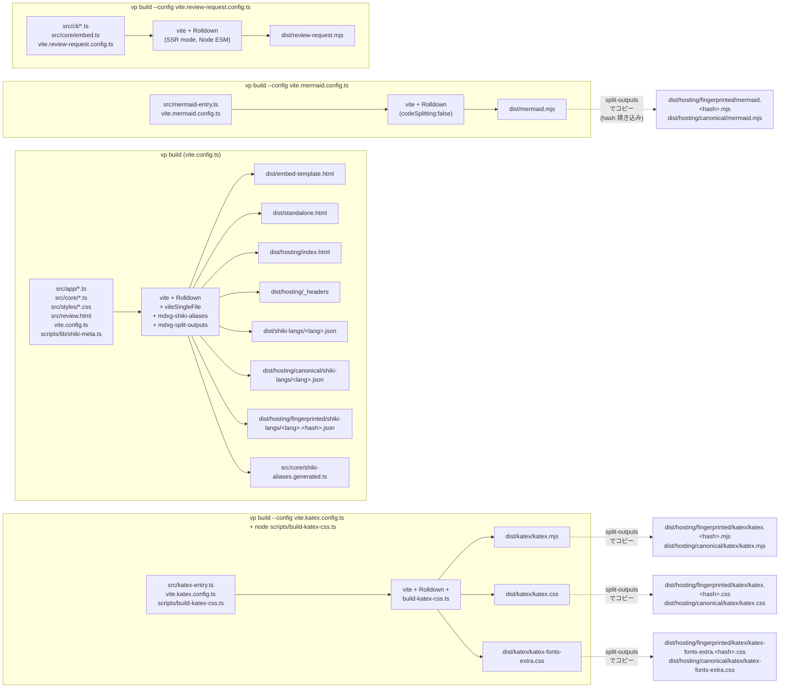

# ビルドパイプライン

> 本書は [DESIGN.md](./DESIGN.md) の旧 §13「ビルドパイプライン」を独立ドキュメントとして切り出したもの。参照互換のため見出し番号 §13 を維持する。記述は DESIGN.md と同じ[編集規約](./DESIGN.md#12-mdxg-準拠状況と設計判断)（設計レイヤーの WHY に絞り、実装スナップショット = file:symbol / 行数 / 実測サイズ はコードと archive へ委譲）に準拠する。**`mdxg-split-outputs` plugin の処理は本節「全体像」の 9 ステップを正典**とし、責務分担表はそれを要約する。

エンドユーザーには単一 HTML を配布するが、開発者は TypeScript で書く。両者の橋渡しが [Vite+ (vp)](https://viteplus.dev/) ベースのビルドパイプライン。vp は Vite 8 + Rolldown + vitest を統合し、`vp build` / `vp dev` / `vp test` の単一 CLI として提供する。

## 全体像

ビルドの出口は 4 つ。エンドユーザーが直接開く配布物 `dist/standalone.html`、review-request CLI が rewrite テンプレートとして読み込む `dist/embed-template.html`、ホスティング配信用の `dist/hosting/index.html`（URL fetch viewer、DESIGN.md §3 入力 3）、配布者向け CLI ツール `dist/review-request.mjs`。加えてホスティング先 (Cloudflare Pages 等) 用の静的設定ファイル `dist/hosting/_headers` が build 時に emit される (Cloudflare Pages の Build output directory に `dist/hosting` を指定する設計、archive 化された `docs/archive/feature-online-runtime-assets.archive.md` Step 4)。

ビルドチェーンは 4 系統が並列で走り、互いに **mermaid → katex → standalone/online inline → CLI bundle** の依存順がある。実行順序の制約は本節末尾「`npm run build` script の実行順」を参照。

各出力成果物の役割と実測サイズ（概数、すべて commit 対象）：

| 成果物                                                                                           | 系統 | 役割                                                                                                                                                                                                                                                                                                                               | サイズ（概数）                     |
| ------------------------------------------------------------------------------------------------ | ---- | ---------------------------------------------------------------------------------------------------------------------------------------------------------------------------------------------------------------------------------------------------------------------------------------------------------------------------------- | ---------------------------------- |
| `dist/embed-template.html`                                                                       | C1   | CLI rewrite テンプレート、grammar / Mermaid / KaTeX 注入なし最小サイズ                                                                                                                                                                                                                                                             | ~334 KB / gzip ~101 KB             |
| `dist/standalone.html`                                                                           | C1   | 単独 Open file / Paste markdown 用、Shiki bundled 全言語（約 235）+ Mermaid + KaTeX (`all` 相当) inline 済み                                                                                                                                                                                                                       | ~48 MB / gzip ~6.9 MB              |
| `dist/hosting/index.html`                                                                        | C1   | ホスティング配信用の URL fetch viewer（DESIGN.md §3 入力 3）。最小 shell として grammar / Mermaid / KaTeX runtime はすべて空 textContent / 空 style に上書き済みで、`` を `<\/script>` に escape したうえで `` escape のみで HTML に貼り込める |
| ターゲット  | es2020                | ブラウザの `` sanity）を inline 済み |
| ターゲット  | es2020                            | ブラウザの `<script type="module">` 内で実行される (Mermaid と同じ水準)                                                                                                                                                                                                                                                                                                                                                                                                                                                                                                                                                                                                                                                                                                                                                                                                                         |

**review-request CLI 用（`vite.review-request.config.ts`）**

| レイヤー        | ツール                | 役割                                                                                                                                                                                                                               |
| --------------- | --------------------- | ---------------------------------------------------------------------------------------------------------------------------------------------------------------------------------------------------------------------------------- |
| バンドル        | Rolldown（Vite 内蔵） | `src/cli/review-request.ts` を入口に `src/cli/*.ts` と `src/core/embed.ts` + `src/core/filename-sanitize.ts` + `src/core/math.ts` を 1 つの ESM (`dist/review-request.mjs`) に統合。Node 組み込みモジュール (`node:*`) は external |
| Node ターゲット | Vite SSR mode         | Node 24+ をターゲットにし、`process` / `fs/promises` / `path` / `url` 等の Node API をそのまま参照する形で出力                                                                                                                     |
| shebang 保持    | Rolldown 標準挙動     | `src/cli/review-request.ts` 冒頭の `#!/usr/bin/env node` を出力先に保持し、`chmod +x` 不要で実行可能な状態にする                                                                                                                   |

ランタイム（`dist/standalone.html` / CLI が生成する `*-review.html`）は Vite / Rolldown を一切知らない。出力 HTML は通常の `<script>` を含むだけ。`dist/review-request.mjs` も Node 標準 ESM として直接実行できる。

## テスト

主要な TypeScript ソースは **in-source testing** を採用する。実装と同じファイル末尾に `if (import.meta.vitest)` ブロックでテストを併記し、`vite.config.ts` の `test.includeSource` でビルド時に分離 → `vp test` で実行する。pure module の境界条件 (型ガード / オフセット計算 / state 集約 / 引数パース 等) を、実装と物理的に隣接させて drift を抑える設計判断。DOM / ブラウザ API に依存するランタイム挙動は happy-dom 環境のテストで補う。テスト対象ファイルの具体的な列挙は実装側の `import.meta.vitest` 出現箇所を grep するのが一次情報源で、本ドキュメントでは追わない。

## `vite-plugin-singlefile` の挙動

- emit された JS バンドル（自前コード + `marked`）と CSS は `<script>` / `<style>` として HTML 内に inline
- HTML 内に直接書かれた `<script id="embedded-md" type="text/markdown">` や `<script id="embedded-feedback" type="application/json">` は **触られない**（`type` がモジュールではないため Vite の処理対象外）
- `src/review.html` には外部 CDN への `<link>` / `<script src="https://...">` を含まない。`<head>` の `<link rel="stylesheet" href="./styles/review.css">` / `<link rel="stylesheet" href="./styles/markdown.css">` も bundle 結果に inline される
- 配布物 `dist/standalone.html` と `dist/embed-template.html` はどちらも **起動に必要なものをすべて内包し、外部依存ゼロ** で動作する

## HTML minify 無効維持と CI スモークテスト指針

review-request CLI は `dist/embed-template.html` の `<script id="embedded-md" type="text/markdown">` を正規表現で書き換える方式を採っているため、HTML minify を有効化して属性順や空白を変えると `core/embed.ts` の `EMBEDDED_MD_RE` (`id="embedded-md"` と `type="text/markdown"` の両方を lookahead で要求) が脆くなる。属性順の揺らぎは lookahead で吸収しているが、属性自体が削除される minify は救済できない。**HTML minify は将来も無効のまま維持する** ことで、CLI 側の保守コストを増やさずに rewrite の安定性を確保する。`mdxg-split-outputs` plugin が `dist/standalone.html` を生成する際も同じ `<script id="embedded-shiki-langs">` への正規表現マッチに依存するため、両 HTML 共通の不変条件としても効く。

将来 CI を強化する場合は、ビルド後の `dist/embed-template.html` と `dist/standalone.html` の両方に **`id="embedded-md"` と `type="text/markdown"` を併せ持つ `<script>` タグが含まれていること**、および `dist/standalone.html` に `<script id="embedded-shiki-langs">` が空でないこと、をスモークテストで検査するのが望ましい（`core/embed.ts` の前提と `splitOutputsPlugin` の不変条件を守るため）。現状は in-source test が dist 配下の構造を直接検査していないため、配布前の手作業確認に依存している。

## i18n 経路の責務分離

CLI と HTML は **言語決定について疎結合に保つ**（[i18n.md §14.1 / §14.3](./i18n.md#143-言語決定の優先順位)）。CLI は HTML への lang 関連属性 (旧設計案の `<html data-lang-init>` 等) を一切埋め込まず、HTML 側は `localStorage > navigator.language > 'en'` で独立に決定する。`src/cli/compose-review-html.ts` の rewrite チェーンには lang 関連の upsert を追加せず、CLI 自身の `--lang`（i18n.md §14.4）は `setCliLang` 経由で stdout / stderr / help 出力にのみ作用させる。

辞書も **CLI bundle と HTML bundle で物理分割** する（i18n.md §14.2）：

- CLI bundle (`dist/review-request.mjs`) は `src/cli/i18n/messages-cli.{en,ja}.ts` (`cli.*` 約 36 entry) のみ import
- HTML bundle (`dist/standalone.html` / `dist/embed-template.html` / `dist/hosting/index.html`) は `src/app/i18n/messages.{en,ja}.ts` (UI 辞書 約 170 entry、`online.*` / `footnote.*` 含む) のみ import

それぞれ独立した import tree なので bundle 重複なし。`dist/hosting/index.html` は `dist/standalone.html` から派生 (`buildOnlineHtml`、上の `mdxg-split-outputs` plugin の手順 7) するため、UI 辞書は派生元に既に inline 済みで online 派生処理での辞書再 inject は不要。

## ソース構成の責務境界

`src/` 配下は 3 層に分かれ、依存方向は `core ← app` / `core ← cli` の一方向のみ：

- **`src/core/`** — 環境非依存の pure module。Node CLI / ブラウザ双方から import される（markdown / block-anchors / page-split / page-outline / slugify / search / embed / escape / feedback / filename-sanitize / review-export / scan-fenced-langs / scan-mermaid / math / footnotes / shiki-aliases.generated / types / `i18n/i18n-core`）
- **`src/app/`** — Browser DOM / Web API 専用のランタイム。直下に entry の `review.ts` / `boot.ts` を置き、残りは機能クラスタ単位のサブディレクトリに分割する：
  - `state/` — `app-state`
  - `dom/` — `dom-utils` / `dialog` / `menu` / `text-range` / `text-segment-skip-rules`
  - `document/` — `doc-mount` / `doc-renderer` / `block-cache` / `code-copy-wrap` / `pages` / `scroll` / `scroll-spy`
  - `comments/` — `comments` / `comment-modal` / `comments-resize` / `comments-width` / `mark-engine` / `selection` / `floater`
  - `navigation/` — `page-navigation` / `page-scroll-spy` / `page-nav-resize` / `page-nav-width` / `keyboard-shortcuts`
  - `renderers/` — `shiki` / `shiki-upgrade` / `mermaid` / `mermaid-modal` / `katex` / `upgrade-utils`
  - `chrome/` — `toolbar` / `theme` / `sidebar-resize` / `help-modal`
  - `layout/` — `sidebar-width`
  - `workspace/` — `workspace` / `workspace-fs` / `storage`
  - `search/` — `search`
- **`src/cli/`** — Node CLI 専用（review-request エントリ / arg-spec / parse-args（dispatch）/ parse-clean-args / parse-run-args / clean / input-source / open-command / serve / assets/{shiki,mermaid,katex,resume-feedback}）

エントリ素材は `src/review.html` / `src/styles/*.css` / `src/mermaid-entry.ts` (vite.mermaid.config.ts の入口、`globalThis.__mdxgMermaid` bridge をエクスポート) / `src/katex-entry.ts` (vite.katex.config.ts の入口、`globalThis.__mdxgKatex` bridge をエクスポート)。`scripts/build-katex-css.ts` は KaTeX CSS のフォント data URI 化 + minimal / extra 分離を行う Node スクリプト (`scripts/lib/shiki-meta.ts` と同じ「ビルドツール側で完結する pure な変換」の位置付け)。`app` / `cli` の型を `core` に持ち込まない。`dist/` 配下（`standalone.html` / `embed-template.html` / `review-request.mjs` / `shiki-langs/*.json` / `mermaid.mjs` / `katex/katex.mjs` / `katex/katex.css` / `katex/katex-fonts-extra.css`）は `vp build` / `node scripts/build-katex-css.ts` の生成物で、commit 対象だが手では編集しない。
