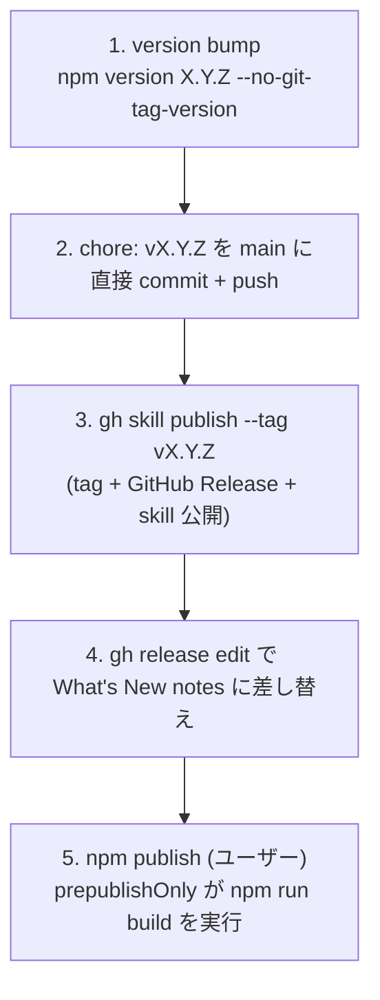

# 開発

> 本書は開発者向けの入口ドキュメント。ローカル開発（セットアップ・ビルド・チェック）、設計ドキュメントへの導線、リリース手順（npm / GitHub Releases / `gh skill` への公開）を 1 枚に統合する。リリース節以降は [DESIGN.md](./DESIGN.md) と同じ[編集規約](./DESIGN.md#12-mdxg-準拠状況と設計判断)（WHY に絞り、実装スナップショットはコードへ委譲）に準拠する。

## セットアップとビルド

ビルドツールは [Vite+ (vp)](https://viteplus.dev/) を使用し、npm の devDependency（`vite-plus`）として導入している。devcontainer / `local_setup.sh` がセットアップを担当するので、ローカル開発時はそれらを利用するのが最短。

品質ゲートは npm scripts に集約している。WHY 集約するか: pre-commit hook・CI・エージェント hook が**同一のコマンドを実行する**ことを構造的に保証し、「ローカルでは通るが CI で落ちる」経路を作らないため。`vp` の直接実行は、vp 固有のオプションを試すときに留める。

| コマンド             | 内容                                                                         |
| -------------------- | ---------------------------------------------------------------------------- |
| `npm run check`      | format / lint / type-check                                                   |
| `npm run check:fix`  | 同上（自動修正つき）                                                         |
| `npm run test`       | in-source tests と `scripts/` の契約テスト                                   |
| `npm run build`      | 配布物一式（mermaid / katex / standalone / embed-template / review-request） |
| `npm run pack:check` | check / test / build / `npm pack --dry-run`                                  |

`vp build` 単体なら本体ビルド（`dist/standalone.html` / `dist/embed-template.html`）だけを行う最短経路になる。

## エージェント hook

Claude / Codex / Cursor の PostToolUse hook は `vp` を直接呼ばず、`.agents/scripts/` の wrapper（`check-file.sh` / `check-all.sh` / `self-review.sh`）を経由する。WHY 一段挟むか: プロジェクト固有の検証を追加するときの変更点を wrapper 側 1 箇所に閉じ込め、`.claude/` / `.codex/` / `.cursor/` をテンプレート更新時にそのまま差し替えられる状態に保つため。

CI（`.github/workflows/ci.yml`）は `.nvmrc` で pin した Node の clean checkout で check / test / build / `npm pack --dry-run` を実行する。tarball の中身は `files` / `bin` を変更したときに壊れやすいため、publish 前と同じ `npm pack --dry-run` まで通す。token 権限は導入先の repository 設定に依存させず `contents: read` に固定する。

## devcontainer のディスク掃除

VS Code server / npm / エージェント CLI の cache はコンテナディスク上で再蓄積し、放置すると ENOSPC で Bash ツールを含む全書き込みが停止する。`scripts/clean-devcontainer-disk.sh` が固定 allowlist 内の再生成可能キャッシュだけを冪等に回収する。契約は `scripts/clean-devcontainer-disk.test.ts` が保持しているので、挙動の詳細はそちらを正典とする。

- `local_setup.sh`（初回、`npm ci` より前）と `postStartCommand`（毎起動）が `--threshold 90` で呼ぶ。WHY 依存インストールより前か: 満杯のディスクでは `npm ci` 自体が書き込めなくなるため。掃除の失敗と script 不在は警告に変換し、setup と container 起動をブロックしない
- 使用中・判定不能・共有 volume 上のリソースは削除しない。`/vscode/vscode-server/bin` の世代は手動確認候補として表示するだけ
- cursor-agent は最大日付の全世代と `~/.local/bin/agent` symlink の target を retained set として保持し、それ以外の旧世代だけを候補にする。WHY 同日世代を残すか: 世代名の git hash 順と release 順が一致せず、新旧を判定できないため
- 終了コードは 0 が正常系（no-op / safety skip を含む）、1 が operational failure、2 が引数エラー。`--dry-run` は候補・skip 理由・回収見込みだけを表示する

由来は [typescript-agent-package-template](https://github.com/oubakiou/typescript-agent-package-template)（cursor-agent category は [delegate-skills](https://github.com/oubakiou/delegate-skills) から移植）。取り込み済みのテンプレート version は `.template.json` に記録してあり、次回以降の差分は tag 間で取れる。

```bash
git remote add template https://github.com/oubakiou/typescript-agent-package-template.git
git fetch template 'refs/tags/*:refs/tags/template-*'
git diff template-v0.1.0..template-v0.2.0 -- .agents/ .claude/ .codex/ .githooks/ .github/ docs/ scripts/
```

## 設計ドキュメント

設計の意図・構成・割り切りは設計ドキュメント [docs/design/DESIGN.md](./DESIGN.md) にまとめている。目次:

- [1. 概要](./DESIGN.md#1-概要)
- [2. 制約](./DESIGN.md#2-制約)
- [3. ユーザーフロー](./DESIGN.md#3-ユーザーフロー)
- [4. アーキテクチャ](./DESIGN.md#4-アーキテクチャ)
- [5. データモデル](./DESIGN.md#5-データモデル)
- [6. コメントのアンカリング](./DESIGN.md#6-コメントのアンカリング)
- [7. 永続化レイヤー](./DESIGN.md#7-永続化レイヤー)
- [8. ワークスペースプロトコル](./DESIGN.md#8-ワークスペースプロトコル)
- [9. 起動シーケンス](./DESIGN.md#9-起動シーケンス)
- [10. ブラウザ互換性](./DESIGN.md#10-ブラウザ互換性)
- [11. セキュリティとプライバシー](./DESIGN.md#11-セキュリティとプライバシー)
- [12. MDXG 準拠状況と設計判断](./DESIGN.md#12-mdxg-準拠状況と設計判断)

ビルドパイプライン（旧 §13）と UI 国際化（旧 §14）は独立ドキュメントに分離した:

- [ビルドパイプライン](./build-pipeline.md) — vp build / split-outputs / 配布物 / ソース構成の責務境界
- [UI 国際化](./i18n.md) — 言語決定の優先順位 / 翻訳辞書とランタイム / DOM 連携

## ドキュメントプロセス

`docs/` 配下には 2 種類のドキュメントがある。永続資料（上記 DESIGN.md / build-pipeline.md / i18n.md）と、**テンプレートから複製して起票し、完了したらアーカイブする寿命付きドキュメント**。後者は「テンプレート → 起票（`docs/<種別>/<topic>.md`）→ 完了後 `docs/archive/<topic>.archive.md` にリネーム」のライフサイクルをたどる。

### バグ

- バグは**必要に応じて** [docs/bug/bug-template.md](../bug/bug-template.md) を元にドキュメントを起票する。`docs/bug/` に `bug-<topic>.md` として複製し、`{プレースホルダ}` を埋める / 引用ブロック内のガイドを削除して使う
- 起票は必須ではない。silent failure / 設計と実装の乖離 / spec violation / regression など、**再現手順や root cause（WHY）を残す価値があるもの**を起票対象とする。1 行で自明に直せる typo 等は対象外
- 修正が完了したら `docs/archive/` に移動し、`bug-<topic>.archive.md` にリネームしてアーカイブする（例: [docs/archive/bug-csp-font-src-missing.archive.md](../archive/bug-csp-font-src-missing.archive.md)）

### 設計プラン / リファクタリング

バグと同じライフサイクルで、それぞれ専用テンプレートから起票し、完了後は `docs/archive/<topic>.archive.md` にリネームする。

- 設計・実装プラン: [docs/feature/feature-plan-template.md](../feature/feature-plan-template.md)
- リファクタリング: [docs/refactoring/refactoring-plan-template.md](../refactoring/refactoring-plan-template.md)

## リリースプロセス

npm パッケージ `mdxg-redline` / GitHub Releases / `gh skill` レジストリの 3 つに対して **同一バージョンタグで成果物を公開する**手順。手順の正典は「全体フロー」とし、以降の小節はその各ステップの WHY を補足する。ビルド成果物そのものの構成は [build-pipeline.md](./build-pipeline.md) を参照。

### 公開先は 3 つ、タグは 1 つ

1 リリースで成果物が向かう先は 3 系統あり、すべて **同一の `vX.Y.Z` git tag に紐づく**。

| 公開先                | 配布物                                  | 公開コマンド                    | この環境からの実行可否             |
| --------------------- | --------------------------------------- | ------------------------------- | ---------------------------------- |
| npm registry          | CLI 本体 `mdxg-redline`（`npx` 起動元） | `npm publish`                   | 不可（npm 未認証、ユーザーが実行） |
| GitHub Releases       | リリースノート（What's New）            | `gh skill publish` が兼ねる     | 可                                 |
| `gh skill` レジストリ | `md-review` skill（`gh skill install`） | `gh skill publish --tag vX.Y.Z` | 可                                 |

WHY タグを共有するか: feedback JSON / review HTML の命名規約（§8）と同様、**バージョン番号を 1 つの真実とし、3 公開先の対応関係を機械的に決める**ため。利用者は `gh skill install ... --pin vX.Y.Z` と `npm view mdxg-redline@X.Y.Z` が同じソースを指すことを前提にできる。

WHY `gh skill publish` が GitHub Release を兼ねるか: `gh skill publish` はローカルの `skills/*/SKILL.md` を agentskills.io 仕様で検証したうえで **GitHub Release を作成してタグを切る**実装になっている（`gh skill publish --help`）。したがって skill 公開と GitHub Release は別コマンドではなく 1 コマンドに統合される。リリースノートは publish が生成する auto notes を後から差し替える。

### 全体フロー



#### 1. version bump

```bash
npm version 0.1.4 --no-git-tag-version
```

`package.json` と `package-lock.json` の **両方**（lock は top-level と `packages[""]` の 2 箇所）を一括で書き換える。WHY `--no-git-tag-version`: 既定の `npm version` は commit とタグ生成まで行うが、本リポジトリは commit メッセージを `chore: vX.Y.Z` に揃え、タグ生成は後段の `gh skill publish` に一元化したいため、bump だけに留める。bump 後は diff が version 行のみであることを確認する。

#### 2. main に直接 commit + push

```bash
git commit -m "chore: v0.1.4"
git push origin main
```

WHY ブランチ + PR ではなく main 直接: 歴代の `chore: vX.Y.Z` を main に直接 commit する運用を踏襲している。main には「pull request 経由必須」ルールが設定されているが、リポジトリ管理者の push は bypass される（push 時に `Bypassed rule violations` 警告が出るのは正常）。

#### 3. gh skill publish でタグ + Release + skill 公開

```bash
gh skill publish --dry-run        # 先に検証（skill 名 / frontmatter / install metadata）
gh skill publish --tag v0.1.4     # tag を push 済み main HEAD に切り、Release を作成
```

`--tag` を渡すと対話なしで publish する。タグは push 済みの main HEAD（= `chore` commit）に切られるため、**手順 2 の push を先に完了しておくこと**が前提。`agent-skills` topic は publish 時に必要だが既に付与済み。`no active tag protection rulesets found` 警告は tag 保護未設定の通知で、publish 自体は成功する。

WHY dry-run を先に: `skills/md-review/SKILL.md` の `name` がディレクトリ名と一致するか、`metadata.github-*` の install metadata が混入していないか等を、Release を作る前に検証するため。混入時は `--fix` で除去できる。

#### 4. リリースノートを What's New 形式に差し替え

```bash
gh release edit v0.1.4 --notes-file <notes.md>
```

publish が付ける auto notes（`Full Changelog` リンクのみ）を、v0.1.3 以前と同じ **What's New 形式**（機能カテゴリ別の箇条書き + Full Changelog 行）に置き換える。ノート本文は `git log vPREV..HEAD` のうち**利用者から見える変更**（CLI オプション追加・UI 機能・配布形態）に絞り、docs / refactoring / 内部 commit は省く。

#### 5. npm publish（ユーザーが実行）

```bash
npm whoami     # 認証確認（この環境は 401 で未認証）
npm publish    # prepublishOnly が npm run build を実行してから公開
```

WHY この環境から実行しないか: CI / devcontainer は npm registry に未認証（`npm whoami` が 401）。`npm publish` は publish 直前に `prepublishOnly`（= `npm run build`）が走り、mermaid / katex / standalone / embed-template / review-request の配布物一式を生成してから公開する。公開が完了するまで `npm view mdxg-redline version` は旧バージョンのままなので、リリース後にこの値で公開反映を確認する。

### リリースチェックリスト

- [ ] `npm version X.Y.Z --no-git-tag-version` の diff が version 行のみ
- [ ] `chore: vX.Y.Z` を main に commit + push 済み
- [ ] `gh skill publish --dry-run` がエラーなし
- [ ] `gh skill publish --tag vX.Y.Z` 後、tag が `chore` commit を指す（`git ls-remote --tags origin vX.Y.Z`）
- [ ] `gh release edit` で What's New ノートに差し替え済み
- [ ] （ユーザー）`npm publish` 後、`npm view mdxg-redline version` が新バージョン
