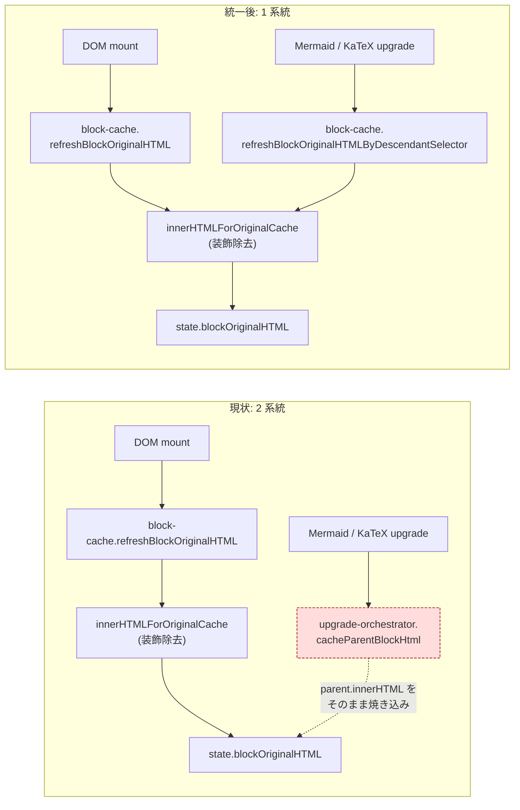
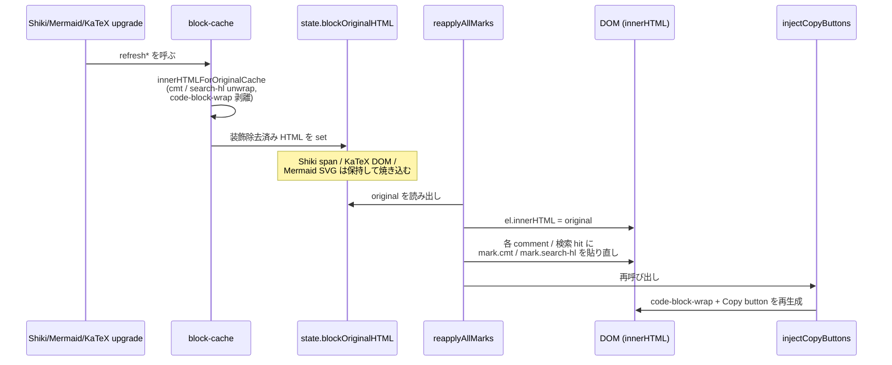
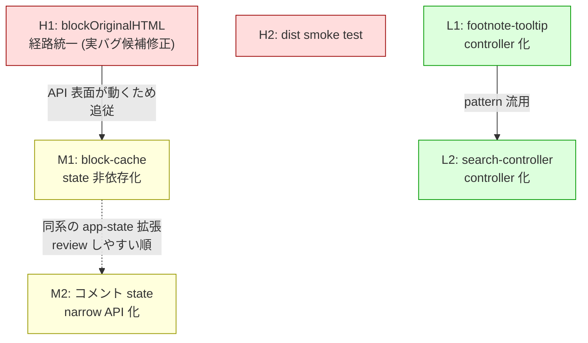

# リファクタリング計画

本ドキュメントは MDXG Redline コードベースに対するリファクタリング候補を優先度順に整理する。各項目は「挙動を変えずに保守性・拡張性を上げる」ことを目的とする。新機能追加・バグ修正とは独立して、ファイル分割・責務再配置を中心に進める。

ただし H1 は「キャッシュ規約のドリフトを構造的に解消する」リファクタリングであると同時に、現状の `upgrade-orchestrator.ts` が `state.blockOriginalHTML` に動的装飾（`mark.cmt` / `mark.search-hl` / `.code-block-wrap` / `.code-copy-btn`）を焼き込みうる **実バグ候補** の修正でもある。挙動不変のリファクタとしては扱わず、後述の「pin すべき不変条件」をテストで固定したうえで進める。

## 目次

1. [背景と方針](#1-背景と方針)
2. [項目テンプレート](#項目テンプレート)
3. [優先度: 高](#2-優先度-高)
4. [優先度: 中](#3-優先度-中)
5. [優先度: 低](#4-優先度-低)
6. [推奨着手順](#5-推奨着手順)
7. [共通の進め方](#6-共通の進め方)
8. [見送り判断](#7-見送り判断)

## 1. 背景と方針

`src/` は 111 ファイル・約 21k 行で、`src/core/` (プラットフォーム非依存) / `src/cli/` (Node CLI) / `src/app/` (ブラウザ UI) の三層に整理されている。直近 1 シリーズの refactor（過去 H1〜H3 / M1〜M10 / L1〜L3、`git log --grep refactor` 参照）で `parse-run-args` / `markdown` / `page-split` / `math` / `html-rewrite` などの肥大化候補はすでに分割済みで、行数の大きさは多くの場合 in-source test の積み上げによるもの。

一方で、シリーズ完了後にも次の 2 系統の問題が残っている：

- **キャッシュ規約のドリフト**: `state.blockOriginalHTML` への書き込み経路が `block-cache.ts` (動的装飾を除去して保存) と `upgrade-orchestrator.ts` (`parent.innerHTML` をそのまま保存) の 2 系統に分かれており、後者が前者の不変条件を破る経路を構造的に許している。
- **配布契約の未検査**: DESIGN.md §13「CI スモークテスト指針」で「`dist/standalone.html` / `dist/embed-template.html` に `id="embedded-md"` + `type="text/markdown"` の `<script>` があること」「`embedded-shiki-langs` が空でないこと」を検査すべきと明言されているが、現状の in-source test は `core/embed` の synthetic HTML を対象にしており、`dist/` 実体を見ていない。

本計画はこの 2 系統を優先度: 高で解消したうえで、関連する block-cache / comments state / module-scope state の構造改善を中〜低の構造変更として後段に並べる。

> 本計画の連番（H1 / M1 / L1 など）は、過去シリーズの同名項目とは独立扱いとする。過去に完了したリファクタリングは `git log --grep refactor` で参照できる。本文で過去項目を参照する場合は `過去 M3 (c5019d8)` のように接頭辞 + 該当 commit ID を付け、世代を一意に特定できるようにする（接頭辞 + 番号だけでは過去シリーズのどの M3 か曖昧になるため）。

新しい候補を起票する際は、`git log --grep refactor --since=<日付>` で直近の完了項目を確認し、既に解消済みの問題を二重起票していないかチェックする。

方針：

- **挙動不変なファイル移動を先**にする。リスクの高い構造変更（state 配線変更・hook 追加など）は後ろに回す。H1 は例外的に「挙動修正 + 構造統一」を同時に行うため最優先に置く
- **public API（CLI 引数仕様 / `feedback.json` スキーマ / DOM 構造）は変えない**。変える必要が出た場合は別 PR として切り出す
- **DESIGN.md と乖離する変更を入れる場合は同時に DESIGN.md を更新**する
- in-source test (`if (import.meta.vitest)`) は実装ファイルに隣接させる原則を保つ。ファイル分割時はテストも一緒に移す

## 項目テンプレート

各候補は次の 5 セクション構造で記述する（必須）。状態欄は完了済み / 不採用などの特殊ケースのみ任意で追加する。

```markdown
### H?. <短いタイトル>

**対象**: <file:line>（複数の場合は箇条書き可）

**現状**: <責務混在 / 重複 / 結合度などの問題説明>

**分割案**:

- `<新ファイル / 新モジュール パス>`: <そこに置く責務>
- ...

**効果**: <得られる保守性 / 拡張性 / テスタビリティの向上>

**リスク**: 低 / 中 / 高 + 根拠（例: 型設計の複雑化 / 不変条件テストの追従が必要 など）
```

一つの候補が「機械的なファイル抽出（挙動不変）」と「責務再配置を含む構造変更」を両方含む場合は、`H?a` / `H?b` に分割して各 sub-section を 2 PR として扱う（前半が挙動不変であることを diff で確認できるようにするため）。

## 2. 優先度: 高

### H1. `blockOriginalHTML` 更新経路の一本化

**対象**:

- `src/app/renderers/upgrade-orchestrator.ts:17-26` (`cacheParentBlockHtml`) / `:32-36` (`refreshAppliedBlocksOriginalHTML`)
- `src/app/document/block-cache.ts:146-208` (`DYNAMIC_MARK_SELECTORS` / `innerHTMLForOriginalCache` / `refreshBlockOriginalHTML`)
- 呼び出し側: `src/app/renderers/shiki-upgrade.ts` / `src/app/renderers/mermaid.ts` / `src/app/renderers/katex.ts`

**現状**: `state.blockOriginalHTML` への書き込みが二系統に分かれている。

1. **block-cache 系**（`block-cache.ts:186` `innerHTMLForOriginalCache` 経由）: `mark.cmt` / `mark.search-hl` を unwrap し、`.code-block-wrap` を中の `<pre>` で置き換えた innerHTML をキャッシュする。`reapplyAllMarks` の巻き戻し前提を満たすための契約。
2. **upgrade-orchestrator 系**（`upgrade-orchestrator.ts:24` `state.blockOriginalHTML.set(blockId, parent.innerHTML)`）: Mermaid / KaTeX upgrade 後に呼ばれ、`parent.innerHTML` をそのまま焼き込む。動的装飾の除去を通っていない。

upgrade 完了時点で偶然 `mark.cmt` / `.code-block-wrap` が無ければ問題は顕在化しないが、たとえば「コメント済みの段落内の Mermaid をホットリロードで再 upgrade」「検索バーを開いたまま KaTeX upgrade が走る」など、装飾と upgrade が時間的に重なる経路では「装飾入りの innerHTML が `blockOriginalHTML` に焼き込まれる → 次の `reapplyAllMarks` が装飾入り原文に対して再貼付して二重 mark を作る / closeSearch しても search-hl が残る」というバグが起きうる。



**分割案**:

- `src/app/document/block-cache.ts` を **`state.blockOriginalHTML` への唯一の書き込み点** にする
  - 既存 export `refreshBlockOriginalHTML(doc)` を残し、`innerHTMLForOriginalCache` (動的装飾除去 + code-block-wrap 剥離) を必ず通る経路に統一する
  - 新 export として「selector を渡して該当要素の親 `[data-block-id]` だけを更新する」絞り込み API を追加する（例: `refreshBlockOriginalHTMLByDescendantSelector(doc, selector)`）。Mermaid `pre[data-mermaid-applied="1"]` / KaTeX `[data-math-applied="1"]` といった既存 selector を引数で渡せるようにし、upgrade ごとに「自分が触った block」だけを再キャッシュする経路を保つ
- `src/app/renderers/upgrade-orchestrator.ts` から `cacheParentBlockHtml` / `refreshAppliedBlocksOriginalHTML` を撤去し、block-cache 側の新 API を呼ぶよう差し替える。`runUpgradeIgnoringErrors` / `scheduleUpgradeOnIdle` はそのまま残す
- 既存の in-source test (`upgrade-orchestrator.ts:79-114`) は block-cache 側に移動する。`runUpgradeIgnoringErrors` のテストは upgrade-orchestrator 側に残す

**pin すべき不変条件 (テストで固定)**:

- `mark.cmt` / `mark.search-hl` は `blockOriginalHTML` に焼き込まれない（既存 test `block-cache.ts:229-242` を Mermaid / KaTeX upgrade 後でも保つ形で拡張する）
- `.code-block-wrap` / `.code-copy-btn` は焼き込まれない（既存 test `block-cache.ts:251-279` を上記同様に拡張）
- Shiki / Mermaid / KaTeX の upgrade 結果 (Shiki span / `pre[data-mermaid-applied]` の sibling `<svg>` / `[data-math-applied]` 配下の KaTeX DOM) は焼き込まれる
- `reapplyAllMarks` 後に `injectCopyButtons` の「wrap が無ければ作る」分岐で copy button が再生成される（既存挙動の継続）

不変条件を時系列で示すと以下の通り。各 step で `state.blockOriginalHTML` に焼き込んでよいもの / よくないものが切り替わる。



**効果**:

- 「動的装飾を焼き込まない」契約が単一経路に集約され、新しい upgrade 系 (例: 将来の `@graph-rendering` 対応) を追加する際の追従漏れが構造的に防がれる
- 上記の二重 mark / closeSearch 後の hl 残留が、現状ノーリピロで起こりうる経路を含めて解消される

**リスク**: 中。実バグ候補の修正を含むため、再帰テストの追加（Mermaid / KaTeX upgrade 中に装飾要素が DOM 上にある状況の fixture）が必要。block-cache の API 表面が変わるため `shiki-upgrade.ts` / `mermaid.ts` / `katex.ts` の呼び出し側 3 箇所に追従が要る。

### H2. `dist/` 配布契約の smoke test 追加

**対象**:

- `dist/embed-template.html` / `dist/standalone.html`（成果物）
- `docs/design/build-pipeline.md`「HTML minify 無効維持と CI スモークテスト指針」
- `vite.config.ts` (`mdxg-split-outputs` plugin, 配布契約の生成側)
- 新規テスト配置先: `src/build/` 配下に `inline-markdown-css.ts` の前例があるため、本件も `src/build/dist-smoke.ts` (in-source test 形式) として置く

**現状**: build-pipeline.md §13 で「ビルド後の `dist/embed-template.html` と `dist/standalone.html` の両方に `id="embedded-md"` + `type="text/markdown"` を併せ持つ `<script>` が含まれていること」「`dist/standalone.html` に `<script id="embedded-shiki-langs">` が空でないこと」をスモークテストで検査するのが望ましい、と明言されているが未実装。`core/embed.ts` の `EMBEDDED_MD_RE` は synthetic HTML 上の in-source test では検証されているものの、`dist/` 実体を直接走査していないため、Vite plugin の改修や HTML minify の意図せぬ有効化で配布契約が静かに壊れる経路が残っている。

**分割案**:

- 新規 `src/build/dist-smoke.ts` を作成し、`if (import.meta.vitest)` ブロックで以下を検査する
  - `dist/embed-template.html` を `node:fs/promises` で読み、`<script ...id="embedded-md"...type="text/markdown"...>` または `<script ...type="text/markdown"...id="embedded-md"...>` のいずれかにマッチする正規表現（`core/embed.ts` の `EMBEDDED_MD_RE` と同等の lookahead 形式）を 1 件以上含むことを確認
  - `dist/standalone.html` についても同じ検査
  - `dist/standalone.html` で `<script id="embedded-shiki-langs"...>` のブロック中身（タグ間テキスト）が 1 文字以上あること
  - ファイルが存在しない場合は「`vp build` を先に実行してください」ヒントを出してテストを skip にする（`it.skipIf` または事前 `fs.access`）。CI と開発ローカルの両方で扱いやすくするため
- `vp test` で他の in-source test と同経路で走る。CI で `vp build && vp test` を順に呼ぶ前提を維持
- DESIGN.md §13「CI スモークテスト指針」の文面を、テスト実装後に「現状は手作業確認に依存している」から「`src/build/dist-smoke.ts` の in-source test として実装済み」に更新

**効果**:

- HTML minify の意図せぬ有効化、`mdxg-split-outputs` plugin の改修ミス、`<script id="embedded-md">` の typo 等が PR ベースで自動検知される
- DESIGN.md §13 と実装の乖離が解消される

**リスク**: 低。テスト追加のみで production 経路は触らない。dist 実体に依存するため、CI が `vp build` 後に `vp test` を走らせる構成であることを README / DESIGN.md に確認する（既に `vp build` → `vp test` の順は標準）。

## 3. 優先度: 中

### M1. `block-cache` の state 非依存化

**対象**:

- `src/app/document/block-cache.ts:120-132` (`cacheBlocksAndBuildAnchors`)
- `src/app/document/doc-mount.ts:184-194` (`mountRenderedDoc`)

**現状**: `cacheBlocksAndBuildAnchors(doc)` は内部で `state.blockOriginalHTML.clear()` と `state.markdown` 読み出しを行い、戻り値として `anchors` だけを返す副作用混在 API になっている (`block-cache.ts:121-122`)。caller の `mountRenderedDoc` は `state.blockAnchors = cacheBlocksAndBuildAnchors(doc)` と書き戻すが、`state.blockOriginalHTML` への書き込みは関数内で完結している（戻り値経由でない）。`state.markdown` への依存も内部に隠れているため、テスト時に state を手動で setup する必要がある。

なお、DOM への `data-block-id` 付与と footnote `<li>` への `tabIndex = -1` 付与は引き続き block-cache の責務に残す。これは DOM 構造そのものの確定処理で、state の管理問題とは別レイヤーのため。したがって本項目は「pure 化」ではなく「state 非依存化」と呼ぶ。

**分割案**:

- `cacheBlocksAndBuildAnchors(doc: HTMLElement, markdown: string)` に第 2 引数 `markdown` を追加し、戻り値を `{ anchors: Map<string, BlockAnchor>, originalHTML: Map<string, string> }` に変更
- 関数内では新規 `Map` を作って組み立て、`state` には触らない
- `mountRenderedDoc` 側で `const { anchors, originalHTML } = cacheBlocksAndBuildAnchors(doc, state.markdown); state.blockAnchors = anchors; state.blockOriginalHTML = originalHTML` の形で state に反映
- 既存の in-source test (`block-cache.ts:216-281`) はそのまま動く（`innerHTMLForOriginalCache` 単体テストなので state 非依存）。`cacheBlocksAndBuildAnchors` 自体のテストを 1〜2 件追加する余地が生まれる
- H1 で追加した `refreshBlockOriginalHTMLByDescendantSelector` も同じく state 非依存 API として再設計するかは別途検討（H1 完了後の追従 PR）

**効果**:

- block-cache を test しやすくなる（state 全体の setup なしに `Map` を渡せる）
- 「state 直 mutate を 1 箇所に閉じ込める」という app-state の DESIGN.md §5 narrow operation 方針と整合する

**リスク**: 中。`cacheBlocksAndBuildAnchors` の呼び出し点は `doc-mount.ts` のみだが、H1 の `refreshBlockOriginalHTML*` 系 API と整合させる必要があるため、H1 完了後に着手する。

### M2. コメント state 操作の narrow API 化

**対象**:

- `src/app/state/app-state.ts:18-91` (現状 `replaceComments` / `loadDocumentState` のみ narrow 化済み)
- `src/app/comments/comments.ts:78-81` (`deleteComment`: `replaceComments(state.comments.filter(...))`)
- `src/app/comments/comment-modal.ts:132-160` (`applyEditedBody` で in-place mutation、`saveNewComment` で `state.comments.push`)

**現状**: コメント集合の置換 (`replaceComments`) と新規 markdown 取り込み (`loadDocumentState`) は app-state 側に narrow API としてあるが、`addComment` / `updateCommentBody` / `deleteCommentById` の 3 経路は呼び出し側で直接 state を触っている。

- 追加: `state.comments.push(newComment)` (`comment-modal.ts:155`)
- 編集: `target.comment = body` の in-place mutation (`comment-modal.ts:137`、`applyEditedBody` 内)
- 削除: `state.comments.filter(...)` を `replaceComments` 経由で書き戻し (`comments.ts:79`)

state mutate の窓口がバラバラなので、追加・更新時の dirty 判定や observer hook を後から張る場合の追従点が散る。一方で `renderComments` / `reapplyAllMarks` / `toast` は副作用の塊（DOM 描画 / DOM mark 貼り直し / ユーザー通知）で、app-state の責務ではないため、本項目では app-state 側に押し込まない。

**分割案**:

- `src/app/state/app-state.ts` に 3 つの narrow operation を追加
  - `addComment(comment: Comment): void` — `state.comments.push(comment)` を実装。defensive copy は不要（caller 側で生成済みの個別オブジェクト）
  - `updateCommentBody(id: string, body: string): boolean` — 該当 id を find して `comment.comment = body` を実行、成否を返す。戻り値で「id が見つからない」失敗経路を caller に伝える契約は `applyEditedBody` 既存挙動と同じ
  - `deleteCommentById(id: string): void` — `state.comments = state.comments.filter(other => other.id !== id)` を内部で実行
- `comments.ts:78-81` の `deleteComment` を `deleteCommentById(comment.id)` に差し替え
- `comment-modal.ts:132-148` の `applyEditedBody` / `saveEditedComment` を `updateCommentBody` 呼び出しに差し替え、`comment-modal.ts` 側の `applyEditedBody` は削除
- `comment-modal.ts:150-160` の `saveNewComment` を `addComment(newComment)` 呼び出しに差し替え
- `renderComments` / `reapplyAllMarks` / `toast` の呼び順は caller (comments / comment-modal) 側に残す。app-state は state mutate のみ責任を持つ

**効果**:

- state mutate の窓口が `loadDocumentState` / `replaceComments` / `addComment` / `updateCommentBody` / `deleteCommentById` / `clearComments`（必要に応じて追加）の 5〜6 個に限定され、observer / undo / dirty 検知などを後から張る際の hook ポイントが明確になる
- in-source test を app-state 側に集約できる（現状 `applyEditedBody` のテストが `comment-modal.ts:292-318` にあり、本来は app-state 側に置きたい性質のもの）

**リスク**: 中。`applyEditedBody` の戻り値 `boolean` 契約を `updateCommentBody` でも保つ必要がある。`comment-modal.ts` 既存テストを app-state 側に移動する。

## 4. 優先度: 低

### L1. `footnote-tooltip` の controller 化

**対象**: `src/app/document/footnote-tooltip.ts:125-128` (module-scope の `tooltipEl` / `showTimer` / `hideTimer` / `activeRef`) と `:244-280` (`wireFootnoteTooltip` が `document` 直接 listen)

**現状**: tooltip の DOM 参照・hover / hide timer・最後にアクティブだった ref がすべて module scope の `let` 変数。`wireFootnoteTooltip` が `document` に対して `mouseover` / `mouseout` / `focusin` / `focusout` / `keydown` を追加するが、解除 API は無い。production では起動時 1 回呼ぶだけなのでリーク経路は無く、リスクは低い。ただし in-source test (`footnote-tooltip.ts:426-479`) の `beforeEach` で `tooltipEl = null; activeRef = null; clearShowTimer(); clearHideTimer()` を手で行っており、テストの隔離が module-scope state に依存している。

**分割案**:

- `createFootnoteTooltipController({ document, window })` を新規 export として追加
  - controller インスタンス内に `tooltipEl` / `showTimer` / `hideTimer` / `activeRef` を closure 変数として保持
  - `wire(): void` で 5 つの listener を `document` に追加し、内部の `handler` 参照を保持
  - `dispose(): void` で listener 解除と tooltip 要素の DOM 削除を行う
- 既存 export `wireFootnoteTooltip` は薄い alias として残し、内部で `createFootnoteTooltipController({ document, window }).wire()` を呼ぶ。caller の `app-wiring.ts` を変えなくて済む
- 既存 in-source test を `wireFootnoteTooltip` 経由ではなく controller インスタンス経由に書き直し、`dispose()` を `afterEach` で呼ぶ形にする

**効果**:

- テストの隔離が controller インスタンス境界で完結する
- 将来 hot reload / 部分 mount などで複数 tooltip controller を扱いたくなった場合の発展余地が出る
- L2 と同型の解決パターンを共有できる

**リスク**: 低。production の挙動は変わらない。listener 追加先が `document` で `wire()` の側に閉じ込めても挙動同型。pure helpers (`computeTooltipPosition` / `buildTooltipBodyHtml` / `findFootnoteBody`) は controller 外の export として残す。

### L2. `search-controller` の controller 化

**対象**: `src/app/search/search-controller.ts:24` (`navigateToPageHook`) と `:80` (`searchDebounceTimer`) と `:185-198` (`wireSearchBar` / `setOnSearchNavigate`)

**現状**: `navigateToPageHook` と `searchDebounceTimer` が module scope の `let`。`wireSearchBar` は `#search-bar` 配下の input / button に listener を追加するが解除 API は無く、`setOnSearchNavigate` で hook を後から差し替える設計。L1 と同型の構造問題。

**分割案**:

- `createSearchController({ document, navigateToPage })` を新規 export として追加
  - `navigateToPageHook` を constructor 引数として受け取り、closure で保持する形に変える（mutable な `setOnSearchNavigate` 経路を廃止）
  - `searchDebounceTimer` を closure 変数化
  - `wire(): void` で input / button listener を追加し、`dispose(): void` で解除
  - 既存 export `openSearch` / `closeSearch` / `toggleSearch` / `setSearchQuery` / `nextMatch` / `prevMatch` / `reapplySearchHighlights` は controller 上のメソッドとして実装
- 既存 export 名は trailing alias として残し、`review.ts` の composition root で controller インスタンスを作って差し替える
- L1 と同じ pattern で書き、両者が「module-scope state を持つ pseudo-singleton」だった構造を同型に解決する

**効果**:

- L1 と同じ効果に加え、`setOnSearchNavigate` を呼び忘れた状態で `setSearchQuery` を呼ぶと `navigateToPageHook === null` で navigate が黙って no-op になる現状の罠（実害なしだが意図不明瞭）が、constructor 引数化で構造的に解消される

**リスク**: 低〜中。`reapplyAllMarks` 経路から register される `reapplySearchHighlights` callback の差し替え順序を保つ必要がある（controller インスタンス生成 → `mark-engine.registerPostMarksReapplied(controller.reapplyHighlights)` の順）。L1 完了後に同じ pattern で進める。

## 5. 推奨着手順

挙動不変なファイル移動を先にし、構造変更（hook 設計・抽象化）は後ろに回す原則で並べる。ただし H1 は実バグ候補の修正を含むため例外的に最優先。



H1 と H2 は依存関係なしで並行 PR 可。M2 と L1 / L2 も独立だが、推奨順は以下:

1. **H1** — `blockOriginalHTML` 更新経路の一本化。実バグ候補の修正と契約統一を同時に行うため最優先。pin すべき不変条件をテストで固定してから本体を入れ替える
2. **H2** — `dist/` 配布契約の smoke test 追加。新規テスト追加のみで production 経路を触らないため H1 と並行 PR 可能（依存関係なし）
3. **M1** — `block-cache` の state 非依存化。H1 で block-cache 周辺の API 表面が動くため、H1 完了後に追従する
4. **M2** — コメント state 操作の narrow API 化。M1 と独立だが、app-state の責務拡張という同じ系の変更なので M1 後にまとめると review がしやすい
5. **L1** — `footnote-tooltip` の controller 化。controller pattern の試行として小さく進める
6. **L2** — `search-controller` の controller 化。L1 で確立した pattern を踏襲

## 6. 共通の進め方

- 各候補は **1 PR = 1 候補** を原則とする
- 同時実施を推奨している組は同一 PR で OK
- 「ファイル分割のみ」と「責務再配置を含む構造変更」を含む候補は 2 PR に分け、前半は挙動不変であることを diff で確認できる形にする
- in-source test は実装と同じ移動先に追従させる
- 実装が終わったら **サブエージェントで独立レビューする**。特に H1 のような「挙動修正 + 契約統一」を狙う候補では、pin した不変条件が新しい経路でも保たれているか・テストカバレッジの欠落・写し間違い・依存方向（循環参照）を重点的に確認させ、指摘を反映してから PR を出す
- DESIGN.md と乖離する変更は **DESIGN.md 更新を同 PR に含める**（特に H2 は §13 の文面更新が必須）
- ビルド成果物（`dist/`）への影響は smoke check（`vp build` 後の `dist/standalone.html` / `dist/embed-template.html` の `<script id="embedded-md">` / `<script id="embedded-shiki-langs">` 存在確認、DESIGN.md §13「CI スモークテスト指針」参照）で確認する。H2 完了後はこの手作業確認が `vp test` 経由で自動化される
- 実装が PR として merge できる状態になったら、計画書本文の該当候補に **`### H?. (完了済み) <タイトル>`** のような状態マーカを付け、コミット ID を添える（例: `**状態**: **完了済み** — commit abc1234 で merge`）。本文や分割案は履歴目的で残してよいが、新しい着手対象から外れたことが目視で分かる状態にする
- 本計画書に含まれる候補がすべて完了（または不要と判断）したら、**リファクタリング計画ドキュメント自体を削除する**（履歴は `git log --grep refactor` で辿れるため、コードベースに古い計画書を残さない）

## 7. 見送り判断

直近シリーズの refactor で解消済み or 行数の大きさが in-source test の積み上げに由来する候補。新規候補として再起票する必要はない（再検討する場合は `git log --grep refactor` で過去の commit を参照する）。

- `src/cli/parse-run-args.ts` (562 行) / `src/cli/arg-spec.ts` (381 行) — 過去 M5 (e8c1771) で `attach` 系を generic helper に集約済み。production 行は 113 行 / 251 行で、残りは in-source test
- `src/core/page-split.ts` (543 行) — partition / synthetic page / finalize が既に `page-boundary.ts` / `synthetic-pages/` に分割済み。production は 178 行
- `src/core/math.ts` (521 行) — 過去 M3 (c5019d8) で scanner protocol 化と `buildSegment` 集約済み
- `src/core/embed/html-rewrite.ts` (506 行) — 過去 M6 (3f299f4) で共通 region 置換 helper を導入済み
- `src/core/markdown.ts` (518 行) — code / heading / math / link policy 系はすでに `markdown-renderer/` 配下に分離済み。残った link / image / table / html / text override は信頼境界（XSS 防御）として 1 ファイルにまとめて読める利点があり、分割するとレビューコストが上がる
- `src/core/footnotes.ts` (491 行) — scanner と post-processing の分離は構造上可能だが、`getOrphanFootnoteIds` と `renderOrphanFootnoteItems` の orphan 判定 invariant が両側に出るため二重管理になりやすい。当面は単一ファイル維持
- `src/app/comments/comments.ts:14-28` の `setOnCommentNavigate` / `setOnCommentEdit` setter 注入 — `comment-modal.ts` との循環参照回避のための既知ワークアラウンドで、コメントで意図が明示済み。event-bus 等を入れると register / unregister のライフサイクル管理コストが増えるだけなので現状維持
- `src/app/state/app-state.ts` (283 行) — production 104 行・9 フィールド。M2 で追加する narrow API 以外に God object 化の兆候はなく、現状放置で問題なし
- `src/styles/review.css` (1678 行) の分割 — 配布物は `viteSingleFile` で inline 化されるためサイズ影響なし、純粋に開発体験の問題。レビュー頻度が上がるまで保留
- `vite.config.ts` の inline helper 群 — `mdxg-split-outputs` plugin と inline 系ヘルパが同居しているが、`src/build/` への切り出しは H2 で smoke test の置き場所が確定したあとに再評価する
